# DCD

- cross-references:
  - DCD from: 
    - [UC-001-DCD]
    - [UC-002-DCD]
    - [UC-002B-DCD]
    - [UC-004-DCD]

## Diagram

```mermaid
---
title: "Domain Class Diagram - Arla Nature Connect"
---
classDiagram
  direction TB

namespace ArlaNatureConnect.Domain.Abstract {
  class IEntity {
    <<interface>>
    +Guid Id
  }
}

namespace ArlaNatureConnect.Domain.Entities {
  class Person {
    +Guid Id
    +Guid RoleId
    +Guid AddressId
    +string FirstName
    +string LastName
    +string Email
    +bool IsActive
    +virtual Role Role
    +virtual Address Address
    +virtual ICollection~Farm~ Farms
  }

  class Role {
    +Guid Id
    +string Name
  }

  class Farm {
    +Guid Id
    +Guid AddressId
    +Guid OwnerId
    +string Name
    +string CVR
    +virtual Person Owner
    +virtual Address Address
  }

  class Address {
    +Guid Id
    +string Street
    +string City
    +string PostalCode
    +string Country
  }

  class NatureCheckCase {
    +Guid Id
    +Guid FarmId
    +Guid ConsultantId
    +Guid AssignedByPersonId
    +NatureCheckCaseStatus Status
    +string? Notes
    +string? Priority
    +DateTimeOffset CreatedAt
    +DateTimeOffset? AssignedAt
    +virtual Farm Farm
    +virtual Person Consultant
    +virtual Person AssignedByPerson
  }

  class NatureArea {
    +Guid Id
    +Guid FarmId
    +string Name
    +string Description
    +virtual ICollection~NatureAreaCoordinate~ Coordinates
    +virtual ICollection~NatureAreaImage~ Images
  }

  class NatureAreaCoordinate {
    +Guid Id
    +Guid NatureAreaId
    +double Latitude
    +double Longitude
    +int OrderIndex
  }

  class NatureAreaImage {
    +Guid Id
    +Guid NatureAreaId
    +string ImageUrl
    +virtual NatureArea NatureArea
  }
}

namespace ArlaNatureConnect.Core.Abstract {
  %% Repositories

  class IRepository~TEntity~ {
    <<interface>>
    +GetByIdAsync(Guid id) Task~TEntity~
    +GetAllAsync() Task~List__TEntity~
    +AddAsync(TEntity entity) Task
    +UpdateAsync(TEntity entity) Task
    +DeleteAsync(Guid id) Task
  }

  class IRoleRepository {
    <<interface>>
    +GetByNameAsync(string name) Task~Role?~
  }

  class IPersonRepository {
    <<interface>>
    +GetPersonsByRoleAsync(string role) Task~IEnumerable~Person~~
    +GetByEmailAsync(string email) Task~Person?~
  }

  class IAddressRepository {
    <<interface>>
  }

  class IFarmRepository {
    <<interface>>
    +GetByCvrAsync(string cvr) Task~Farm?~
  }

  class INatureCheckCaseRepository {
    <<interface>>
    +GetActiveCasesAsync() Task~IReadOnlyList~NatureCheckCase~~
    +FarmHasActiveCaseAsync(Guid farmId) Task~bool~
    +GetAssignedCasesForConsultantAsync(Guid consultantId) Task~IReadOnlyList~NatureCheckCase~~
    +GetActiveCaseForFarmAsync(Guid farmId) Task~NatureCheckCase?~
  }

  class INatureAreaRepository {
    <<interface>>
  }

  class INatureAreaImageRepository {
    <<interface>>
  }

  class INatureAreaCoordinateRepository {
    <<interface>>
  }

  %% Services

  class IPrivilegeService {
    <<interface>>
  }

  class IStatusInfoServices {
    <<interface>>
  }

  class IAppMessageService {
    <<interface>>
  }

  class IConnectionStringService {
    <<interface>>
  }

  class INatureCheckCaseService {
    <<interface>>
  }

  class INavigationHandler {
    <<interface>>
    +Initialize(Frame frame) void
    +Navigate(Type pageType, object? parameter) void
    +GoBack() bool
    +CanGoBack : bool
  }

  class IGetAddressFromCvr {
    <<interface>>
  }
}

namespace ArlaNatureConnect.Infrastructure.Repositories {
  class Repository~TEntity~ {
    #IDbContextFactory~AppDbContext~ _factory
    +Repository(IDbContextFactory factory) void
  }

  class RoleRepository {
    +RoleRepository(IDbContextFactory factory) void
  }

  class PersonRepository {
    +PersonRepository(IDbContextFactory factory) void
  }

  class AddressRepository {
    +AddressRepository(IDbContextFactory factory) void
  }

  class FarmRepository {
    +FarmRepository(IDbContextFactory factory) void
  }

  class NatureCheckCaseRepository {
    +NatureCheckCaseRepository(IDbContextFactory factory) void
    +GetActiveCasesAsync() Task~IReadOnlyList~NatureCheckCase~~
    +FarmHasActiveCaseAsync(Guid farmId) Task~bool~
    +GetAssignedCasesForConsultantAsync(Guid consultantId) Task~IReadOnlyList~NatureCheckCase~~
    +GetActiveCaseForFarmAsync(Guid farmId) Task~NatureCheckCase?~
  }

  class NatureAreaRepository {
    +NatureAreaRepository(IDbContextFactory factory) void
  }

  class NatureAreaCoordinateRepository {
    +NatureAreaCoordinateRepository(IDbContextFactory factory) void
  }

  class NatureAreaImageRepository {
    +NatureAreaImageRepository(IDbContextFactory factory) void
  }
}

namespace ArlaNatureConnect.Core.Services {
  class NatureCheckCaseService {
    +LoadAssignmentContextAsync() Task~NatureCheckCaseAssignmentContext~
    +AssignCaseAsync(NatureCheckCaseAssignmentRequest request) Task~NatureCheckCase~
    +UpdateCaseAsync(Guid farmId, NatureCheckCaseAssignmentRequest request) Task~NatureCheckCase~
    +SaveFarmAsync(FarmRegistrationRequest request) Task~Farm~
    +DeleteFarmAsync(Guid farmId) Task
    +GetNotificationsForConsultantAsync(Guid consultantId) Task~IReadOnlyList~ConsultantNotificationDto~~
  }

  class ConnectionStringService {
    +SaveAsync(string connectionString) Task
    +ReadAsync() Task~string?~
    +ExistsAsync() Task~bool~
  }

  class PrivilegeService {
    +CurrentUser : Person?
  }

  class AppMessageService {
    +AddInfoMessage(string message) void
    +AddErrorMessage(string message) void
    +ClearErrorMessages() void
  }

  class StatusInfoService {
    +IsLoading : bool
    +IsConnected : bool
  }
}

namespace ArlaNatureConnect.WinUI.ViewModels {
  %% Abstract viewmodels
  class ViewModelBase {
    <<abstract>>
    +OnPropertyChanged(string? propertyName) void
  }

  class ListViewModelBase~TRepos, TEntity~ {
    <<abstract>>
    +LoadAsync(Guid id) Task
    +SelectedItem : TEntity?
  }

  class CRUDViewModelBase~TRepos, TEntity~ {
    <<abstract>>
    +AddCommand : ICommand
    +SaveCommand : ICommand
    +DeleteCommand : ICommand
    +CancelCommand : ICommand
  }

  class NavigationViewModelBase {
    <<abstract>>
    +InitializeNavigation(string initialTag) void
    +AttachSideMenuToMainWindow() void
  }

  class SideMenuViewModelBase {
    <<abstract>>
  }

  %% Pages
  class AdministratorPageViewModel {
    +AdministratorPageViewModel()
  }

  class ArlaEmployeePageViewModel {
    +InitializeAsync(Role role) Task
  }

  class ArlaEmployeeAssignNatureCheckViewModel {
    +AssignCaseButtonText : string
    +AssignNatureCheckCaseAsync() Task
    +SelectedFarm : AssignableFarmViewModel?
    +SelectedConsultant : Person?
    +SelectedPriority : string
    +AssignmentNotes : string
  }

  class ConsultantPageViewModel {
    +InitializeAsync(Role role) Task
  }

  class ConsultantNatureCheckViewModel {
    +LoadAssignedCasesAsync() Task
  }

  class FarmerPageViewModel {
    +InitializeAsync(Role role) Task
  }

  class LoginPageViewModel {
    +LoginPageViewModel()
    +SelectRole(string roleName) void
  }

  class ManageViewModel {
    +ManageViewModel()
  }

  %% Controls / SideMenu
  class AdministratorPageSideMenuUCViewModel {
    +InitializeAsync() Task
  }

  class ArlaEmployeePageSideMenuUCViewModel {
    +InitializeAsync() Task
  }

  class ConsultantPageSideMenuUCViewModel {
    +InitializeAsync() Task
  }

  class FarmerPageSideMenuUCViewModel {
    +InitializeAsync() Task
  }

  %% Shared Controls
  class CRUDPersonUCViewModel {
    +CRUDPersonUCViewModel()
    +CreatePerson() Task
    +UpdatePerson() Task
    +DeletePerson() Task
  }

  class CRUDNatureAreaUCViewModel {
    +CreateNatureArea() Task
    +UpdateNatureArea() Task
    +DeleteNatureArea() Task
  }

  class StatusBarUCViewModel {
    +IsLoading : bool
    +IsConnected : bool
  }

  class MenuBarUCViewModel {
    +NavigateTo(string tag) void
  }

  class MessageErrorSuccesUCViewModel {
    +InfoMessages : ObservableCollection~string~
    +ErrorMessages : ObservableCollection~string~
  }

  %% Items
  class AssignableFarmViewModel {
    +FarmId : Guid
    +FarmName : string
    +HasActiveCase : bool
    +Status : string
    +Priority : string
    +ConsultantName : string
  }
}

%% Associations
Person "1" --o "*" Role : has
Person "1" --o "1" Address : has
Person "1" --o "*" Farm : owns
Person "*" -- "*" Farm : "assigned to (UserFarms)"
Farm "1" --o "1" Address : has
Farm "1" --o "*" NatureArea : has
Farm "1" --o "*" NatureCheckCase : has
Person "1" --o "*" NatureCheckCase : "assigned as consultant"
Person "1" --o "*" NatureCheckCase : "assigned by"
NatureArea "1" --o "*" NatureAreaCoordinate : has
NatureArea "1" --o "*" NatureAreaImage : has

%% Repository Associations
Role --* RoleRepository : manages
Person --* PersonRepository : manages
Farm --* FarmRepository : manages
Address --* AddressRepository : manages
NatureCheckCase --* NatureCheckCaseRepository : manages
NatureArea --* NatureAreaRepository : manages
NatureAreaCoordinate --* NatureAreaCoordinateRepository : manages
NatureAreaImage --* NatureAreaImageRepository : manages

%% ViewModel relationships
AdministratorPageViewModel --o CRUDPersonUCViewModel : includes
AdministratorPageViewModel ..> INavigationHandler : depends
ArlaEmployeePageViewModel --o ArlaEmployeeAssignNatureCheckViewModel : includes
ArlaEmployeePageViewModel ..> INavigationHandler : depends
ConsultantPageViewModel --o ConsultantNatureCheckViewModel : includes
ConsultantPageViewModel ..> INavigationHandler : depends

CRUDPersonUCViewModel ..> IPersonRepository : depends
CRUDPersonUCViewModel ..> IStatusInfoServices : depends
CRUDPersonUCViewModel ..> IAppMessageService : depends

ArlaEmployeeAssignNatureCheckViewModel ..> INatureCheckCaseService : depends
ArlaEmployeeAssignNatureCheckViewModel ..> IAppMessageService : depends
ArlaEmployeeAssignNatureCheckViewModel ..> IStatusInfoServices : depends

LoginPageViewModel ..> INavigationHandler : depends
ManageViewModel ..> INavigationHandler : depends

AdministratorPageSideMenuUCViewModel ..> IPersonRepository : depends
AdministratorPageSideMenuUCViewModel ..> IStatusInfoServices : depends
AdministratorPageSideMenuUCViewModel ..> IAppMessageService : depends
AdministratorPageSideMenuUCViewModel ..> INavigationHandler : depends

StatusBarUCViewModel ..> IStatusInfoServices : depends
MessageErrorSuccesUCViewModel ..> IAppMessageService : depends

%% Service Implementation
NatureCheckCaseService ..|> INatureCheckCaseService : implements
ConnectionStringService ..|> IConnectionStringService : implements
PrivilegeService ..|> IPrivilegeService : implements
AppMessageService ..|> IAppMessageService : implements
StatusInfoService ..|> IStatusInfoServices : implements

%% Service Dependencies
NatureCheckCaseService --> INatureCheckCaseRepository : uses
NatureCheckCaseService --> IFarmRepository : uses
NatureCheckCaseService --> IPersonRepository : uses
NatureCheckCaseService --> IAddressRepository : uses
NatureCheckCaseService --> IRoleRepository : uses

%% Inheritance and Implementation
Person --|> IEntity : implements
Role --|> IEntity : implements
Farm --|> IEntity : implements
Address --|> IEntity : implements
NatureCheckCase --|> IEntity : implements
NatureArea --|> IEntity : implements
NatureAreaCoordinate --|> IEntity : implements
NatureAreaImage --|> IEntity : implements

Repository~TEntity~ ..|> IRepository~TEntity~ : implements
RoleRepository ..|> Repository : inheritance
PersonRepository ..|> Repository : inheritance
AddressRepository ..|> Repository : inheritance
FarmRepository ..|> Repository : inheritance
NatureCheckCaseRepository ..|> Repository : inheritance
NatureAreaRepository ..|> Repository : inheritance
NatureAreaCoordinateRepository ..|> Repository : inheritance
NatureAreaImageRepository ..|> Repository : inheritance

RoleRepository ..|> IRoleRepository : implements
PersonRepository ..|> IPersonRepository : implements
AddressRepository ..|> IAddressRepository : implements
FarmRepository ..|> IFarmRepository : implements
NatureCheckCaseRepository ..|> INatureCheckCaseRepository : implements
NatureAreaRepository ..|> INatureAreaRepository : implements
NatureAreaCoordinateRepository ..|> INatureAreaCoordinateRepository : implements
NatureAreaImageRepository ..|> INatureAreaImageRepository : implements

IRoleRepository --|> IRepository : extends
IPersonRepository --|> IRepository : extends
IAddressRepository --|> IRepository : extends
IFarmRepository --|> IRepository : extends
INatureCheckCaseRepository --|> IRepository : extends
INatureAreaRepository --|> IRepository : extends
INatureAreaCoordinateRepository --|> IRepository : extends
INatureAreaImageRepository --|> IRepository : extends

%% ViewModel Inheritance
ListViewModelBase --|> ViewModelBase : extends
CRUDViewModelBase --|> ListViewModelBase : extends
NavigationViewModelBase --|> ViewModelBase : extends
SideMenuViewModelBase --|> ViewModelBase : extends
AdministratorPageViewModel --|> NavigationViewModelBase : extends
ArlaEmployeePageViewModel --|> NavigationViewModelBase : extends
ConsultantPageViewModel --|> NavigationViewModelBase : extends
FarmerPageViewModel --|> NavigationViewModelBase : extends
CRUDPersonUCViewModel --|> CRUDViewModelBase : extends
CRUDNatureAreaUCViewModel --|> CRUDViewModelBase : extends

%% note right of ArlaNatureConnect.Core.INatureCheckCaseService: Service enforces authorization, validation and mapping
```

   
### Class Descriptions
- **Person**: Represents a person in the system with attributes such as first name, last name, email, address, and active status. A person has one role (Farmer, Consultant, Employee, or Administrator).
- **Role**: Defines a role that can be assigned to persons for access control, with an attribute for the role name.
- **Address**: Represents the address details associated with a person or farm, including street, city, postal code, and country.
- **Farm**: Represents a farm with attributes such as name and CVR number. A farm has one owner (Person) and one address.
- **NatureCheckCase**: Represents a nature check case associated with a farm, assigned to a consultant and assigned by an Arla employee.
- **NatureArea**: Represents a nature area associated with a farm, with coordinates and images.
- **NatureAreaCoordinate**: Represents geographic coordinates for a nature area.
- **NatureAreaImage**: Represents images associated with a nature area.

### Relationships
- A **Person** has exactly one **Role**, establishing a one-to-one relationship.
- A **Person** can own zero or more **Farms** (via OwnerId).
- A **Person** can be assigned to zero or more **Farms** (via UserFarms junction table).
- A **Farm** has exactly one **Address** and one **Person** as owner.
- A **Farm** can have zero or more **NatureCheckCases**.
- A **Person** (consultant) can be assigned to zero or more **NatureCheckCases**.
- A **Person** (Arla employee) can assign zero or more **NatureCheckCases**.

### Notes
- This domain model captures the essential entities and their relationships required for managing persons, farms, and nature check cases within the system.
- Additional attributes and methods can be added to each class as needed to support further functionalities.

<!-- Links -->
[UC-001-DCD]:     ./UseCase001-LoginAndRoleaccess/UC001-Artifacts.md]
[UC-002-DCD]:     ./UseCase002-AdministrateFarmsAndUsers/UC002-Artifacts.md
[UC-002B-DCD]:    ./UseCase002B-AssignNatureCheckCase/UC002B-Artifacts.md
[UC-004-DCD]:     ./UseCase004-RegisterNatureAreas/UC004-Artifacts.md