# DCD

- cross-references:
  - DCD from: 
    - [UC-002-DCD]
    - [UC-002B-DCD]
    - [UC-004-DCD]

## Diagram

```mermaid
---
title: "Domain Class Diagram - Arla Nature Connect"
---
classDiagram
  direction TB

namespace ArlaNatureConnect.Domain.Abstract {
  class IEntity {
    <<interface>>
    +Guid Id
  }
}

namespace ArlaNatureConnect.Domain.Entities {
  class Person {
    +Guid Id
    +Guid RoleId
    +Guid AddressId
    +string FirstName
    +string LastName
    +string Email
    +bool IsActive
    +virtual Role Role
    +virtual Address Address
    +virtual ICollection<Farm> Farms
  }

  class Role {
    +Guid Id
    +string Name
  }

  class Farm {
    +Guid Id
    +Guid AddressId
    +Guid PersonId
    +string Name
    +string CVR
  }

  class Address {
    +Guid Id
    +string Street
    +string City
    +string PostalCode
    +string Country
  }

  class NatureCheckCase {
    +Guid Id
    +Guid FarmId
    +Guid ConsultantId
    +Guid AssignedByPersonId
    +string Status
    +string? Notes
    +string? Priority
    +DateTimeOffset CreatedAt
    +DateTimeOffset? AssignedAt
  }

  class NatureArea {
    +Guid Id
    +Guid FarmId
    +string Name
    +string? Description
    +string Coordinates
    +string Type
    +Farm Farm
  }

  class NatureAreaImage {
    +Guid Id
    +Guid NatureAreaId
    +string ImageUrl
  }

  class Coordinate {
    +Guid Id
    +double Latitude
    +double Longitude
    +int OrderIndex
  }
}

namespace ArlaNatureConnect.Core.Abstract {
  %% Repositories

  class IRepository~TEntity~ {
    <<interface>>
    +GetByIdAsync(Guid id) Task~TEntity~
    +GetAllAsync() Task~List__TEntity~
    +AddAsync(TEntity entity) Task
    +UpdateAsync(TEntity entity) Task
    +DeleteAsync(Guid id) Task
  }

  class IRoleRepository {
    <<interface>>
  }

  class IPersonRepository {
    <<interface>>
  }

  class IAddressRepository {
    <<interface>>
  }

  class IFarmRepository {
    <<interface>>
  }

  class INatureCheckCaseRepository {
    <<interface>>
  }

  class INatureAreaRepository {
    <<interface>>
  }

  class INatureAreaImageRepository {
    <<interface>>
  }

  class INatureAreaCoordinateRepository {
    <<interface>>
  }

  %% Services

  class IPrivilegeService {
    <<interface>>
  }

  class IStatusInfoServices {
    <<interface>>
  }

  class IAppMessageService {
    <<interface>>
  }

  class IConnectionStringService {
    <<interface>>
  }

  class INatureCheckCaseService {
    <<interface>>
  }

  class INavigationHandler {
    <<interface>>
  }

  class IPersonService {
    <<interface>>
  }
}

namespace ArlaNatureConnect.Infrastructure.Repositories {
  class Repository~TEntity~ {
    #AppDbContect _context
    +Repository() void
    +SaveChangesAsync(AppDbContext context) Task
  }

  class RoleRepository {
    +RoleRepository() void
  }

  class PersonRepository {
    +PersonRepository() void
  }

  class AddressRepository {
    +AddressRepository() void
  }

  class FarmRepository {
    +FarmRepository() void
  }
}

namespace ArlaNatureConnect.Core.Services {
  class NatureCheckCaseService {
    +LoadAssignmentContextAsync() Task
    +AssignCaseAsync() Task
    +SaveFarmAsync() Task
  }

  class ConnectionStringService {
    +SaveAsync(string) Task
    +ReadAsync() Task~string?~
    +ExistsAsync() Task~bool~
  }

  class PrivilegeService {
    +CurrentUser : Person?
  }

  class AppMessageService {
    +AddInfoMessage(string) void
    +AddErrorMessage(string) void
    +ClearErrorMessages() void
  }
}

namespace ArlaNatureConnect.WinUI.ViewModels {
  %% Pages
  class AdministratorPageViewModel {
    +AdministratorPageViewModel()
    +LoadCommand()
  }

  class CRUDPersonUCViewModel {
    +CRUDPersonUCViewModel()
    +CreatePerson()
    +UpdatePerson()
    +DeletePerson()
  }

  class LoginPageViewModel {
    +LoginPageViewModel()
    +SelectRole(string) void
  }

  class ManageViewModel {
    +ManageViewModel()
  }

  class ArlaEmployeePageViewModel {
    +InitializeAsync(Role) Task
    +AssignCaseAsync() Task
  }

  class FarmerPageViewModel {
    +InitializeAsync(Role) Task
  }

  class ConsultantPageViewModel {
    +InitializeAsync(Role) Task
  }

  %% Controls / SideMenu
  class AdministratorPageSideMenuUCViewModel {
    +InitializeAsync() Task
  }

  %% Abstract viewmodels
  class ViewModelBase {
    <<abstract>>
  }

  class NavigationViewModelBase {
    <<abstract>>
  }

  class CRUDViewModelBase~TRepos, TEntity~ {
    <<abstract>>
  }
}

%% Associations
Role --* RoleRepository : manages
Person --* PersonRepository : manages
Farm --* FarmRepository : manages
Address --* AddressRepository : manages
Role --* IRoleRepository : manages

%% Composition
Person "0..*" --o "1" Role : has
Person "0..*" --o "1" Address : has
Person "1" --o "0..*" Farm : may have
Farm "0..*" --o "1" Address : has

%% ViewModel relationships
AdministratorPageViewModel --o CRUDPersonUCViewModel : includes
AdministratorPageViewModel ..> INavigationHandler : depends
CRUDPersonUCViewModel ..> IPersonRepository : depends
CRUDPersonUCViewModel ..> IStatusInfoServices : depends
CRUDPersonUCViewModel ..> IAppMessageService : depends

LoginPageViewModel ..> INavigationHandler : depends
ManageViewModel ..> INavigationHandler : depends

ArlaEmployeePageViewModel ..> INatureCheckCaseService : depends
ArlaEmployeePageViewModel ..> IAppMessageService : depends
ArlaEmployeePageViewModel ..> IStatusInfoServices : depends

AdministratorPageSideMenuUCViewModel ..> IPersonRepository : depends
AdministratorPageSideMenuUCViewModel ..> IStatusInfoServices : depends
AdministratorPageSideMenuUCViewModel ..> IAppMessageService : depends
AdministratorPageSideMenuUCViewModel ..> INavigationHandler : depends

%% Service Implementation
NatureCheckCaseService ..|> INatureCheckCaseService : implements
ConnectionStringService ..|> IConnectionStringService : implements
PrivilegeService ..|> IPrivilegeService : implements
AppMessageService ..|> IAppMessageService : implements
NavigationHandler ..|> INavigationHandler : implements

%% Service Dependencies
NatureCheckCaseService --> INatureCheckCaseRepository : uses
NatureCheckCaseService --> IFarmRepository : uses
NatureCheckCaseService --> IPersonRepository : uses
NatureCheckCaseService --> IAddressRepository : uses
NatureCheckCaseService --> IRoleRepository : uses

%% Inheritance and Implementation
Person --|> IEntity : implements
Role --|> IEntity : implements
Farm --|> IEntity : implements
Address --|> IEntity : implements
NatureCheckCase --|> IEntity : implements
NatureArea --|> IEntity : implements
Repository --|> IRepository : implements
RoleRepository --|> IRoleRepository : implements
PersonRepository --|> IPersonRepository : implements
AddressRepository --|> IAddressRepository : implements
FarmRepository --|> IFarmRepository : implements

IRoleRepository --|> IRepository : implements
IPersonRepository --|> IRepository : implements
IAddressRepository --|> IRepository : implements
IFarmRepository --|> IRepository : implements

RoleRepository ..|> Repository : inheritance
PersonRepository ..|> Repository : inheritance
FarmRepository ..|> Repository : inheritance
AddressRepository ..|> Repository  : inheritance

%% note right of ArlaNatureConnect.Core.INatureCheckCaseService: Service enforces authorization, validation and mapping
```

   
### Class Descriptions
- **Person**: Represents a user personal entity with attributes such as first name, last name, email, address, and active status.
- **User**: Inherits from Person and represents a system user who can have multiple roles.
- **Role**: Defines a role that can be assigned to users for access control,
with an attribute for the role name.
- **Farmer**: Inherits from User and represents a farmer with additional attributes such as farm name, address, and CVR number.
- **Address**: Represents the address details associated with a person or farm, including street, city, postal code, and country.
- **NatureCheckCase**: Represents a nature check case associated with a farm,
### Relationships
- A **User** can have multiple **Roles**, establishing a many-to-many relationship.
- A **Farmer** is a specialized type of **User**, indicating that every farmer
is also a user, but not every user is a farmer.

### Notes
- This domain model captures the essential entities and their relationships
required for managing users and farmers within the system.
- Additional attributes and methods can be added to each class as needed
to support further functionalities.

<!-- Links -->
[UC-002-DCD]:     ./UseCase002-AdministrateFarmsAndUsers/UC002-Artifacts.md
[UC-002B-DCD]:    ./UseCase002B-AssignNatureCheckCase/UC002B-Artifacts.md
[UC-004-DCD]:     ./UseCase004-RegisterNatureAreas/UC004-Artifacts.md