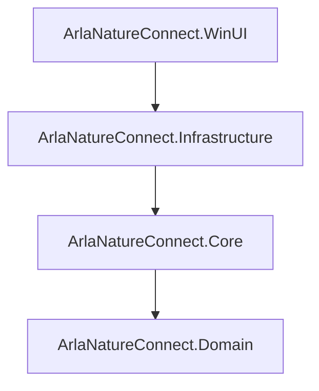

# Solution Dependency Graph

The following Mermaid diagram shows project-to-project references in this solution.

Notes:
- Arrows point from the referencing project to the referenced project.
- Put this file in `docs/` so it renders on GitHub with Mermaid support (if enabled) or use a Mermaid renderer when viewing locally.
