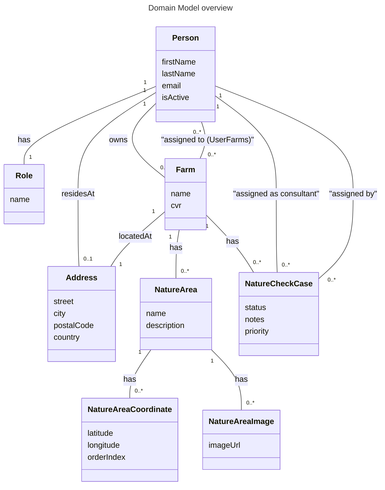

# Domain Model Overview

**Domain Concepts:**
- **Person** - A person in the system who can be a farmer, consultant, Arla employee, or administrator
- **Role** - A role that defines a person's function in the system (Farmer, Consultant, Employee, Administrator)
- **Address** - A physical address where a person resides or a farm is located
- **Farm** - A farm that can have Nature Check Cases assigned to it
- **NatureCheckCase** - An assignment of a Nature Check task to a consultant for a specific farm
- **NatureArea** - A nature area associated with a farm
- **NatureAreaCoordinate** - Geographic coordinates for a nature area
- **NatureAreaImage** - Images associated with a nature area

**Domain Relationships:**
- A Person has exactly one Role
- A Person may have one Address (where they reside)
- A Person can own zero or more Farms
- A Person can be assigned to zero or more Farms (via UserFarms)
- A Farm has exactly one Address (where it is located)
- A Farm can have zero or more Nature Areas
- A Farm can have zero or more Nature Check Cases
- A Person (consultant) can be assigned to zero or more Nature Check Cases
- A Person (Arla employee) can assign zero or more Nature Check Cases
- A Nature Area has zero or more Coordinates
- A Nature Area has zero or more Images