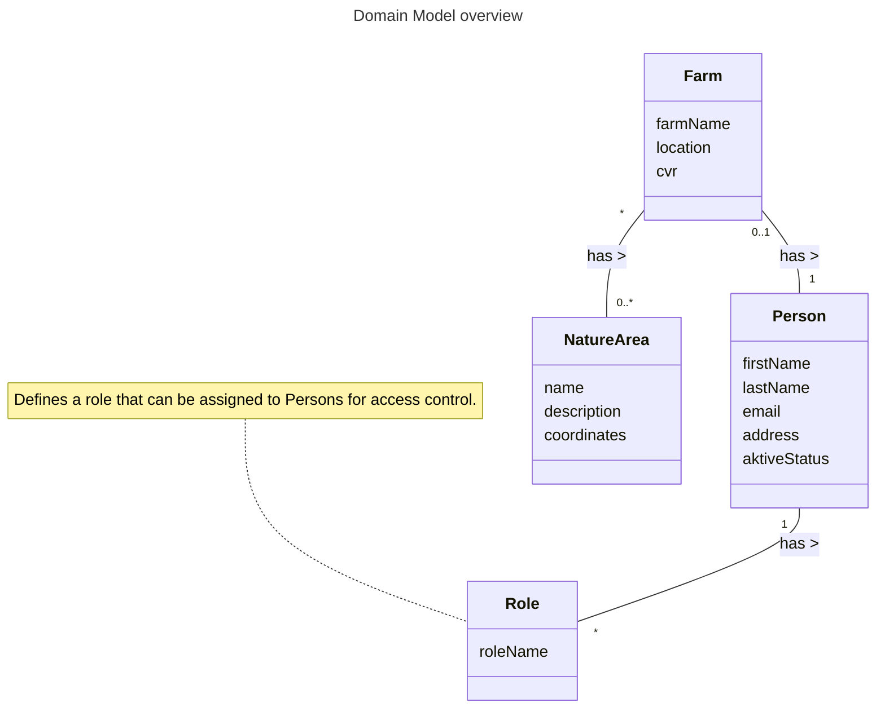

```mermaid
---
  title: "Domain Model overview"
---
classDiagram
  direction TB

  class Role {
    roleName
  }

  class Person {
    firstName
    lastName
    email
    address
    aktiveStatus
  }

  class Farm {
    farmName
    location
    cvr
  }

  class NatureArea {
    name
    description
    coordinates
  }

  note for Role "Defines a role that can be assigned to Persons for access control."

  Person "1" -- "*" Role : has >
  Farm "0..1" -- "1" Person : has >
  Farm "*" -- "0..*" NatureArea : has >
```