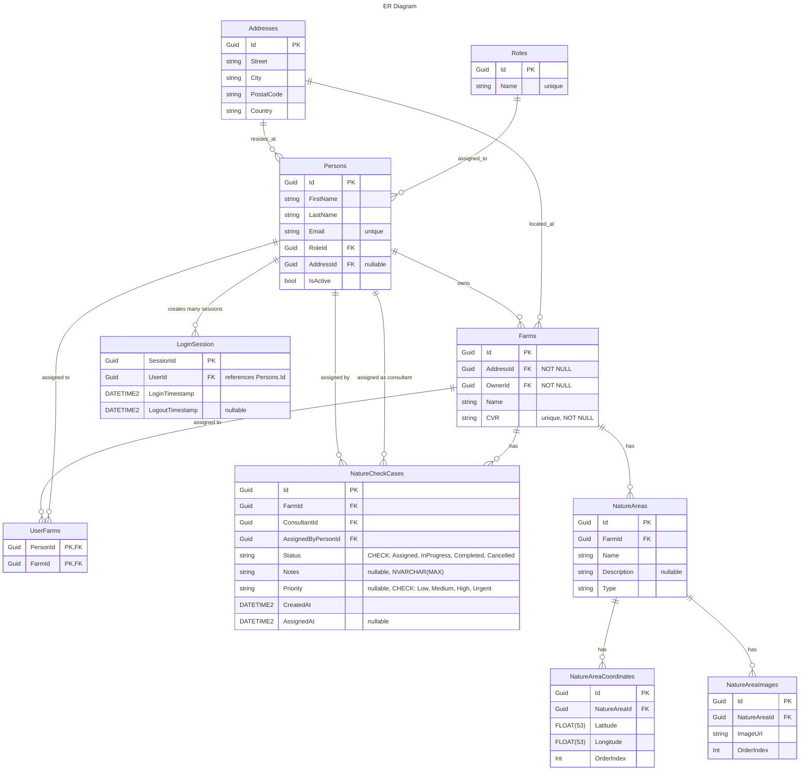

# ER - Entity Relationship Diagram

```mermaid
---
  title: "ER Diagram"
---
erDiagram

  Roles {
    Guid Id PK
    string Name "unique"
  }

  Addresses {
    Guid Id PK
    string Street
    string City
    string PostalCode
    string Country
  }

  Persons {
    Guid Id PK
    string FirstName
    string LastName
    string Email "unique"
    Guid RoleId FK
    Guid AddressId FK "nullable"
    bool IsActive
  }

  Farms {
    Guid Id PK
    Guid AddressId FK "NOT NULL"
    Guid OwnerId FK "NOT NULL"
    string Name
    string CVR "unique, NOT NULL"
  }

  UserFarms {
    Guid PersonId PK, FK
    Guid FarmId PK, FK
  }

  NatureCheckCases {
    Guid Id PK
    Guid FarmId FK
    Guid ConsultantId FK
    Guid AssignedByPersonId FK
    string Status "CHECK: Assigned, InProgress, Completed, Cancelled"
    string Notes "nullable, NVARCHAR(MAX)"
    string Priority "nullable, CHECK: Low, Medium, High, Urgent"
    DATETIME2 CreatedAt
    DATETIME2 AssignedAt "nullable"
  }

  NatureAreas {
    Guid Id PK
    Guid FarmId FK
    string Name
    string Description "nullable"
    string Type
  }

  NatureAreaCoordinates {
    Guid Id PK
    Guid NatureAreaId FK
    FLOAT(53) Latitude
    FLOAT(53) Longitude
    Int OrderIndex
  }

  NatureAreaImages {
    Guid Id PK
    Guid NatureAreaId FK
    string ImageUrl
    Int OrderIndex
  }

  LoginSession {
    Guid SessionId PK
    Guid UserId FK "references Persons.Id"
    DATETIME2 LoginTimestamp
    DATETIME2 LogoutTimestamp "nullable"
  }
  
  Roles ||--o{ Persons : assigned_to
  Addresses ||--o{ Persons : resides_at
  Addresses ||--o{ Farms : located_at
  Persons ||--o{ Farms : owns
  Persons ||--o{ UserFarms : "assigned to"
  Farms ||--o{ UserFarms : "assigned to"
  Farms ||--o{ NatureAreas : has
  Farms ||--o{ NatureCheckCases : has
  Persons ||--o{ NatureCheckCases : "assigned as consultant"
  Persons ||--o{ NatureCheckCases : "assigned by"
  Persons ||--o{ LoginSession : "creates many sessions"
  NatureAreas ||--o{ NatureAreaCoordinates : has
  NatureAreas ||--o{ NatureAreaImages : has
```