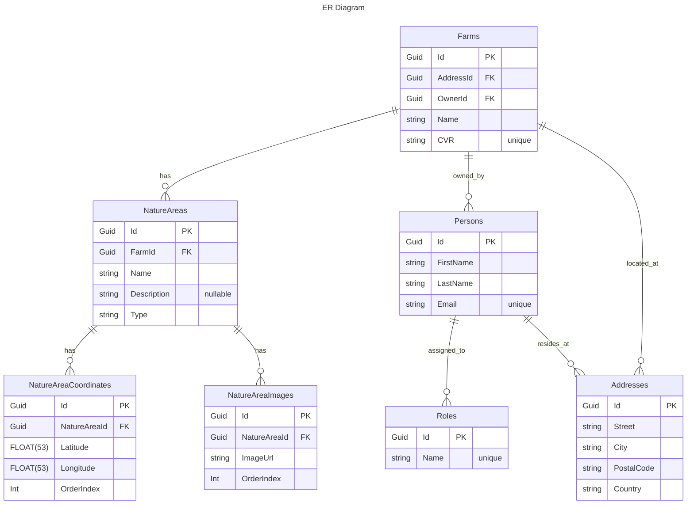

# ER - Entity Relationship Diagram

```mermaid
---
  title: "ER Diagram"
---
erDiagram

  Roles {
    Guid Id PK
    string Name "unique"
  }

  Addresses {
    Guid Id PK
    string Street
    string City
    string PostalCode
    string Country
  }

  Persons {
    Guid Id PK
    string FirstName
    string LastName
    string Email "unique"
  }

  Farms {
    Guid Id PK
    Guid AddressId FK
    Guid OwnerId FK
    string Name
    string CVR "unique"
  }

  NatureAreas {
    Guid Id PK
    Guid FarmId FK
    string Name
    string Description "nullable"
    string Type
  }

  NatureAreaCoordinates {
    Guid Id PK
    Guid NatureAreaId FK
    FLOAT(53) Latitude
    FLOAT(53) Longitude
    Int OrderIndex
  }

  NatureAreaImages {
    Guid Id PK
    Guid NatureAreaId FK
    string ImageUrl
    Int OrderIndex
  }
  
  Farms ||--o{ NatureAreas : has
  Farms ||--o{ Persons : owned_by
  Farms ||--o{ Addresses : located_at
  Persons ||--o{ Roles : assigned_to
  Persons ||--o{ Addresses : resides_at
  NatureAreas ||--o{ NatureAreaCoordinates : has
  NatureAreas ||--o{ NatureAreaImages : has
```