## UC001 – Design Class Diagram

This diagram shows the main components that collaborate when a user logs in and selects a role. It follows Larman's UML conventions with proper visibility notation, relationships, and namespace organization.

```mermaid
classDiagram
    direction TB
    %% === DCD – UC001: Login & Role Access ===

    %% === DOMAIN ENTITIES ===
    namespace ArlaNatureConnect.Domain.Entities {
        class Person {
            +Guid Id
            +Guid RoleId
            +Guid AddressId
            +string FirstName
            +string LastName
            +string Email
            +bool IsActive
            +Role Role
            +Address Address
        }

        class Role {
            +Guid Id
            +string Name
        }

        class Address {
            +Guid Id
            +string Street
            +string City
            +string PostalCode
            +string Country
        }
    }

    %% === VIEWMODELS (Application Layer) ===
    namespace ArlaNatureConnect.WinUI.ViewModels.Pages {
        class LoginPageViewModel {
            -INavigationHandler _navigationHandler
            +Role? SelectedRole
            +RelayCommand~string~ SelectRoleCommand
            -SelectRole(string? roleName) void
        }

        class FarmerPageViewModel {
            -INavigationHandler _navigationHandler
            +InitializeAsync(Role? role) Task
        }

        class ConsultantPageViewModel {
            -INavigationHandler _navigationHandler
            -INatureCheckCaseService? _natureCheckCaseService
            +Person? SelectedConsultant
            +string CurrentSection
            +ConsultantNatureCheckViewModel? NatureCheckViewModel
            +RelayCommand~object~ NavigationCommand
            +RelayCommand~Person~ ChooseUserCommand
            +InitializeAsync(Role? role) Task
        }

        class ArlaEmployeePageViewModel {
            -INavigationHandler _navigationHandler
            +ArlaEmployeeAssignNatureCheckViewModel AssignNatureCheckViewModel
            +RelayCommand~Person~ ChooseUserCommand
            +InitializeAsync(Role? role) Task
        }
    }

    namespace ArlaNatureConnect.WinUI.ViewModels.Controls.SideMenu {
        class FarmerPageSideMenuUCViewModel {
            -IStatusInfoServices _statusInfoServices
            -IAppMessageService _appMessageService
            -IPersonRepository _personRepository
            -INavigationHandler _navigationHandler
            +ObservableCollection~Person~ AvailablePersons
            +Person? SelectedPerson
            +bool IsLoading
            +ObservableCollection~NavItem~ NavItems
            +ICommand DashboardsCommand
            +ICommand NaturCheckCommand
            +ICommand TasksCommand
            +Task InitializeAsync()
        }

        class ConsultantPageSideMenuUCViewModel {
            -IStatusInfoServices _statusInfoServices
            -IAppMessageService _appMessageService
            -IPersonRepository _personRepository
            -INavigationHandler _navigationHandler
            +ObservableCollection~Person~ AvailablePersons
            +Person? SelectedPerson
            +bool IsLoading
            +Task InitializeAsync()
        }
    }

    namespace ArlaNatureConnect.WinUI.ViewModels.Abstracts {
        class SideMenuViewModelBase {
            <<abstract>>
            -IPersonRepository _repository
            -IStatusInfoServices _statusInfoServices
            -IAppMessageService _appMessageService
            -INavigationHandler _navigationHandler
            +ObservableCollection~Person~ AvailablePersons
            +Person? SelectedPerson
            +bool IsLoading
            +RelayCommand~object~? NavigationCommand
            +RelayCommand~object~? LogoutCommand
            +Task LoadAvailablePersonsAsync(string role)
        }

        class NavigationViewModelBase {
            <<abstract>>
            -INavigationHandler _navigationHandler
            +UserControl? CurrentContent
            +RelayCommand~Person~? ChooseUserCommand
            +Task InitializeAsync(Role? role)
        }
    }

    %% === SERVICES (Infrastructure Layer) ===
    namespace ArlaNatureConnect.WinUI.Services {
        class INavigationHandler {
            <<interface>>
            +Initialize(Frame frame) void
            +Navigate(Type pageType, object? parameter) void
            +GoBack() bool
            +CanGoBack : bool
        }

        class NavigationHandler {
            -Frame? _frame
            +Initialize(Frame frame) void
            +Navigate(Type pageType, object? parameter) void
            +GoBack() bool
            +CanGoBack : bool
        }
    }

    %% === REPOSITORIES (Domain/Infrastructure Layer) ===
    namespace ArlaNatureConnect.Core.Abstract {
        class IPersonRepository {
            <<interface>>
            +GetPersonsByRoleAsync(string role, CancellationToken) Task~IEnumerable~Person~~
            +GetAllAsync(CancellationToken) Task~IEnumerable~Person~~
        }

        class IRoleRepository {
            <<interface>>
            +GetAllAsync(CancellationToken) Task~IEnumerable~Role~~
        }
    }

    namespace ArlaNatureConnect.Core.Services {
        class IStatusInfoServices {
            <<interface>>
            +IDisposable BeginLoading()
        }

        class IAppMessageService {
            <<interface>>
            +void AddErrorMessage(string)
            +void AddInfoMessage(string)
        }
    }

    %% === RELATIONER ===
    %% Inheritance
    FarmerPageViewModel --|> NavigationViewModelBase : extends
    ConsultantPageViewModel --|> NavigationViewModelBase : extends
    ArlaEmployeePageViewModel --|> NavigationViewModelBase : extends
    LoginPageViewModel --|> NavigationViewModelBase : extends
    FarmerPageSideMenuUCViewModel --|> SideMenuViewModelBase : extends
    ConsultantPageSideMenuUCViewModel --|> SideMenuViewModelBase : extends

    %% Interface Implementation
    NavigationHandler ..|> INavigationHandler : implements

    %% ViewModels → Services
    LoginPageViewModel ..> INavigationHandler : uses
    FarmerPageViewModel ..> INavigationHandler : uses
    ConsultantPageViewModel ..> INavigationHandler : uses
    ArlaEmployeePageViewModel ..> INavigationHandler : uses
    FarmerPageSideMenuUCViewModel ..> INavigationHandler : uses
    ConsultantPageSideMenuUCViewModel ..> INavigationHandler : uses
    SideMenuViewModelBase ..> IStatusInfoServices : uses
    SideMenuViewModelBase ..> IAppMessageService : uses

    %% ViewModels → Repositories
    FarmerPageSideMenuUCViewModel ..> IPersonRepository : uses
    ConsultantPageSideMenuUCViewModel ..> IPersonRepository : uses
    SideMenuViewModelBase ..> IPersonRepository : uses

    %% ViewModels → Domain.Entities
    LoginPageViewModel --> Role : SelectedRole
    FarmerPageSideMenuUCViewModel --> Person : AvailablePersons
    FarmerPageSideMenuUCViewModel --> Person : SelectedPerson
    ConsultantPageSideMenuUCViewModel --> Person : AvailablePersons
    ConsultantPageSideMenuUCViewModel --> Person : SelectedPerson
    ConsultantPageViewModel --> Person : SelectedConsultant

    %% Page ViewModels → SideMenu ViewModels
    FarmerPageViewModel ..> FarmerPageSideMenuUCViewModel : includes
    ConsultantPageViewModel ..> ConsultantPageSideMenuUCViewModel : includes

    %% Repository manages Entities
    IPersonRepository --> Person : manages
    IRoleRepository --> Role : manages

    %% Domain Entity Relationships (Navigation Properties)
    Person --> Role : Role
    Person --> Address : Address

    %% Domain relations
    Person "1" --o "1" Role : has
    Person "1" --o "0..1" Address : residesAt
```

