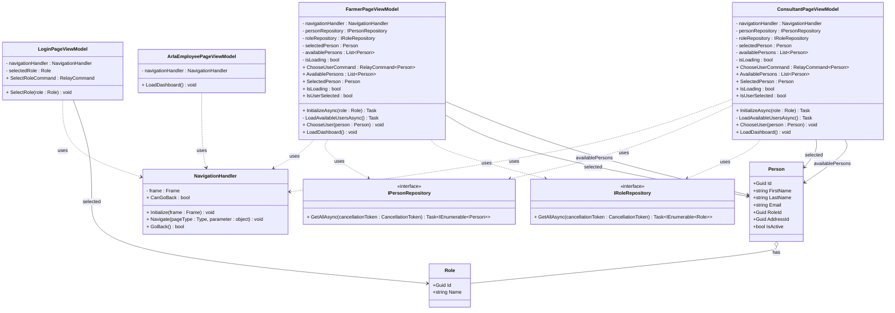

```mermaid
classDiagram
    direction TB
    %% === DCD – UC01: Login & Role Access ===

    %% === DOMAIN ENTITIES ===
    class Person {
        +Guid Id
        +string FirstName
        +string LastName
        +string Email
        +Guid RoleId
        +Guid AddressId
        +bool IsActive
    }

    class Role {
        +Guid Id
        +string Name
    }

    %% === VIEWMODELS (Application Layer) ===
    class LoginPageViewModel {
        - navigationHandler : NavigationHandler
        - selectedRole : Role
        + SelectRoleCommand : RelayCommand
        + SelectRole(role : Role) void
    }

    class FarmerPageViewModel {
        - navigationHandler : NavigationHandler
        - personRepository : IPersonRepository
        - roleRepository : IRoleRepository
        - selectedPerson : Person
        - availablePersons : List~Person~
        - isLoading : bool
        + ChooseUserCommand : RelayCommand~Person~
        + AvailablePersons : List~Person~
        + SelectedPerson : Person
        + IsLoading : bool
        + IsUserSelected : bool
        + InitializeAsync(role : Role) Task
        - LoadAvailableUsersAsync() Task
        + ChooseUser(person : Person) void
        + LoadDashboard() void
    }

    class ConsultantPageViewModel {
        - navigationHandler : NavigationHandler
        - personRepository : IPersonRepository
        - roleRepository : IRoleRepository
        - selectedPerson : Person
        - availablePersons : List~Person~
        - isLoading : bool
        + ChooseUserCommand : RelayCommand~Person~
        + AvailablePersons : List~Person~
        + SelectedPerson : Person
        + IsLoading : bool
        + IsUserSelected : bool
        + InitializeAsync(role : Role) Task
        - LoadAvailableUsersAsync() Task
        + ChooseUser(person : Person) void
        + LoadDashboard() void
    }

    class ArlaEmployeePageViewModel {
        - navigationHandler : NavigationHandler
        + LoadDashboard() void
    }

    %% === SERVICES (Infrastructure Layer) ===
    class NavigationHandler {
        - frame : Frame
        + Initialize(frame : Frame) void
        + Navigate(pageType : Type, parameter : object) void
        + GoBack() bool
        + CanGoBack : bool
    }

    %% === REPOSITORIES (Domain/Infrastructure Layer) ===
    class IPersonRepository {
        <<interface>>
        + GetAllAsync(cancellationToken : CancellationToken) Task~IEnumerable~Person~~
    }

    class IRoleRepository {
        <<interface>>
        + GetAllAsync(cancellationToken : CancellationToken) Task~IEnumerable~Role~~
    }

    %% === RELATIONER ===
    %% ViewModels → Services
    LoginPageViewModel ..> NavigationHandler : uses
    FarmerPageViewModel ..> NavigationHandler : uses
    ConsultantPageViewModel ..> NavigationHandler : uses
    ArlaEmployeePageViewModel ..> NavigationHandler : uses

    %% ViewModels → Repositories
    FarmerPageViewModel ..> IPersonRepository : uses
    FarmerPageViewModel ..> IRoleRepository : uses
    ConsultantPageViewModel ..> IPersonRepository : uses
    ConsultantPageViewModel ..> IRoleRepository : uses

    %% ViewModels → Domain.Entities
    LoginPageViewModel --> Role : selected
    FarmerPageViewModel --> Person : selected
    FarmerPageViewModel --> Person : availablePersons
    ConsultantPageViewModel --> Person : selected
    ConsultantPageViewModel --> Person : availablePersons

    %% Domain relations
    Person o-- Role : has
```
