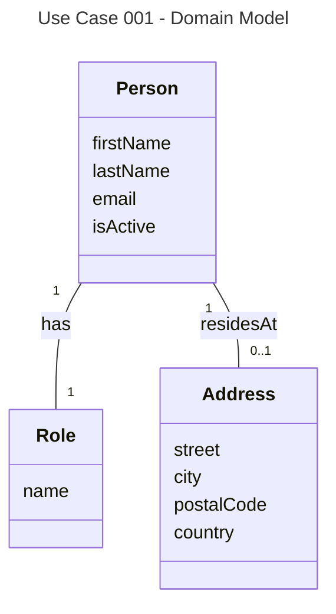

# UC001 Domain Model

**Domain Concepts:**
- **Person** - A person in the system who can be a farmer, consultant, Arla employee, or administrator
- **Role** - A role that defines a person's function in the system (Farmer, Consultant, Employee, Administrator)
- **Address** - A physical address where a person resides

**Domain Relationships:**
- A Person has exactly one Role
- A Person may have one Address (where they reside)

**Business Rules:**
- A Person must have a Role
- A Person's Role determines which pages and functionality they can access
- A Person's Address is optional (nullable)
- IsActive indicates whether a Person account is currently active in the system
