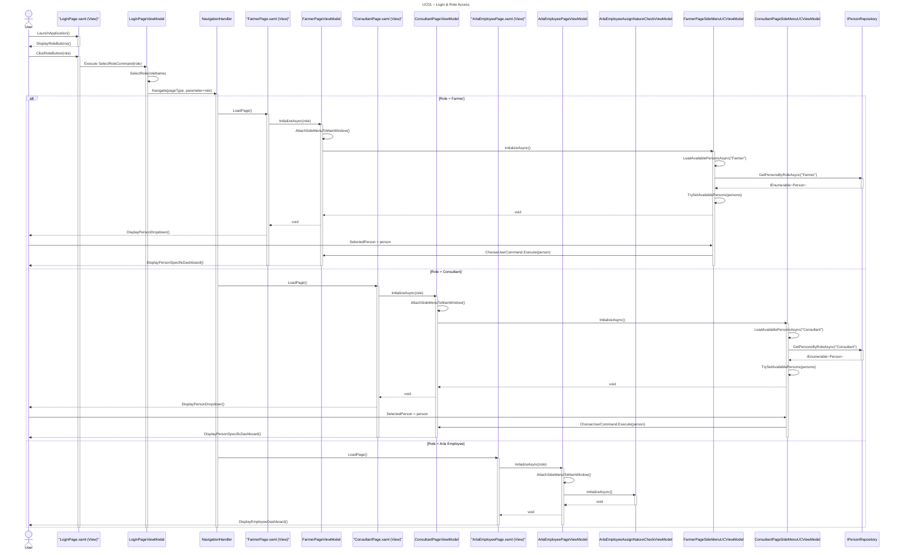

```mermaid
sequenceDiagram
    title UC01 – Login & Role Access

    actor User
    participant LoginPage as "LoginPage.xaml (View)"
    participant LoginPageViewModel
    participant NavigationHandler
    participant FarmerPage as "FarmerPage.xaml (View)"
    participant FarmerPageViewModel
    participant ConsultantPage as "ConsultantPage.xaml (View)"
    participant ConsultantPageViewModel
    participant ArlaEmployeePage as "ArlaEmployeePage.xaml (View)"
    participant ArlaEmployeePageViewModel
    participant ArlaEmployeeAssignNatureCheckViewModel
    participant FarmerPageSideMenuUCViewModel
    participant ConsultantPageSideMenuUCViewModel
    participant IPersonRepository

    %% Step 1: Launch
    User ->> LoginPage: LaunchApplication()
    activate LoginPage
    LoginPage -->> User: DisplayRoleButtons()
    deactivate LoginPage

    %% Step 2: Role selection
    User ->> LoginPage: ClickRoleButton(role)
    activate LoginPage
    LoginPage ->> LoginPageViewModel: Execute SelectRoleCommand(role)
    activate LoginPageViewModel
    LoginPageViewModel ->> LoginPageViewModel: SelectRole(roleName)
    LoginPageViewModel ->> NavigationHandler: Navigate(pageType, parameter=role)
    activate NavigationHandler

    %% Step 3: Navigation based on role
    alt Role = Farmer
        NavigationHandler ->> FarmerPage: LoadPage()
        activate FarmerPage
        FarmerPage ->> FarmerPageViewModel: InitializeAsync(role)
        activate FarmerPageViewModel
        FarmerPageViewModel ->> FarmerPageViewModel: AttachSideMenuToMainWindow()
        FarmerPageViewModel ->> FarmerPageSideMenuUCViewModel: InitializeAsync()
        activate FarmerPageSideMenuUCViewModel
        FarmerPageSideMenuUCViewModel ->> FarmerPageSideMenuUCViewModel: LoadAvailablePersonsAsync("Farmer")
        FarmerPageSideMenuUCViewModel ->> IPersonRepository: GetPersonsByRoleAsync("Farmer")
        activate IPersonRepository
        IPersonRepository -->> FarmerPageSideMenuUCViewModel: IEnumerable~Person~
        deactivate IPersonRepository
        FarmerPageSideMenuUCViewModel ->> FarmerPageSideMenuUCViewModel: TrySetAvailablePersons(persons)
        FarmerPageSideMenuUCViewModel -->> FarmerPageViewModel: void
        FarmerPageViewModel -->> FarmerPage: void
        FarmerPage -->> User: DisplayPersonDropdown()
        User ->> FarmerPageSideMenuUCViewModel: SelectedPerson = person
        FarmerPageSideMenuUCViewModel ->> FarmerPageViewModel: ChooseUserCommand.Execute(person)
        FarmerPageViewModel -->> User: DisplayPersonSpecificDashboard()
        deactivate FarmerPageSideMenuUCViewModel
        deactivate FarmerPageViewModel
        deactivate FarmerPage
    else Role = Consultant
        NavigationHandler ->> ConsultantPage: LoadPage()
        activate ConsultantPage
        ConsultantPage ->> ConsultantPageViewModel: InitializeAsync(role)
        activate ConsultantPageViewModel
        ConsultantPageViewModel ->> ConsultantPageViewModel: AttachSideMenuToMainWindow()
        ConsultantPageViewModel ->> ConsultantPageSideMenuUCViewModel: InitializeAsync()
        activate ConsultantPageSideMenuUCViewModel
        ConsultantPageSideMenuUCViewModel ->> ConsultantPageSideMenuUCViewModel: LoadAvailablePersonsAsync("Consultant")
        ConsultantPageSideMenuUCViewModel ->> IPersonRepository: GetPersonsByRoleAsync("Consultant")
        activate IPersonRepository
        IPersonRepository -->> ConsultantPageSideMenuUCViewModel: IEnumerable~Person~
        deactivate IPersonRepository
        ConsultantPageSideMenuUCViewModel ->> ConsultantPageSideMenuUCViewModel: TrySetAvailablePersons(persons)
        ConsultantPageSideMenuUCViewModel -->> ConsultantPageViewModel: void
        ConsultantPageViewModel -->> ConsultantPage: void
        ConsultantPage -->> User: DisplayPersonDropdown()
        User ->> ConsultantPageSideMenuUCViewModel: SelectedPerson = person
        ConsultantPageSideMenuUCViewModel ->> ConsultantPageViewModel: ChooseUserCommand.Execute(person)
        ConsultantPageViewModel -->> User: DisplayPersonSpecificDashboard()
        deactivate ConsultantPageSideMenuUCViewModel
        deactivate ConsultantPageViewModel
        deactivate ConsultantPage
    else Role = Arla Employee
        NavigationHandler ->> ArlaEmployeePage: LoadPage()
        activate ArlaEmployeePage
        ArlaEmployeePage ->> ArlaEmployeePageViewModel: InitializeAsync(role)
        activate ArlaEmployeePageViewModel
        ArlaEmployeePageViewModel ->> ArlaEmployeePageViewModel: AttachSideMenuToMainWindow()
        ArlaEmployeePageViewModel ->> ArlaEmployeeAssignNatureCheckViewModel: InitializeAsync()
        activate ArlaEmployeeAssignNatureCheckViewModel
        ArlaEmployeeAssignNatureCheckViewModel -->> ArlaEmployeePageViewModel: void
        deactivate ArlaEmployeeAssignNatureCheckViewModel
        ArlaEmployeePageViewModel -->> ArlaEmployeePage: void
        ArlaEmployeePage -->> User: DisplayEmployeeDashboard()
        deactivate ArlaEmployeePageViewModel
        deactivate ArlaEmployeePage
    end

    deactivate NavigationHandler
    deactivate LoginPageViewModel
    deactivate LoginPage
```
