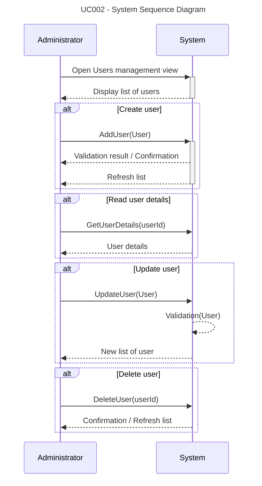
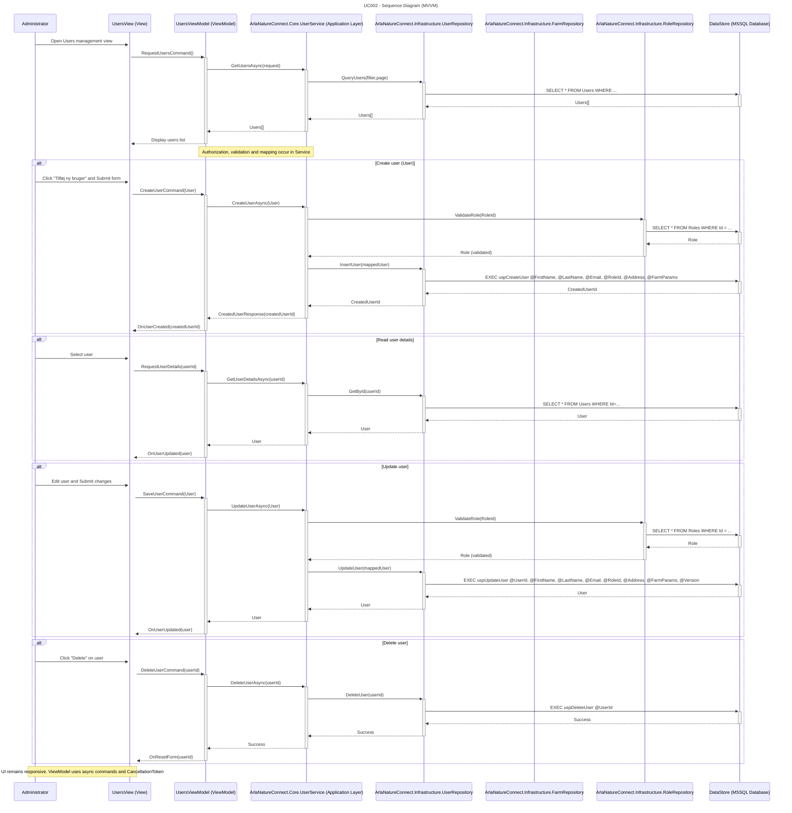
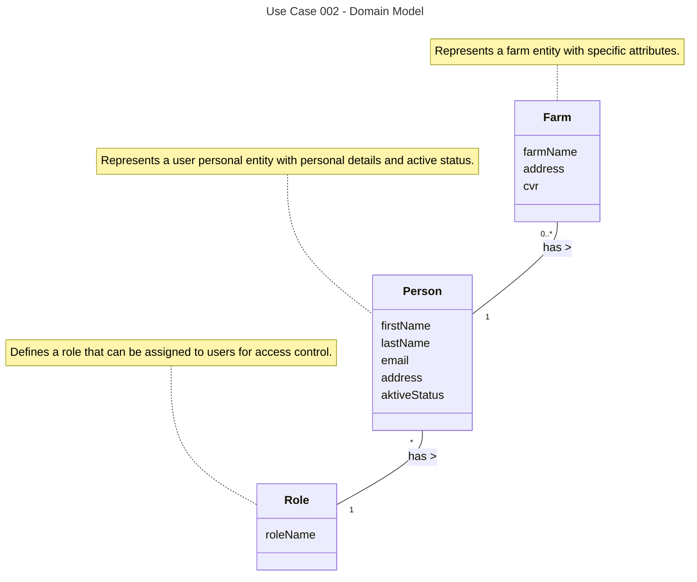
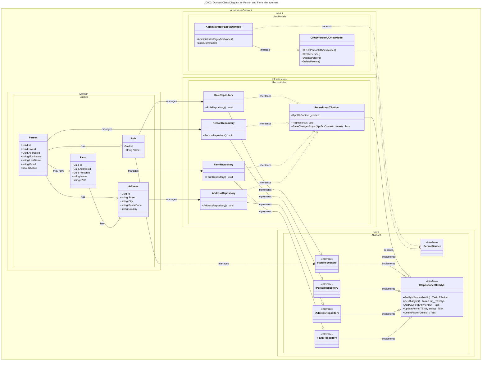
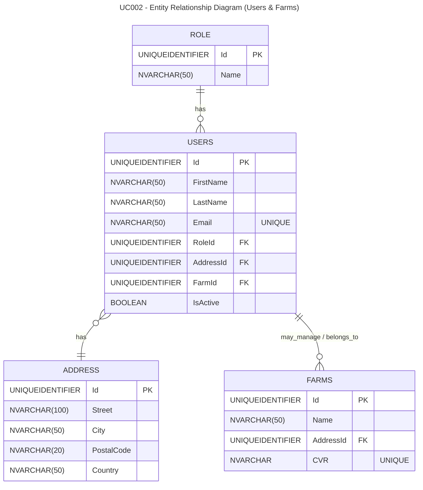

# Use Case 002 - Administrate Farms and Users

## Table of Contents
- [User Story](#user-story)
- [User Case Brief](#user-case-brief)
  - [Use Case Metadata](#use-case-metadata)
  - [Preconditions](#preconditions)
  - [Postconditions](#postconditions)
  - [Primary success scenario (happy path)](#primary-success-scenario-happy-path)
    - [Option: Create](#option-create)
    - [Option: Read](#option-read)
    - [Option: Update](#option-update)
    - [Option: Delete](#option-delete)
  - [Security & Permissions](#security--permissions)
  - [Non-functional requirements](#non-functional-requirements)
- [SSD - System Sequence Diagram](#ssd---system-sequence-diagram)
- [OC - Operations Contracts](#oc---operations-contracts)
  - [OC000-Navigate To Manage Users](#oc000-navigate-to-manage-users)
  - [OC001-AddUser](#oc001-adduser)
  - [OC002-Select User](#oc002-select-user)
  - [OC003-Edit User](#oc003-edit-user)
  - [OC004-Delete User](#oc004-delete-user)
  - [OC005-Navigate To Home](#oc005-navigate-to-home)
- [Sequence Diagram](#sequence-diagram)
- [Domain Model](#domain-model)
  - [Domain Model Metadata](#domain-model-metadata)
  - [Class Descriptions](#class-descriptions)
  - [Relationships](#relationships)
  - [Notes](#notes)
- [DCD](#dcd)
- [ERD](#erd)

---

## User Story
As a Admin,  
I want to be able to manage user and farmer information,  
so that I can keep my profile up to date and ensure accurate data is available for system operations.

---

## User Case Brief
Administrator can create, view, update and delete user accounts.
This use case assumes the administrator is already authenticated and has appropriate permissions.

Metadata:
- ID: UC-002-B
- Primary actor: Administrator
- Stakeholders: System administrators, farm managers
- Scope: Web / WinUI application
- Level: User goal
- Cross references:
  - See the User Story above: [User Story](#user-story)
  - See the Domain Model below: [UC-002-DM](#domain-model)

### Preconditions
  - The Administrator is authenticated and authorized (already logged in).
  - Administrator is on the administration screen (Users management section)

### Postconditions
  - Changes to user records are persisted to the data store.
  - Audit trail / logs record administration actions (if enabled).

### Primary success scenario (happy path)
1. Administrator opens the Users management view.
2. System displays existing users.

At this point the Administrator chooses one of the following actions (each is an alternative option):

#### Option: Create
3. Administrator chooses role for the new user (e.g., Farmer, Consultant, Admin).
4. If role requires additional data (farmName, location, cvr), system prompts for that information.
5. Administrator enters required fields (firstName, lastName, email and address) and saves.
6. System validates input, creates the user, and updates the list.

#### Option: Read
7. Administrator selects a user from the list.
8. System displays user details.

#### Option: Update
9. Administrator selects a user and chooses "Edit".
10. Administrator modifies fields (role, email, enabled/disabled) and saves.
11. System validates changes, persists them, and refreshes the list.

#### Option: Delete
12. Administrator selects a user and chooses "Delete".
13. System asks for confirmation.
14. Administrator confirms deletion.
15. System removes user (or marks as deleted/disabled) and updates the list.

### Security & Permissions
- Only users with the Administrator role may access this use case.
- Actions must be audited and validated server-side.
- Sensitive fields (password) must be handled securely (hashed, not returned in clear text).

### Non-functional requirements
- Response time for CRUD operations: <500 ms under normal load.
- Concurrency: Changes must be applied safely; optimistic concurrency recommended.

---

## SSD - System Sequence Diagram

---

## OC - Operations Contracts

### OC000-Navigate To Manage Users

**Operation**: NavigateToManageUsers()

**Cross References**: SSD - System Sequence Diagram (Admin->>System: Open Users management view), UC-002-B (steps1–2)

**Preconditions**:
- Administrator is logged in and has `Administrator` privileges.
- Main navigation is available.

**Postconditions**:
- The user administration view is active.
- A list of existing users is loaded and displayed.
- The UI is ready for the following alternative actions: Create / Select / Edit / Delete.

### OC001-AddUser

**Operation**: AddNewUser(NewUserDto user, CredentialsDto? credentials)

**Cross References**: SSD - System Sequence Diagram (Admin->>System: AddUser(User)), UC-002-B (Create flow)

**Preconditions**:
- Administrator is logged in and authorized.
- The UI is in "New User" state (form visible).
- Required fields in `NewUserDto` are filled (e.g., FirstName, LastName, Email, Role).
- If Role == Farmer and farm data is required, `FarmDto` is provided.

**Postconditions**:
- A new `UserAggregate` is persisted to the data store.
- Credentials (if provided) are hashed and stored securely.
- The user list is updated in the UI.
- An audit log entry is created with actor and timestamp.

**Validation**:
- Email format and unique constraints (Email/Username) are enforced.
- Password policy is validated for provided credentials.

**Error handling**:
- `ValidationException` for invalid input.
- `ConflictException` for duplicate Email/Username/CVR.
- `UnauthorizedAccessException` if lacking permissions.

### OC002-Select User

**Operation**: SelectUser(Guid userId)

**Cross References**: SSD - System Sequence Diagram (Admin->>System: GetUserDetails), UC-002-B (Read flow)

**Preconditions**:
- The user list is loaded in the UI.
- `userId` exists in the data store and is not archived (or otherwise available for viewing).
- No unsaved local changes block selection (or the user accepts discarding them).

**Postconditions**:
- Details for the selected `UserAggregate` are returned to the UI and displayed in a form/panel.
- The UI enters view or edit mode depending on context.

**Error handling**:
- `NotFoundException` if the userId does not exist.
- `UnauthorizedAccessException` if the call is not authorized.

### OC003-Edit User

**Operation**: SaveUser(Guid userId, UserUpdateDto changes, int? expectedVersion = null)

**Cross References**: SSD - System Sequence Diagram (Admin->>System: UpdateUser), UC-002-B (Update flow)

**Preconditions**:
- An existing user is selected for editing (`userId`).
- Input fields in `UserUpdateDto` meet validation rules.
- If email or username changes, they remain unique or are otherwise permitted.

**Postconditions**:
- Changes are persisted to the data store (optimistic concurrency applied when `expectedVersion` is provided).
- The user list and any displayed details are refreshed.
- An audit log entry is created with change details, actor and timestamp.

**Validation**:
- Email format, field lengths and business rules are validated on the service layer.

**Error handling**:
- `ValidationException` for invalid input.
- `ConflictException` for version conflicts or unique constraint violations.
- `NotFoundException` if the userId was removed between read and write.

### OC004-Delete User

**Operation**: DeleteUser(Guid userId, bool force = false)

**Cross References**: SSD - System Sequence Diagram (Admin->>System: DeleteUser), UC-002-B (Delete flow)

**Preconditions**:
- `userId` exists.
- Administrator is authorized to delete users.
- The UI has confirmed the action (confirmation dialog completed with "OK").
- System permissions for deletion or soft-delete are satisfied (e.g., no critical dependency without force).

**Postconditions**:
- User is marked inactive or removed (depending on policy).
- The user list is updated in the UI.
- An audit log entry is created with actor and reason.

**Error handling**:
- `ConflictException` if the user cannot be deleted due to dependencies.
- `NotFoundException` if the `userId` does not exist.
- `UnauthorizedAccessException` if lacking permissions.

### OC005-Navigate To Home

**Operation**: NavigateToHome()

**Cross References**: SSD - System Sequence Diagram (recent UX flow or return navigation), UC-002-B (closing flow)

**Preconditions**:
- The user administration view is active.
- No unresolved critical changes exist (or the user has accepted discarding them).

**Postconditions**:
- The home view is displayed.
- Temporary edit state is ended and any temporary data is discarded.

### Notes (WinUI in-process)
- The operations are intended to be exposed via an in-process service interface (`IUserService`) and invoked via DI in view models.
- The service layer must enforce authorization, validation, auditing and exception handling — the UI must not assume these are performed.
- Errors are communicated through well-defined exceptions that are caught in view models and presented to the user in a friendly manner.
- Use asynchronous methods (`Task`/`async`) and `CancellationToken` to keep the UI responsive.

---

## Sequence Diagram
Metadata:
- ID: UC-002-SD
- Cross references:
  - See the User Story above: [User Story](#user-story)
  - See the User Case Brief above: [UC-002-B](#user-case-brief)

### Sequence Diagram

---

## Domain Model

### Domain Model Metadata
- ID: UC-002-DM
- Cross references:
  - See the User Story above: [User Story](#user-story)
  - See the User Case Brief above: [UC-002-B](#user-case-brief)

### Domain Model Diagram

   
### Class Descriptions
- **Person**: Represents a user personal entity with attributes such as first name, last name, email, address, and active status.
- **User**: Inherits from Person and represents a system user who can have multiple roles.
- **Role**: Defines a role that can be assigned to users for access control,
with an attribute for the role name.
- **Farmer**: Inherits from User and represents a farmer with additional attributes such as farm name, location, and CVR number.
### Relationships
- A **User** can have multiple **Roles**, establishing a many-to-many relationship.
- A **Farmer** is a specialized type of **User**, indicating that every farmer
is also a user, but not every user is a farmer.

### Notes
- This domain model captures the essential entities and their relationships
required for managing users and farmers within the system.
- Additional attributes and methods can be added to each class as needed
to support further functionalities.

## DCD
Metadata:
- ID: UC-002-DCD

### Domain Class Diagram
  

---

## ERD

