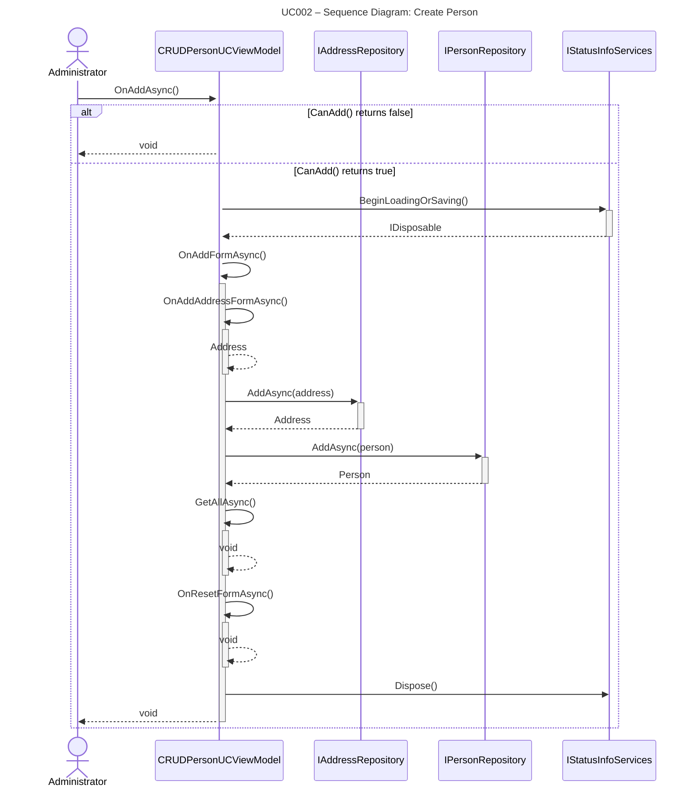
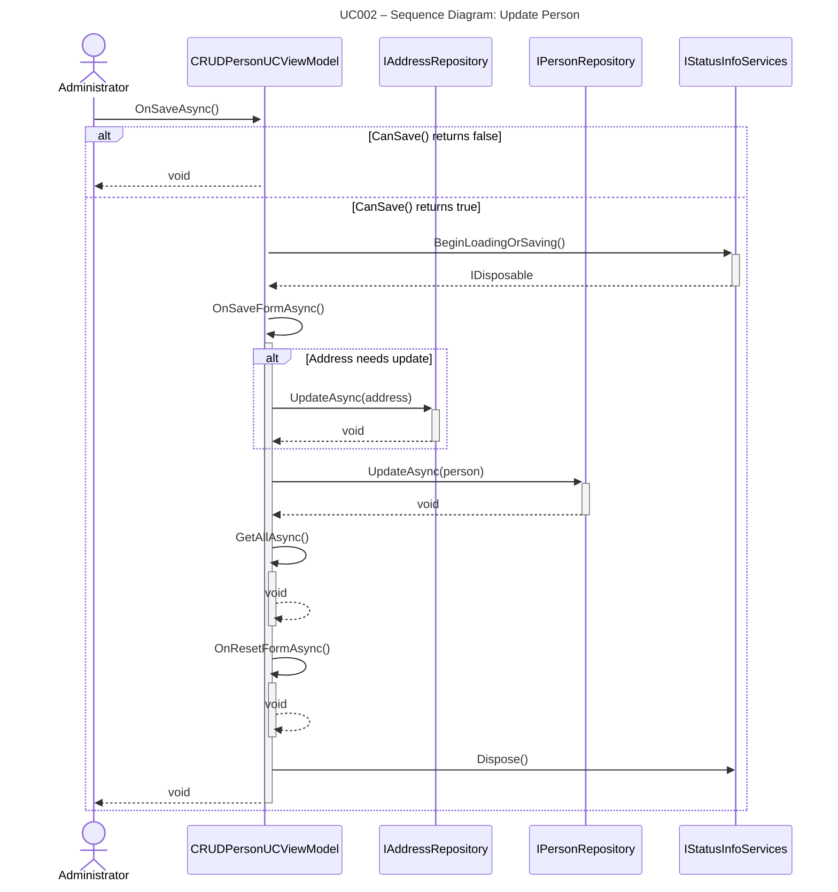
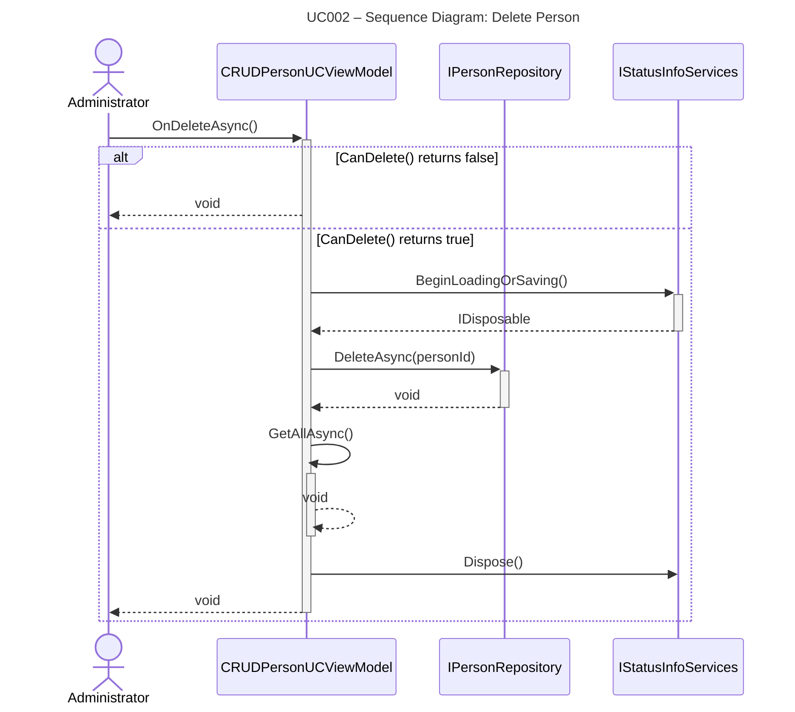
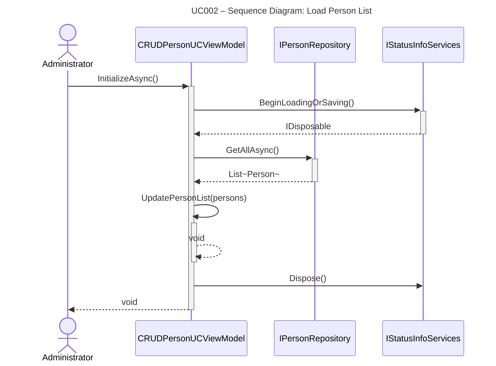

## UC002 – Sequence Diagram: Create Person (v2)

This sequence diagram shows the detailed interaction flow when an Administrator creates a new Person, following Larmann's UML conventions.

**Notes:**
- All method calls use PascalCase (C# convention).
- All calls have return arrows (including void methods).
- Activation bars show object lifetime using automatic activation/deactivation (+/-).
- ViewModel calls repositories directly (no service layer in UC002).
- Address is created and saved before Person (due to foreign key relationship).

---

## UC002 – Sequence Diagram: Update Person (v2)

This sequence diagram shows the detailed interaction flow when an Administrator updates an existing Person, following Larmann's UML conventions.

**Notes:**
- All method calls use PascalCase (C# convention).
- All calls have return arrows (including void methods).
- Activation bars show object lifetime using automatic activation/deactivation (+/-).

---

## UC002 – Sequence Diagram: Delete Person (v2)

This sequence diagram shows the detailed interaction flow when an Administrator deletes a Person, following Larmann's UML conventions.

**Notes:**
- All method calls use PascalCase (C# convention).
- All calls have return arrows (including void methods).
- Activation bars show object lifetime using automatic activation/deactivation (+/-).

---

## UC002 – Sequence Diagram: Load Person List (v2)

This sequence diagram shows the detailed interaction flow when an Administrator loads the list of persons, following Larmann's UML conventions.

**Notes:**
- All method calls use PascalCase (C# convention).
- All calls have return arrows (including void methods).
- Activation bars show object lifetime using automatic activation/deactivation (+/-).
- This is a read-only operation - no data is modified.

