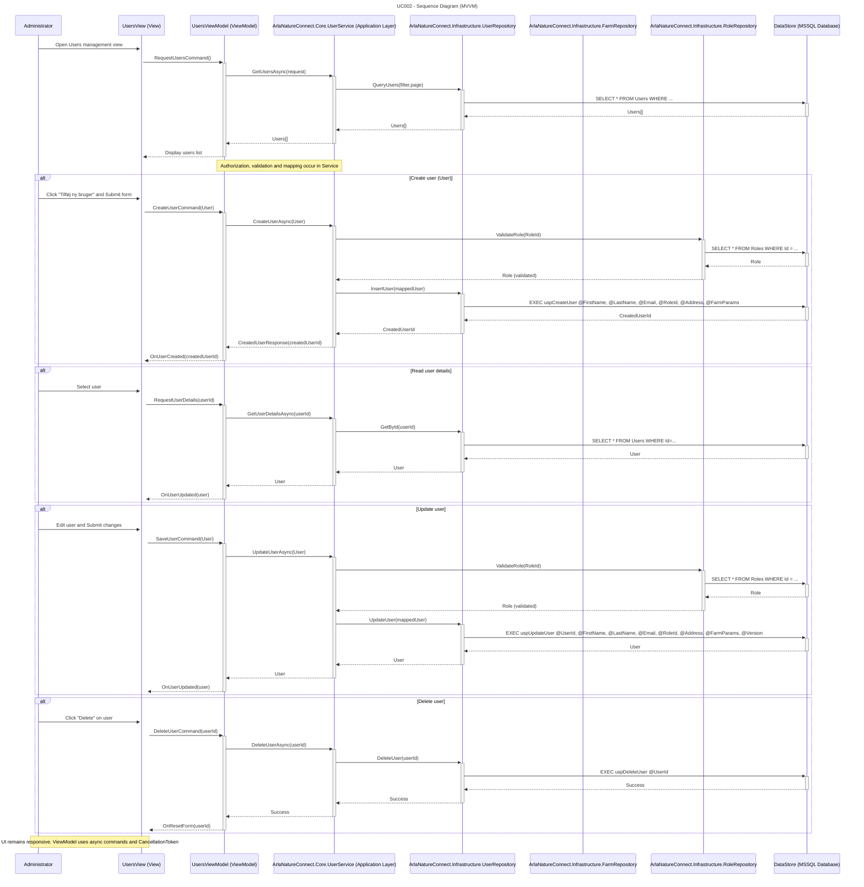

```mermaid
---
title: UC002 - Sequence Diagram (MVVM)
---
sequenceDiagram
    participant Admin as Administrator
    participant View as UsersView (View)
    participant VM as UsersViewModel (ViewModel)
    participant Service as ArlaNatureConnect.Core.UserService (Application Layer)
    participant UserRepo as ArlaNatureConnect.Infrastructure.UserRepository
    participant FarmRepo as ArlaNatureConnect.Infrastructure.FarmRepository
    participant RoleRepo as ArlaNatureConnect.Infrastructure.RoleRepository
    participant Store as DataStore (MSSQL Database)

    %% Main flow: Open list
    Admin->>+View: Open Users management view
    View->>+VM: RequestUsersCommand()
    VM->>+Service: GetUsersAsync(request)
    Service->>+UserRepo: QueryUsers(filter,page)
    UserRepo->>+Store: SELECT * FROM Users WHERE ...
    Store-->>-UserRepo: Users[]
    UserRepo-->>-Service: Users[]
    Service-->>-VM: Users[]
    VM-->>-View: Display users list

    note over VM,Service: Authorization, validation and mapping occur in Service

    alt Create user (User)
    Admin->>+View: Click "Tilføj ny bruger" and Submit form
    View->>+VM: CreateUserCommand(User)
    VM->>+Service: CreateUserAsync(User)
    Service->>+RoleRepo: ValidateRole(RoleId)
    RoleRepo->>+Store: SELECT * FROM Roles WHERE Id = ...
    Store-->>-RoleRepo: Role
    RoleRepo-->>-Service: Role (validated)
    Service->>+UserRepo: InsertUser(mappedUser)
    UserRepo->>+Store: EXEC uspCreateUser @FirstName, @LastName, @Email, @RoleId, @Address, @FarmParams
    Store-->>-UserRepo: CreatedUserId
    UserRepo-->>-Service: CreatedUserId
    Service-->>-VM: CreatedUserResponse(createdUserId)
    VM-->>-View: OnUserCreated(createdUserId)
    end

    alt Read user details
    Admin->>+View: Select user
    View->>+VM: RequestUserDetails(userId)
    VM->>+Service: GetUserDetailsAsync(userId)
    Service->>+UserRepo: GetById(userId)
    UserRepo->>+Store: SELECT * FROM Users WHERE Id=...
    Store-->>-UserRepo: User
    UserRepo-->>-Service: User
    Service-->>-VM: User
    VM-->>-View: OnUserUpdated(user)
    end

    alt Update user
    Admin->>+View: Edit user and Submit changes
    View->>+VM: SaveUserCommand(User)
    VM->>+Service: UpdateUserAsync(User)
    Service->>+RoleRepo: ValidateRole(RoleId)
    RoleRepo->>+Store: SELECT * FROM Roles WHERE Id = ...
    Store-->>-RoleRepo: Role
    RoleRepo-->>-Service: Role (validated)
    Service->>+UserRepo: UpdateUser(mappedUser)
    UserRepo->>+Store: EXEC uspUpdateUser @UserId, @FirstName, @LastName, @Email, @RoleId, @Address, @FarmParams, @Version
    Store-->>-UserRepo: User
    UserRepo-->>-Service: User
    Service-->>-VM: User
    VM-->>-View: OnUserUpdated(user)
    end

    alt Delete user
    Admin->>+View: Click "Delete" on user
    View->>+VM: DeleteUserCommand(userId)
    VM->>+Service: DeleteUserAsync(userId)
    Service->>+UserRepo: DeleteUser(userId)
    UserRepo->>+Store: EXEC uspDeleteUser @UserId
    Store-->>-UserRepo: Success
    UserRepo-->>-Service: Success
    Service-->>-VM: Success
    VM-->>-View: OnResetForm(userId)
    end

    note over Admin,View: UI remains responsive. ViewModel uses async commands and CancellationToken
```