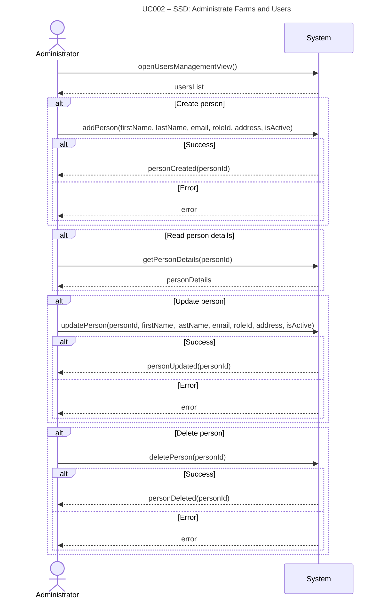

# UC002-SSD – Administrate Farms and Users (v2)

System Sequence Diagram showing the interaction between the Administrator actor and the System, following Larmann's UML conventions.

**Notes:**
- This SSD shows the high-level interaction for managing persons (users).
- All internal operations (validation, repository calls, etc.) are hidden within the system boundary.
- Method names use camelCase following Larmann's conventions.
- Parameters are shown in parentheses.
- Return values are generic (e.g., "error", "personCreated").
