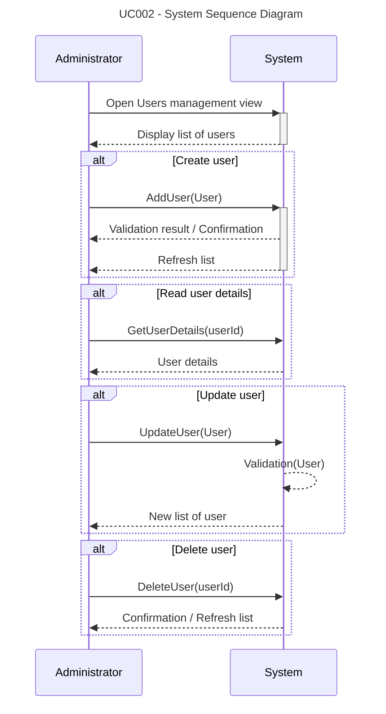

# UC002-SSD – Administrate Farms and Users (Original)

This is the original System Sequence Diagram before updating to match Larmann's UML conventions.

**Note:** This is the original diagram. See UC002-SSD-v2.md for the updated version that follows Larmann's UML conventions.
