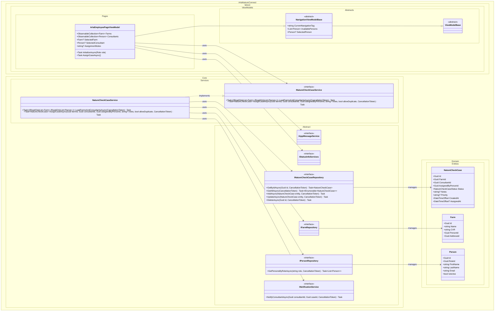

## UC002B – High-Level Design Class Diagram

This draft shows the main components that will collaborate when an Arla employee assigns a Nature Check Case to a consultant. It focuses on responsibilities and relationships only; properties/methods will be refined when the detailed design solidifies.

**Noter**
- `ArlaEmployeePageViewModel` arver fra `NavigationViewModelBase` og står for UI-flowet: vise gårde/konsulenter og udløse `AssignCaseAsync`.
- `INatureCheckCaseService` og `NatureCheckCaseService` orkestrerer brugssagen og kalder repositories og notifikationsservice.
- Repositories er holdt abstrakte i `ArlaNatureConnect.Core.Abstract` for at matche nuværende arkitektur (EF Core implementationen tilføjes i Infrastructure).
- `IAppMessageService` og `IStatusInfoServices` er eksisterende Core services for feedback og status.
- `INotificationService` repræsenterer en planlagt infrastrukturtjeneste for notifikationer.
