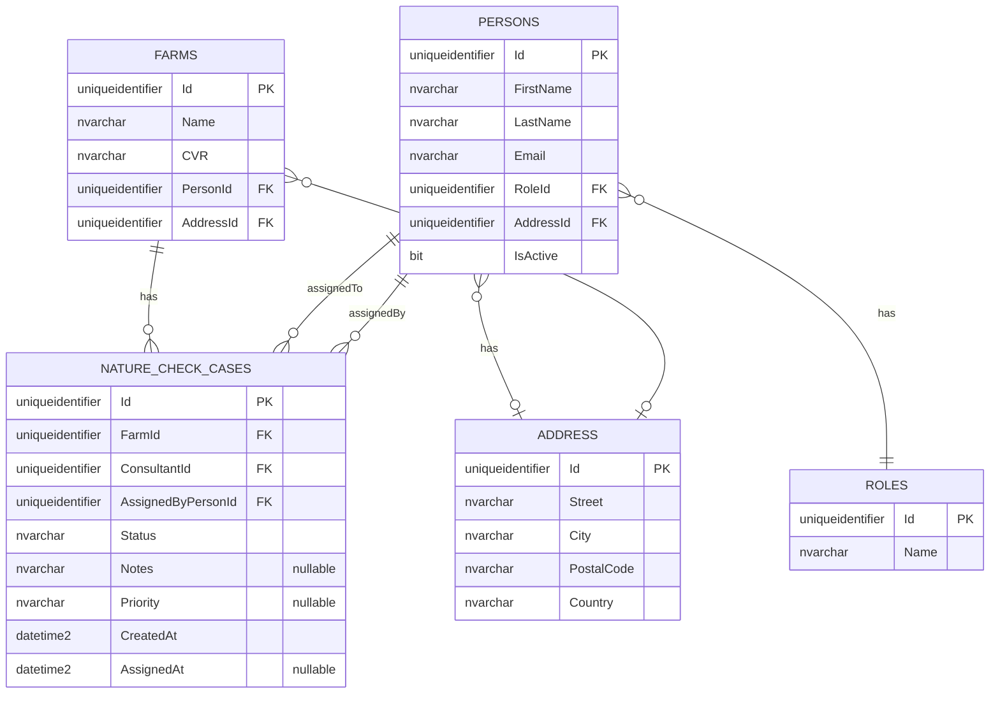

# UC002B – Entity Relationship Diagram

## ER Diagram for Nature Check Case Assignment

## Relationship Details

| Relationship | Cardinality | Description |
|--------------|-------------|-------------|
| `FARMS` → `NATURE_CHECK_CASES` | **1 : 0..*** | One farm can have zero or more Nature Check Cases |
| `PERSONS` → `NATURE_CHECK_CASES` (ConsultantId) | **1 : 0..*** | One consultant can be assigned to zero or more Nature Check Cases |
| `PERSONS` → `NATURE_CHECK_CASES` (AssignedByPersonId) | **1 : 0..*** | One Arla employee can assign zero or more Nature Check Cases |
| `PERSONS` → `ROLES` | **N : 1** | Many persons can have the same role |
| `PERSONS` → `ADDRESS` | **N : 1** | Many persons can share an address (nullable) |
| `FARMS` → `ADDRESS` | **N : 1** | Many farms can share an address (nullable) |

## Notes

- `NATURE_CHECK_CASES.FarmId` references `FARMS.Id` - Each case is associated with one farm
- `NATURE_CHECK_CASES.ConsultantId` references `PERSONS.Id` - Each case is assigned to one consultant (person with Consultant role)
- `NATURE_CHECK_CASES.AssignedByPersonId` references `PERSONS.Id` - Each case is assigned by one Arla employee (person with Employee role)
- `Status` field stores the case status (e.g., "Assigned", "InProgress", "Completed", "Cancelled")
- `Notes` and `Priority` are optional fields for additional case information
- `CreatedAt` is set when the case is created
- `AssignedAt` is set when the case is assigned to a consultant (can be null if not yet assigned)

