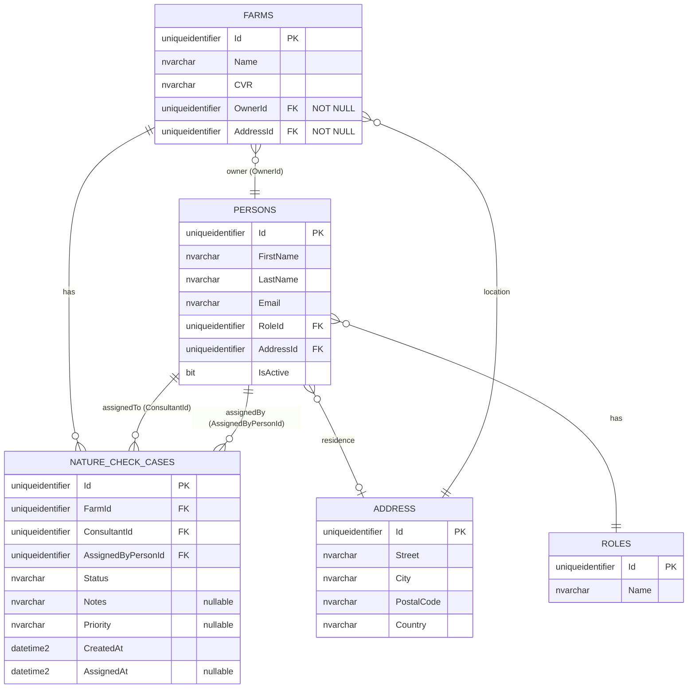

# UC002B – Entity Relationship Diagram

ER Diagram for Nature Check Case Assignment, following Larmann's UML conventions and database schema.

## Relationship Details

| Relationship | Cardinality | Description |
|--------------|-------------|-------------|
| `FARMS` → `NATURE_CHECK_CASES` | **1 : 0..*** | One farm can have zero or more Nature Check Cases |
| `PERSONS` → `NATURE_CHECK_CASES` (ConsultantId) | **1 : 0..*** | One consultant can be assigned to zero or more Nature Check Cases |
| `PERSONS` → `NATURE_CHECK_CASES` (AssignedByPersonId) | **1 : 0..*** | One Arla employee can assign zero or more Nature Check Cases |
| `PERSONS` → `ROLES` | **N : 1** | Many persons can have the same role |
| `PERSONS` → `ADDRESS` | **N : 1** | Many persons can share an address (nullable) |
| `FARMS` → `ADDRESS` | **N : 1** | Many farms can share an address (NOT NULL per domain model) |
| `FARMS` → `PERSONS` | **N : 1** | Many farms can have the same owner (NOT NULL per domain model) |

## Table Origins

| Table | Origin | Description |
|-------|--------|-------------|
| **ROLES** | UC002 | Role definitions (Consultant, Employee, Farmer) |
| **ADDRESSES** | UC002 | Address information for persons and farms |
| **PERSONS** | UC002 | Person information (owners, consultants, employees) |
| **FARMS** | UC002 | Farm information with owner and address |
| **NATURE_CHECK_CASES** | UC002B | Nature Check Case assignments (new for UC002B) |

**Important:** The `NATURE_CHECK_CASES` table is created via **Entity Framework Core Migrations**, not direct SQL scripts. The table is defined by:
- Entity: `NatureCheckCase` (in `src/ArlaNatureConnect.Domain/Entities/NatureCheckCase.cs`)
- Configuration: `NatureCheckCaseConfiguration` (in `src/ArlaNatureConnect.Infrastructure/Persistence/Configurations/NatureCheckCaseConfiguration.cs`)
- DbSet: `AppDbContext.NatureCheckCases` (in `src/ArlaNatureConnect.Infrastructure/Persistence/AppDbContext.cs`)

When EF Core Migrations are run (`Add-Migration` and `Update-Database`), they generate and apply the SQL DDL to create the table in the database.

## Field Details

### NATURE_CHECK_CASES
- `Status` field stores the case status as NVARCHAR (e.g., "Assigned", "InProgress", "Completed", "Cancelled")
- `Priority` field stores priority as NVARCHAR in English format ("Low", "Medium", "High", "Urgent")
- `Notes` is optional (nullable) for additional case information
- `CreatedAt` is set when the case is created (audit property)
- `AssignedAt` is set when the case is assigned to a consultant (can be null if not yet assigned)

### FARMS
- `OwnerId` is NOT NULL per domain model (a farm must have an owner)
- `AddressId` is NOT NULL per domain model (a farm must have an address)
- In the domain model, these use `Guid.Empty` as default if not set, but database schema enforces NOT NULL

