## UC002B – Sequence Diagram: Assign Nature Check Case

This sequence diagram shows the detailed interaction flow when an Arla employee assigns a Nature Check Case to a consultant, following Larmann's UML conventions.

```mermaid
sequenceDiagram
    title UC002B – Sequence Diagram: Assign Nature Check Case

    actor ArlaEmployee as Arla Employee
    participant ViewModel as ArlaEmployeeAssignNatureCheckViewModel
    participant Service as NatureCheckCaseService
    participant FarmRepo as IFarmRepository
    participant PersonRepo as IPersonRepository
    participant AddressRepo as IAddressRepository
    participant CaseRepo as INatureCheckCaseRepository
    participant RoleRepo as IRoleRepository
    participant MsgService as IAppMessageService
    participant StatusService as IStatusInfoServices

    %% Initialization Flow
    ArlaEmployee ->> ViewModel: Open "Nature Check Cases" module
    ViewModel ->> StatusService: BeginLoading()
    StatusService -->> ViewModel: IDisposable loading
    ViewModel ->> Service: LoadAssignmentContextAsync()
    
    %% Service loads data from multiple repositories
    Service ->> FarmRepo: GetAllAsync()
    FarmRepo -->> Service: List~Farm~
    Service ->> PersonRepo: GetAllAsync()
    PersonRepo -->> Service: List~Person~
    Service ->> PersonRepo: GetPersonsByRoleAsync("Consultant")
    PersonRepo -->> Service: List~Person~ (Consultants)
    Service ->> AddressRepo: GetAllAsync()
    AddressRepo -->> Service: List~Address~
    Service ->> CaseRepo: GetActiveCasesAsync()
    CaseRepo -->> Service: IReadOnlyList~NatureCheckCase~
    
    %% Service maps Entities to DTOs
    Note over Service: Maps Farm + Person + Address + Case → FarmAssignmentOverviewDto
    Service -->> ViewModel: NatureCheckCaseAssignmentContext<br/>(Farms: List~FarmAssignmentOverviewDto~,<br/>Consultants: List~Person~)
    
    %% ViewModel maps DTOs to ViewModel Items
    Note over ViewModel: Maps FarmAssignmentOverviewDto → AssignableFarmViewModel
    ViewModel ->> ViewModel: UpdateFarms(context.Farms)
    ViewModel ->> ViewModel: UpdateConsultants(context.Consultants)
    ViewModel ->> StatusService: Dispose loading
    ViewModel -->> ArlaEmployee: Display farms and consultants

    %% Farm Selection Flow
    alt Farm exists in list
        ArlaEmployee ->> ViewModel: Select existing farm
        ViewModel ->> ViewModel: SelectedFarm = farm
        alt Farm has active case
            Note over ViewModel: Auto-populate form with existing assignment data
            ViewModel ->> ViewModel: SelectedConsultant = assigned consultant
            ViewModel ->> ViewModel: SelectedPriority = assigned priority (converted to Danish)
            ViewModel ->> ViewModel: AssignmentNotes = existing notes
        end
        ViewModel -->> ArlaEmployee: Display farm details and form
    else Farm does not exist
        Note over ArlaEmployee,ViewModel: Navigate to UC02 - Create Farm
        ArlaEmployee ->> ViewModel: Click "Create New Farm" (UC02)
        Note over ViewModel: UC02 handles farm creation via SaveFarmAsync()
        ViewModel -->> ArlaEmployee: Return to farm list with new farm
        ArlaEmployee ->> ViewModel: Select newly created farm
        ViewModel -->> ArlaEmployee: Display farm details
    end

    %% Assignment Flow
    ArlaEmployee ->> ViewModel: Select consultant, priority, and enter notes
    ArlaEmployee ->> ViewModel: Click "Lav natur check opgave"
    
    ViewModel ->> ViewModel: Validate selection (farm and consultant selected)
    alt Validation fails
        ViewModel ->> MsgService: AddErrorMessage("Vælg gård og konsulent")
        ViewModel -->> ArlaEmployee: Display error message
    else Validation succeeds
        ViewModel ->> StatusService: BeginLoading()
        ViewModel ->> Service: AssignCaseAsync(NatureCheckCaseAssignmentRequest)
        
        %% Service validates and creates case
        Service ->> FarmRepo: GetByIdAsync(request.FarmId)
        FarmRepo -->> Service: Farm?
        alt Farm not found
            Service -->> ViewModel: InvalidOperationException("Gården findes ikke")
            ViewModel ->> MsgService: AddErrorMessage(...)
            ViewModel -->> ArlaEmployee: Display error message
        else Farm found
            Service ->> PersonRepo: GetByIdAsync(request.ConsultantId)
            PersonRepo -->> Service: Person? (Consultant)
            alt Consultant not found
                Service -->> ViewModel: InvalidOperationException("Konsulent findes ikke")
                ViewModel ->> MsgService: AddErrorMessage(...)
                ViewModel -->> ArlaEmployee: Display error message
            else Consultant found
                Service ->> RoleRepo: GetByIdAsync(consultant.RoleId)
                RoleRepo -->> Service: Role?
                alt Consultant does not have Consultant role
                    Service -->> ViewModel: InvalidOperationException("Person har ikke konsulent-rollen")
                    ViewModel ->> MsgService: AddErrorMessage(...)
                    ViewModel -->> ArlaEmployee: Display error message
                else Consultant has correct role
                    Service ->> CaseRepo: FarmHasActiveCaseAsync(farmId)
                    CaseRepo -->> Service: bool
                    alt Farm has active case AND allowDuplicate is false
                        Service -->> ViewModel: InvalidOperationException("Gården har allerede en aktiv opgave")
                        ViewModel ->> MsgService: AddErrorMessage(...)
                        ViewModel -->> ArlaEmployee: Display error message
                    else No active case OR allowDuplicate is true
                        %% Create new case
                        Service ->> Service: Create NatureCheckCase entity
                        Note over Service: Status = Assigned<br/>Priority = request.Priority<br/>Notes = request.Notes<br/>CreatedAt = DateTimeOffset.UtcNow<br/>AssignedAt = DateTimeOffset.UtcNow
                        Service ->> CaseRepo: AddAsync(natureCheckCase)
                        CaseRepo -->> Service: Task completed
                        Service -->> ViewModel: NatureCheckCase (created entity)
                        ViewModel ->> MsgService: AddInfoMessage("Opgave tildelt succesfuldt")
                        ViewModel ->> ViewModel: Refresh farm list (reload data)
                        ViewModel ->> StatusService: Dispose loading
                        ViewModel -->> ArlaEmployee: Display success message and updated list
                    end
                end
            end
        end
    end
```

