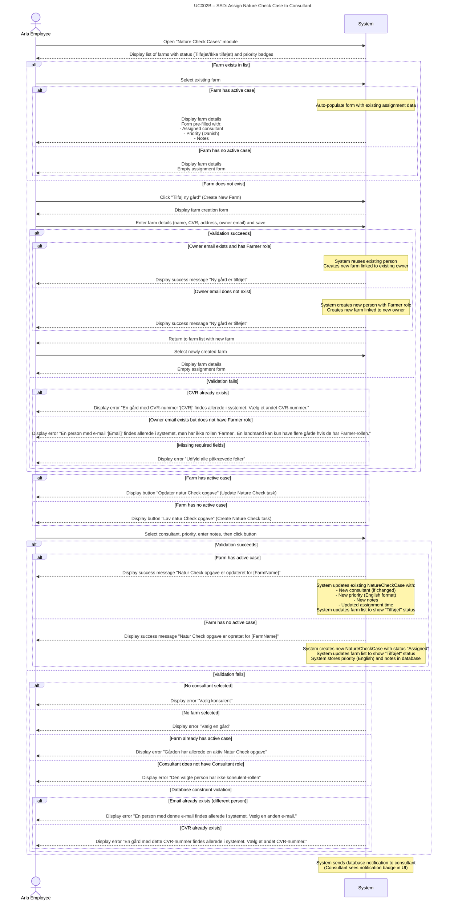

# **UC002B-SSD – Assign Nature Check Case to Consultant**

System Sequence Diagram showing the interaction between the Arla Employee actor and the System, following Larmann's UML conventions.

**Notes:**
- The system displays farms with their assignment status ("Tilføjet" / "Ikke tilføjet") and priority badges.
- When a farm with an active case is selected, the form is auto-populated with existing assignment data (consultant, priority, notes) and the button text changes to "Opdater natur Check opgave" (Update Nature Check task).
- When a farm with no active case is selected, the button text displays "Lav natur Check opgave" (Create Nature Check task).
- Priority selection is available in the assignment form (Danish values: Lav, Normal, Høj, Haster).
- The system stores priority in English format in the database ("Low", "Medium", "High", "Urgent").
- Notifications are database-based (consultant sees notification badge in UI, not email/SMS).
- The system validates all inputs before creating or updating the case and provides clear error messages.
- The system can update existing active cases (status "Assigned" or "InProgress") without creating duplicate cases.
- **Farm creation:** When creating a new farm, if the owner email already exists and the person has the Farmer role, the system reuses the existing person and links the new farm to them. This allows a farmer to own multiple farms with different CVR numbers. If the email exists but the person does not have the Farmer role, the system displays an error message.
- **CVR validation:** Each farm must have a unique CVR number. If a CVR already exists, the system displays an error message.
- **Error handling:** The system provides specific error messages for database constraint violations (duplicate email or CVR) to help users understand what went wrong.
