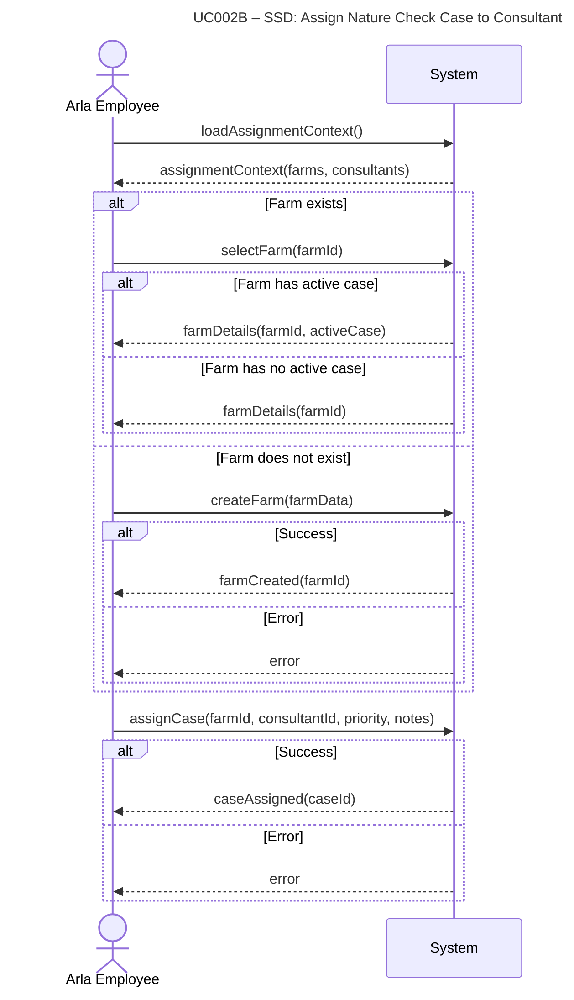

# **UC002B-SSD – Assign Nature Check Case to Consultant**

System Sequence Diagram showing the interaction between the Arla Employee actor and the System, following Larmann's UML conventions.

**Notes:**
- This SSD shows the high-level interaction between the actor and the system at use case level.
- All internal operations (validation, database access, etc.) are hidden within the system boundary.
- Error messages are generic - specific validation details are not exposed at this level.
