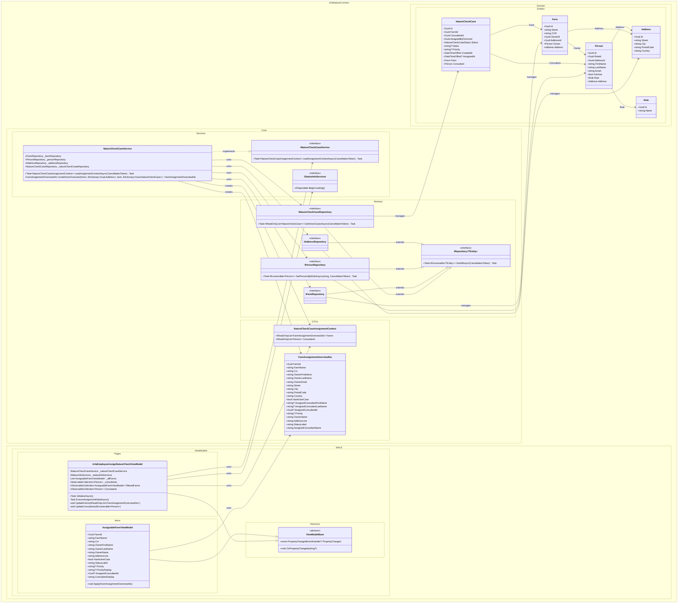

## UC002B.1 – Design Class Diagram

This diagram shows the main components that collaborate when an Arla employee views farms and consultants for assignment. It follows Larmann's UML conventions with proper visibility notation, relationships, and namespace organization.

