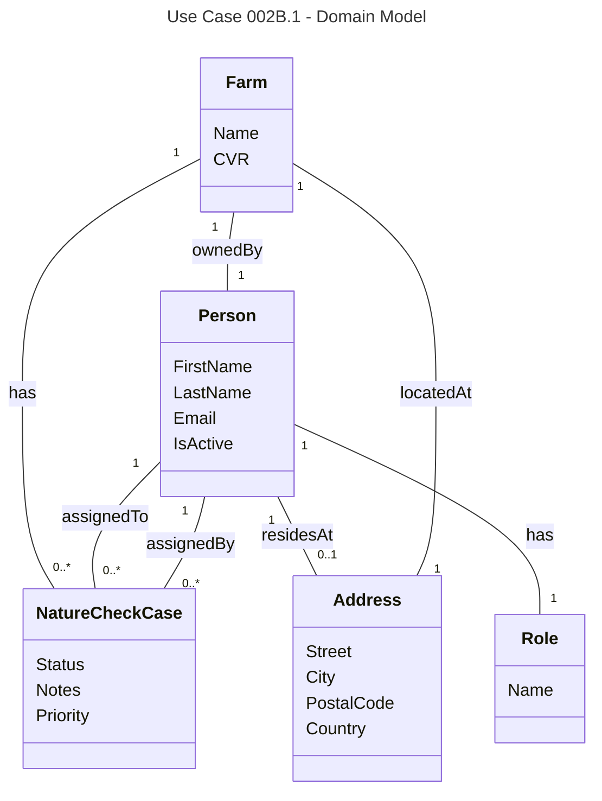

# UC002B.1 Domain Model

Domain Model for View Farms and Consultants for Assignment use case. This is the base domain model that will be extended by subsequent user stories.

**Domain Concepts:**
- **Farm** - A farm that can have Nature Check Cases assigned to it
- **Person** - A person in the system who can be a consultant, Arla employee, or farm owner
- **Address** - A physical address where a person resides or a farm is located
- **Role** - A role that defines a person's function in the system (Consultant, Employee, Farmer)
- **NatureCheckCase** - An assignment of a Nature Check task to a consultant for a specific farm

**Domain Relationships:**
- A Farm can have zero or more Nature Check Cases
- A Person (consultant) can be assigned to zero or more Nature Check Cases
- A Person (Arla employee) can assign zero or more Nature Check Cases
- A Person has exactly one Role
- A Person may have one Address (where they reside)
- A Farm has exactly one Address (where it is located)
- A Farm has exactly one Person as owner

**Business Rules:**
- A Nature Check Case is always linked to one Farm
- A Nature Check Case is always assigned to one Person (consultant)
- A Nature Check Case is always assigned by one Person (Arla employee)
- A Farm must have an owner (Person)
- A Farm must have an address (Address)
- Priority is an optional attribute that indicates the urgency of a Nature Check Case
- Status indicates the current state of a Nature Check Case (Assigned, InProgress, Completed, etc.)
- Notes provide additional information about a Nature Check Case

**View-Specific Concepts:**
- **Assignment Status** - Derived concept indicating whether a farm has an active Nature Check Case
- **Active Case** - A Nature Check Case with status "Assigned" or "InProgress"

