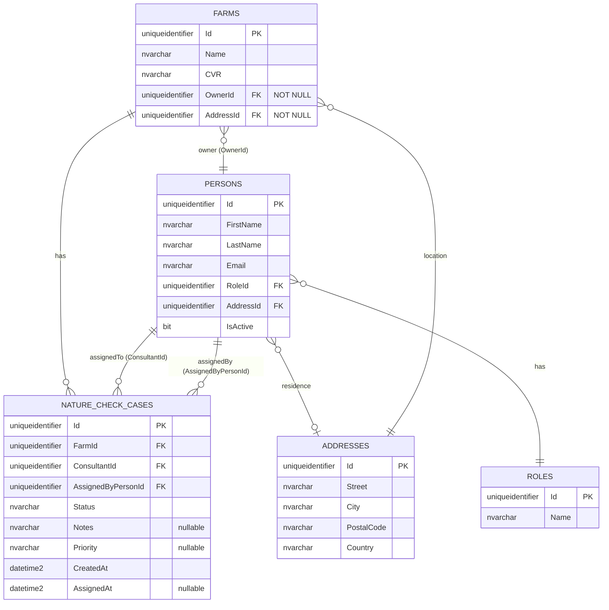

# UC002B.1 – Entity Relationship Diagram

ER Diagram for View Farms and Consultants for Assignment, following Larmann's UML conventions and database schema.

**Note:** This diagram shows all tables used by UC002B.1. Tables marked with *(UC001/UC002)* are from previous use cases and are assumed to already exist in the database.



## Table Origins

| Table | Origin | Description |
|-------|--------|-------------|
| **ROLES** | UC002 | Role definitions (Consultant, Employee, Farmer) |
| **ADDRESSES** | UC002 | Address information for persons and farms |
| **PERSONS** | UC002 | Person information (owners, consultants, employees) |
| **FARMS** | UC002 | Farm information with owner and address |
| **NATURE_CHECK_CASES** | UC002B | Nature Check Case assignments (new for UC002B) |

**Note:** UC002B.1 assumes that tables from UC001 and UC002 already exist in the database. 

**Important:** The `NATURE_CHECK_CASES` table is created via **Entity Framework Core Migrations**, not direct SQL scripts. The table is defined by:
- Entity: `NatureCheckCase` (in `src/ArlaNatureConnect.Domain/Entities/NatureCheckCase.cs`)
- Configuration: `NatureCheckCaseConfiguration` (in `src/ArlaNatureConnect.Infrastructure/Persistence/Configurations/NatureCheckCaseConfiguration.cs`)
- DbSet: `AppDbContext.NatureCheckCases` (in `src/ArlaNatureConnect.Infrastructure/Persistence/AppDbContext.cs`)

When EF Core Migrations are run, they generate and apply the SQL DDL to create the table in the database.

## Relationship Details

| Relationship | Cardinality | Description |
|-----------|--------------|-------------|
| `FARMS` → `NATURE_CHECK_CASES` | **1 : 0..*** | One farm can have zero or more Nature Check Cases |
| `PERSONS` → `NATURE_CHECK_CASES` (ConsultantId) | **1 : 0..*** | One consultant can be assigned to zero or more Nature Check Cases |
| `PERSONS` → `NATURE_CHECK_CASES` (AssignedByPersonId) | **1 : 0..*** | One Arla employee can assign zero or more Nature Check Cases |
| `PERSONS` → `ROLES` | **N : 1** | Many persons can have the same role |
| `PERSONS` → `ADDRESSES` | **N : 1** | Many persons can share an address (nullable) |
| `FARMS` → `ADDRESSES` | **N : 1** | Many farms can share an address (NOT NULL per domain model) |
| `FARMS` → `PERSONS` | **N : 1** | Many farms can have the same owner (NOT NULL per domain model) |

## Field Details

### NATURE_CHECK_CASES
- `Status` field stores the case status as NVARCHAR (e.g., "Assigned", "InProgress", "Completed", "Cancelled")
- `Priority` field stores priority as NVARCHAR in English format ("Low", "Medium", "High", "Urgent")
- `Notes` is optional (nullable) for additional case information
- `CreatedAt` is set when the case is created (audit property)
- `AssignedAt` is set when the case is assigned to a consultant (can be null if not yet assigned)

### FARMS
- `OwnerId` is NOT NULL per domain model (a farm must have an owner)
- `AddressId` is NOT NULL per domain model (a farm must have an address)

### PERSONS
- `RoleId` is used to filter consultants (must have "Consultant" role)
- `IsActive` determines if person should be displayed

## Indexes for View Performance

| Index Name | Table | Columns | Purpose |
|------------|-------|----------|---------|
| `IX_Farms_OwnerId` | Farms | OwnerId | Efficient owner lookups |
| `IX_Farms_AddressId` | Farms | AddressId | Efficient address lookups |
| `IX_Persons_RoleId` | Persons | RoleId | Efficient role filtering |
| `IX_NatureCheckCases_FarmId` | NatureCheckCases | FarmId | Efficient case lookups by farm |
| `IX_NatureCheckCases_ConsultantId` | NatureCheckCases | ConsultantId | Efficient case lookups by consultant |
| `IX_NatureCheckCases_Status` | NatureCheckCases | Status | Filtering active cases |

## Entity Framework Navigation Properties

### Automatic Includes (AutoInclude Configuration)

EF Core automatically loads related entities via navigation properties:

- **Person.Role** - Automatically included when loading Person entities
- **Person.Address** - Automatically included when loading Person entities
- **Farm.Owner** - Automatically included when loading Farm entities
- **Farm.Address** - Automatically included when loading Farm entities

This means when loading farms or persons, related data is loaded in a single query with JOINs.

### Navigation Properties in Code

```csharp
// Access related entities directly via navigation properties
Farm farm = await _farmRepository.GetByIdAsync(farmId);
Person owner = farm.Owner;  // Automatically loaded via AutoInclude
Address address = farm.Address;  // Automatically loaded via AutoInclude

Person consultant = await _personRepository.GetByIdAsync(consultantId);
Role role = consultant.Role;  // Automatically loaded via AutoInclude
```

## Views (Not Used in EF Implementation)

**Note:** In Entity Framework Core implementation, views are replaced by:
- **LINQ queries** in repositories
- **DTOs** created in service layer
- **In-memory processing** for aggregations

The following views exist only in standard SQL documentation:
- `vw_FarmAssignmentOverview` - Replaced by `FarmAssignmentOverviewDto` created in service
- `vw_ConsultantsList` - Replaced by LINQ query in `PersonRepository.GetPersonsByRoleAsync()`

