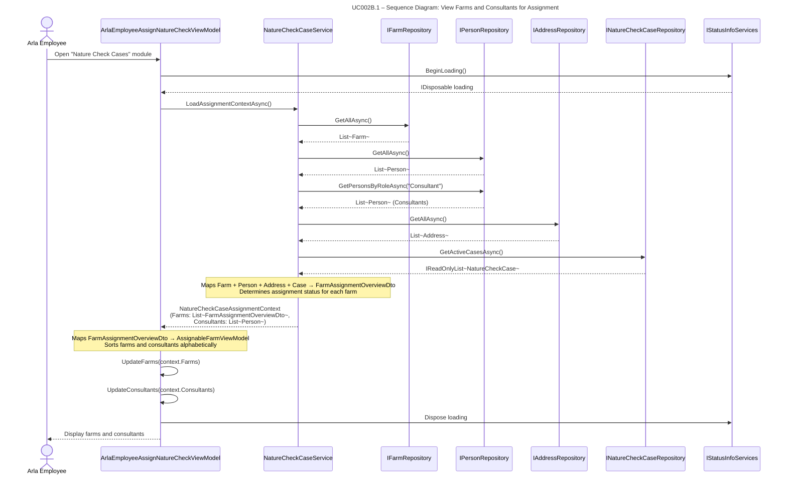

## UC002B.1 – Sequence Diagram: View Farms and Consultants for Assignment

This sequence diagram shows the detailed interaction flow when an Arla employee views farms and consultants, following Larmann's UML conventions.

**Notes:**
- The service aggregates data from multiple repositories to create a comprehensive view.
- Assignment status is calculated by checking for active cases (status "Assigned" or "InProgress").
- Farms and consultants are sorted alphabetically in the ViewModel.
- This is a read-only operation - no data is modified.

