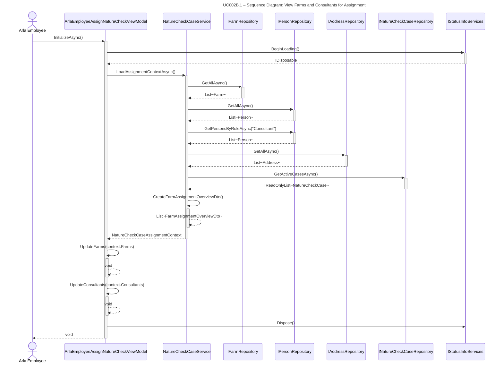

## UC002B.1 – Sequence Diagram: View Farms and Consultants for Assignment

This sequence diagram shows the detailed interaction flow when an Arla employee views farms and consultants, following Larmann's UML conventions.

**Notes:**
- All method calls use PascalCase (C# convention).
- All calls have return arrows (including void methods).
- Activation bars show object lifetime using automatic activation/deactivation (+/-).
- This is a read-only operation - no data is modified.
