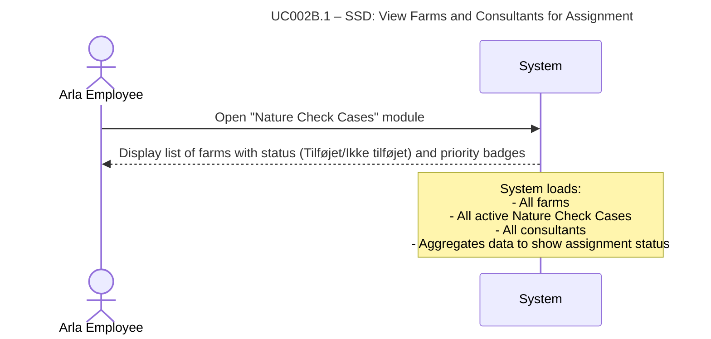

# UC002B.1-SSD – View Farms and Consultants for Assignment

System Sequence Diagram showing the interaction between the Arla Employee actor and the System, following Larmann's UML conventions.

**Notes:**
- The system displays farms with their assignment status ("Tilføjet" / "Ikke tilføjet") and priority badges.
- Farms with active cases show the assigned consultant's name and priority level.
- Consultants are displayed in a separate list, sorted alphabetically.
- This is a read-only operation - no data is modified.

