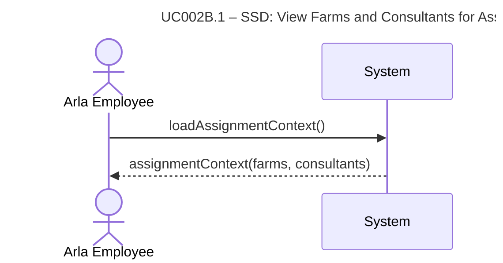

# UC002B.1-SSD – View Farms and Consultants for Assignment

System Sequence Diagram showing the interaction between the Arla Employee actor and the System, following Larmann's UML conventions.

**Notes:**
- This SSD shows the high-level interaction for viewing farms and consultants.
- All internal operations (data loading, aggregation, etc.) are hidden within the system boundary.

