## UC002B.2 – Design Class Diagram: Comparison (UC002B.1 vs UC002B.2)

This diagram shows the differences between UC002B.1 and UC002B.2, highlighting new methods, properties, and classes added in UC002B.2.

**Legend:**
- **UC002B.1 (Before)**: Classes and members that existed in UC002B.1
- **UC002B.2 (After)**: New additions in UC002B.2 (highlighted in green/with +)

```mermaid
classDiagram
    direction TB
    %% === DCD Comparison: UC002B.1 vs UC002B.2 ===
    %% Shows only classes that changed, with before/after versions

    %% === DOMAIN ENTITIES ===
    namespace ArlaNatureConnect.Domain.Entities {
        class NatureCheckCase_UC002B1 {
            <<UC002B.1>>
            +Guid Id
            +Guid FarmId
            +Guid ConsultantId
            +Guid AssignedByPersonId
            +NatureCheckCaseStatus Status
            +string? Notes
            +string? Priority
            +DateTimeOffset CreatedAt
            +DateTimeOffset? AssignedAt
            +Farm Farm
            +Person Consultant
        }

        class NatureCheckCase_UC002B2 {
            <<UC002B.2>>
            +Guid Id
            +Guid FarmId
            +Guid ConsultantId
            +Guid AssignedByPersonId
            +NatureCheckCaseStatus Status
            +string? Notes
            +string? Priority
            +DateTimeOffset CreatedAt
            +DateTimeOffset? AssignedAt
            +Farm Farm
            +Person Consultant
            +Person AssignedByPerson ⭐ NEW
        }
    }

    %% === DTOs ===
    namespace ArlaNatureConnect.Core.DTOs {
        class NatureCheckCaseAssignmentRequest {
            <<UC002B.2 NEW>>
            +Guid FarmId
            +Guid ConsultantId
            +Guid AssignedByPersonId
            +string? Notes
            +string? Priority
            +bool AllowDuplicateActiveCase
        }
    }

    %% === VIEWMODELS ===
    namespace ArlaNatureConnect.WinUI.ViewModels.Pages {
        class ArlaEmployeeAssignNatureCheckViewModel_UC002B1 {
            <<UC002B.1>>
            -INatureCheckCaseService _natureCheckCaseService
            -IStatusInfoServices _statusInfoServices
            -List~AssignableFarmViewModel~ _allFarms
            -ObservableCollection~Person~ _consultants
            +ObservableCollection~AssignableFarmViewModel~ FilteredFarms
            +ObservableCollection~Person~ Consultants
            +Task InitializeAsync()
            -Task EnsureAssignmentDataAsync()
            -void UpdateFarms(IReadOnlyList~FarmAssignmentOverviewDto~)
            -void UpdateConsultants(IEnumerable~Person~)
        }

        class ArlaEmployeeAssignNatureCheckViewModel_UC002B2 {
            <<UC002B.2>>
            -INatureCheckCaseService _natureCheckCaseService
            -IAppMessageService _appMessageService ⭐ NEW
            -IStatusInfoServices _statusInfoServices
            -List~AssignableFarmViewModel~ _allFarms
            -AssignableFarmViewModel? _selectedFarm ⭐ NEW
            -Person? _selectedConsultant ⭐ NEW
            -string _farmSearchText ⭐ NEW
            -string _assignmentNotes ⭐ NEW
            -string? _selectedPriority ⭐ NEW
            -Guid? _assignedByPersonId ⭐ NEW
            +ObservableCollection~AssignableFarmViewModel~ FilteredFarms
            +ObservableCollection~Person~ Consultants
            +AssignableFarmViewModel? SelectedFarm ⭐ NEW
            +Person? SelectedConsultant ⭐ NEW
            +string? SelectedPriority ⭐ NEW
            +string AssignmentNotes ⭐ NEW
            +Guid? AssignedByPersonId ⭐ NEW
            +bool IsFarmSelected ⭐ NEW
            +string AssignCaseButtonText ⭐ NEW
            +RelayCommand AssignNatureCheckCaseCommand ⭐ NEW
            +Task InitializeAsync()
            +Task AssignNatureCheckCaseAsync() ⭐ NEW
            -Task EnsureAssignmentDataAsync()
            -void UpdateFarms(IReadOnlyList~FarmAssignmentOverviewDto~)
            -void UpdateConsultants(IEnumerable~Person~)
        }
    }

    %% === SERVICES ===
    namespace ArlaNatureConnect.Core.Services {
        class INatureCheckCaseService_UC002B1 {
            <<UC002B.1>>
            <<interface>>
            +Task~NatureCheckCaseAssignmentContext~ LoadAssignmentContextAsync(CancellationToken) Task
        }

        class INatureCheckCaseService_UC002B2 {
            <<UC002B.2>>
            <<interface>>
            +Task~NatureCheckCaseAssignmentContext~ LoadAssignmentContextAsync(CancellationToken) Task
            +Task~NatureCheckCase~ AssignCaseAsync(NatureCheckCaseAssignmentRequest, CancellationToken) Task ⭐ NEW
        }

        class NatureCheckCaseService_UC002B1 {
            <<UC002B.1>>
            -IFarmRepository _farmRepository
            -IPersonRepository _personRepository
            -IAddressRepository _addressRepository
            -INatureCheckCaseRepository _natureCheckCaseRepository
            +Task~NatureCheckCaseAssignmentContext~ LoadAssignmentContextAsync(CancellationToken) Task
            -FarmAssignmentOverviewDto CreateFarmOverview(...) FarmAssignmentOverviewDto
        }

        class NatureCheckCaseService_UC002B2 {
            <<UC002B.2>>
            -IFarmRepository _farmRepository
            -IPersonRepository _personRepository
            -IAddressRepository _addressRepository
            -INatureCheckCaseRepository _natureCheckCaseRepository
            -IRoleRepository _roleRepository ⭐ NEW
            +Task~NatureCheckCaseAssignmentContext~ LoadAssignmentContextAsync(CancellationToken) Task
            +Task~NatureCheckCase~ AssignCaseAsync(NatureCheckCaseAssignmentRequest, CancellationToken) Task ⭐ NEW
            +Task~IReadOnlyList~ConsultantNotificationDto~~ GetNotificationsForConsultantAsync(Guid, CancellationToken) Task ⭐ NEW
            -FarmAssignmentOverviewDto CreateFarmOverview(...) FarmAssignmentOverviewDto
            -string ConvertPriorityToEnglish(string?) string ⭐ NEW
            -void ValidateAssignmentRequest(NatureCheckCaseAssignmentRequest) void ⭐ NEW
        }

        class IAppMessageService {
            <<UC002B.2 NEW>>
            <<interface>>
            +void AddErrorMessage(string)
            +void AddInfoMessage(string)
        }
    }

    %% === REPOSITORIES ===
    namespace ArlaNatureConnect.Core.Abstract {
        class IRepository_UC002B1 {
            <<UC002B.1>>
            <<interface>>
            +Task~IEnumerable~TEntity~~ GetAllAsync(CancellationToken) Task
        }

        class IRepository_UC002B2 {
            <<UC002B.2>>
            <<interface>>
            +Task~TEntity?~ GetByIdAsync(Guid, CancellationToken) Task ⭐ NEW
            +Task~IEnumerable~TEntity~~ GetAllAsync(CancellationToken) Task
            +Task AddAsync(TEntity, CancellationToken) Task ⭐ NEW
        }

        class INatureCheckCaseRepository_UC002B1 {
            <<UC002B.1>>
            <<interface>>
            +Task~IReadOnlyList~NatureCheckCase~~ GetActiveCasesAsync(CancellationToken) Task
        }

        class INatureCheckCaseRepository_UC002B2 {
            <<UC002B.2>>
            <<interface>>
            +Task~IReadOnlyList~NatureCheckCase~~ GetActiveCasesAsync(CancellationToken) Task
            +Task~bool~ FarmHasActiveCaseAsync(Guid, CancellationToken) Task ⭐ NEW
            +Task~NatureCheckCase~ AddAsync(NatureCheckCase, CancellationToken) Task ⭐ NEW
        }

        class IFarmRepository_UC002B1 {
            <<UC002B.1>>
            <<interface>>
        }

        class IFarmRepository_UC002B2 {
            <<UC002B.2>>
            <<interface>>
            +Task~Farm?~ GetByIdAsync(Guid, CancellationToken) Task ⭐ NEW
        }

        class IPersonRepository_UC002B1 {
            <<UC002B.1>>
            <<interface>>
            +Task~IEnumerable~Person~~ GetPersonsByRoleAsync(string, CancellationToken) Task
        }

        class IPersonRepository_UC002B2 {
            <<UC002B.2>>
            <<interface>>
            +Task~IEnumerable~Person~~ GetPersonsByRoleAsync(string, CancellationToken) Task
            +Task~Person?~ GetByIdAsync(Guid, CancellationToken) Task ⭐ NEW
        }

        class IRoleRepository {
            <<UC002B.2 NEW>>
            <<interface>>
            +Task~Role?~ GetByIdAsync(Guid, CancellationToken) Task
        }
    }

    %% === RELATIONSHIPS ===
    %% Show that UC002B.2 extends UC002B.1
    NatureCheckCase_UC002B2 --|> NatureCheckCase_UC002B1 : extends
    ArlaEmployeeAssignNatureCheckViewModel_UC002B2 --|> ArlaEmployeeAssignNatureCheckViewModel_UC002B1 : extends
    INatureCheckCaseService_UC002B2 --|> INatureCheckCaseService_UC002B1 : extends
    NatureCheckCaseService_UC002B2 --|> NatureCheckCaseService_UC002B1 : extends
    IRepository_UC002B2 --|> IRepository_UC002B1 : extends
    INatureCheckCaseRepository_UC002B2 --|> INatureCheckCaseRepository_UC002B1 : extends
    IFarmRepository_UC002B2 --|> IFarmRepository_UC002B1 : extends
    IPersonRepository_UC002B2 --|> IPersonRepository_UC002B1 : extends

    %% New dependencies in UC002B.2
    ArlaEmployeeAssignNatureCheckViewModel_UC002B2 --> IAppMessageService : uses ⭐ NEW
    NatureCheckCaseService_UC002B2 --> IRoleRepository : uses ⭐ NEW
    ArlaEmployeeAssignNatureCheckViewModel_UC002B2 --> NatureCheckCaseAssignmentRequest : uses ⭐ NEW
    NatureCheckCaseService_UC002B2 --> NatureCheckCaseAssignmentRequest : uses ⭐ NEW
    NatureCheckCase_UC002B2 --> Person : AssignedByPerson ⭐ NEW
```

## Summary of Changes from UC002B.1 to UC002B.2

### New Classes
1. **`NatureCheckCaseAssignmentRequest`** (DTO) - Request object for case assignment
2. **`IAppMessageService`** (Interface) - Service for displaying messages to user
3. **`IRoleRepository`** (Interface) - Repository for Role entities

### Modified Classes

#### 1. **NatureCheckCase** (Domain Entity)
- **Added**: `+Person AssignedByPerson` (navigation property)

#### 2. **ArlaEmployeeAssignNatureCheckViewModel** (ViewModel)
- **Added Fields**:
  - `-IAppMessageService _appMessageService`
  - `-AssignableFarmViewModel? _selectedFarm`
  - `-Person? _selectedConsultant`
  - `-string _farmSearchText`
  - `-string _assignmentNotes`
  - `-string? _selectedPriority`
  - `-Guid? _assignedByPersonId`
- **Added Properties**:
  - `+AssignableFarmViewModel? SelectedFarm`
  - `+Person? SelectedConsultant`
  - `+string? SelectedPriority`
  - `+string AssignmentNotes`
  - `+Guid? AssignedByPersonId`
  - `+bool IsFarmSelected`
  - `+string AssignCaseButtonText`
  - `+RelayCommand AssignNatureCheckCaseCommand`
- **Added Methods**:
  - `+Task AssignNatureCheckCaseAsync()`

#### 3. **INatureCheckCaseService** (Interface)
- **Added Methods**:
  - `+Task~NatureCheckCase~ AssignCaseAsync(NatureCheckCaseAssignmentRequest, CancellationToken) Task`

#### 4. **NatureCheckCaseService** (Service)
- **Added Fields**:
  - `-IRoleRepository _roleRepository`
- **Added Methods**:
  - `+Task~NatureCheckCase~ AssignCaseAsync(NatureCheckCaseAssignmentRequest, CancellationToken) Task`
  - `+Task~IReadOnlyList~ConsultantNotificationDto~~ GetNotificationsForConsultantAsync(Guid, CancellationToken) Task`
  - `-string ConvertPriorityToEnglish(string?) string`
  - `-void ValidateAssignmentRequest(NatureCheckCaseAssignmentRequest) void`

#### 5. **IRepository<TEntity>** (Base Interface)
- **Added Methods**:
  - `+Task~TEntity?~ GetByIdAsync(Guid, CancellationToken) Task`
  - `+Task AddAsync(TEntity, CancellationToken) Task`

#### 6. **INatureCheckCaseRepository** (Interface)
- **Added Methods**:
  - `+Task~bool~ FarmHasActiveCaseAsync(Guid, CancellationToken) Task`
  - `+Task~NatureCheckCase~ AddAsync(NatureCheckCase, CancellationToken) Task`

#### 7. **IFarmRepository** (Interface)
- **Added Methods**:
  - `+Task~Farm?~ GetByIdAsync(Guid, CancellationToken) Task`

#### 8. **IPersonRepository** (Interface)
- **Added Methods**:
  - `+Task~Person?~ GetByIdAsync(Guid, CancellationToken) Task`

### Key Functional Changes
1. **Case Assignment**: UC002B.2 adds the ability to create and assign Nature Check Cases to consultants
2. **Validation**: New validation methods ensure consultant has correct role and farm doesn't have duplicate active cases
3. **User Feedback**: Integration with `IAppMessageService` for displaying success/error messages
4. **Repository Enhancements**: Base repository interface extended with `GetByIdAsync` and `AddAsync` methods
5. **Role Management**: New `IRoleRepository` for validating consultant roles
