## UC002B.2 – Design Class Diagram

This diagram shows the main components that collaborate when an Arla employee assigns a Nature Check Case to a consultant. It builds upon UC002B.1 and adds assignment-specific classes. It follows Larmann's UML conventions with proper visibility notation, relationships, and namespace organization.

```mermaid
classDiagram
    direction TB
    %% === DCD – UC002B.2: Assign Nature Check Case (Builds on UC002B.1) ===

    %% === DOMAIN ENTITIES (from UC002B.1) ===
    namespace ArlaNatureConnect.Domain.Entities {
        class Farm {
            +Guid Id
            +string Name
            +string CVR
            +Guid OwnerId
            +Guid AddressId
            +Person Owner
            +Address Address
        }

        class Person {
            +Guid Id
            +Guid RoleId
            +Guid AddressId
            +string FirstName
            +string LastName
            +string Email
            +bool IsActive
            +Role Role
            +Address Address
        }

        class Address {
            +Guid Id
            +string Street
            +string City
            +string PostalCode
            +string Country
        }

        class Role {
            +Guid Id
            +string Name
        }

        class NatureCheckCase {
            +Guid Id
            +Guid FarmId
            +Guid ConsultantId
            +Guid AssignedByPersonId
            +NatureCheckCaseStatus Status
            +string? Notes
            +string? Priority
            +DateTimeOffset CreatedAt
            +DateTimeOffset? AssignedAt
            +Farm Farm
            +Person Consultant
            +Person AssignedByPerson
        }

        %% New entity for UC002B.2
        class Notification {
            +Guid Id
            +Guid CaseId
            +Guid ConsultantId
            +DateTimeOffset CreatedAt
            +bool IsRead
            +NatureCheckCase Case
            +Person Consultant
        }
    }

    %% === DTOs (Data Transfer Objects) - from UC002B.1 ===
    namespace ArlaNatureConnect.Core.DTOs {
        class FarmAssignmentOverviewDto {
            +Guid FarmId
            +string FarmName
            +string Cvr
            +string OwnerFirstName
            +string OwnerLastName
            +string OwnerEmail
            +string Street
            +string City
            +string PostalCode
            +string Country
            +bool HasActiveCase
            +string? AssignedConsultantFirstName
            +string? AssignedConsultantLastName
            +Guid? AssignedConsultantId
            +string? Priority
            +string OwnerName
            +string AddressLine
            +string StatusLabel
            +string AssignedConsultantName
        }

        class NatureCheckCaseAssignmentContext {
            +IReadOnlyList~FarmAssignmentOverviewDto~ Farms
            +IReadOnlyList~Person~ Consultants
        }

        %% New DTOs for UC002B.2
        class NatureCheckCaseAssignmentRequest {
            +Guid FarmId
            +Guid ConsultantId
            +Guid AssignedByPersonId
            +string? Notes
            +string? Priority
            +bool AllowDuplicateActiveCase
        }
    }

    %% === VIEWMODELS (Application Layer) - from UC002B.1 ===
    namespace ArlaNatureConnect.WinUI.ViewModels.Pages {
        class ArlaEmployeeAssignNatureCheckViewModel {
            -INatureCheckCaseService _natureCheckCaseService
            -IAppMessageService _appMessageService
            -IStatusInfoServices _statusInfoServices
            -List~AssignableFarmViewModel~ _allFarms
            -AssignableFarmViewModel? _selectedFarm
            -Person? _selectedConsultant
            -string _farmSearchText
            -string _assignmentNotes
            -string? _selectedPriority
            -Guid? _assignedByPersonId
            +ObservableCollection~AssignableFarmViewModel~ FilteredFarms
            +ObservableCollection~Person~ Consultants
            +AssignableFarmViewModel? SelectedFarm
            +Person? SelectedConsultant
            +string? SelectedPriority
            +string AssignmentNotes
            +Guid? AssignedByPersonId
            +bool IsFarmSelected
            +string AssignCaseButtonText
            +RelayCommand AssignNatureCheckCaseCommand
            +Task InitializeAsync()
            +Task AssignNatureCheckCaseAsync()
            -Task EnsureAssignmentDataAsync()
            -void UpdateFarms(IReadOnlyList~FarmAssignmentOverviewDto~)
            -void UpdateConsultants(IEnumerable~Person~)
        }
    }

    namespace ArlaNatureConnect.WinUI.ViewModels.Items {
        class AssignableFarmViewModel {
            +Guid FarmId
            +string FarmName
            +string Cvr
            +string OwnerFirstName
            +string OwnerLastName
            +string OwnerName
            +string AddressLine
            +bool HasActiveCase
            +string StatusLabel
            +string? Priority
            +string? PriorityDisplay
            +Guid? AssignedConsultantId
            +string ConsultantDisplay
            +void Apply(FarmAssignmentOverviewDto)
        }
    }

    namespace ArlaNatureConnect.WinUI.ViewModels.Abstracts {
        class ViewModelBase {
            <<abstract>>
            +event PropertyChangedEventHandler? PropertyChanged
            +void OnPropertyChanged(string?)
        }
    }

    %% === SERVICES (Core Layer) - extends UC002B.1 ===
    namespace ArlaNatureConnect.Core.Services {
        class INatureCheckCaseService {
            <<interface>>
            +Task~NatureCheckCaseAssignmentContext~ LoadAssignmentContextAsync(CancellationToken) Task
            +Task~NatureCheckCase~ AssignCaseAsync(NatureCheckCaseAssignmentRequest, CancellationToken) Task
        }

        class NatureCheckCaseService {
            -IFarmRepository _farmRepository
            -IPersonRepository _personRepository
            -IAddressRepository _addressRepository
            -INatureCheckCaseRepository _natureCheckCaseRepository
            -IRoleRepository _roleRepository
            -INotificationRepository _notificationRepository
            +Task~NatureCheckCaseAssignmentContext~ LoadAssignmentContextAsync(CancellationToken) Task
            +Task~NatureCheckCase~ AssignCaseAsync(NatureCheckCaseAssignmentRequest, CancellationToken) Task
            -FarmAssignmentOverviewDto CreateFarmOverview(Farm, IDictionary~Guid,Person~, IDictionary~Guid,Address~, bool, IDictionary~Guid,NatureCheckCase~) FarmAssignmentOverviewDto
            -string ConvertPriorityToEnglish(string?) string
            -void ValidateAssignmentRequest(NatureCheckCaseAssignmentRequest) void
        }

        class IAppMessageService {
            <<interface>>
            +void AddErrorMessage(string)
            +void AddInfoMessage(string)
        }

        class IStatusInfoServices {
            <<interface>>
            +IDisposable BeginLoading()
        }
    }

    %% === REPOSITORIES (Core Abstract Layer) - extends UC002B.1 ===
    namespace ArlaNatureConnect.Core.Abstract {
        class IRepository~TEntity~ {
            <<interface>>
            +Task~TEntity?~ GetByIdAsync(Guid, CancellationToken) Task
            +Task~IEnumerable~TEntity~~ GetAllAsync(CancellationToken) Task
            +Task AddAsync(TEntity, CancellationToken) Task
        }

        class INatureCheckCaseRepository {
            <<interface>>
            +Task~IReadOnlyList~NatureCheckCase~~ GetActiveCasesAsync(CancellationToken) Task
            +Task~bool~ FarmHasActiveCaseAsync(Guid, CancellationToken) Task
            +Task~NatureCheckCase~ AddAsync(NatureCheckCase, CancellationToken) Task
        }

        class IFarmRepository {
            <<interface>>
            +Task~Farm?~ GetByIdAsync(Guid, CancellationToken) Task
        }

        class IPersonRepository {
            <<interface>>
            +Task~IEnumerable~Person~~ GetPersonsByRoleAsync(string, CancellationToken) Task
            +Task~Person?~ GetByIdAsync(Guid, CancellationToken) Task
        }

        class IAddressRepository {
            <<interface>>
        }

        class IRoleRepository {
            <<interface>>
            +Task~Role?~ GetByIdAsync(Guid, CancellationToken) Task
        }

        %% New repository for UC002B.2
        class INotificationRepository {
            <<interface>>
            +Task~Notification~ CreateNotificationAsync(Guid, Guid, CancellationToken) Task
        }
    }

    %% === RELATIONER (Relationships) ===
    %% Inheritance (from UC002B.1)
    ArlaEmployeeAssignNatureCheckViewModel --|> ViewModelBase
    AssignableFarmViewModel --|> ViewModelBase

    %% Interface Implementation
    NatureCheckCaseService ..|> INatureCheckCaseService : implements
    INatureCheckCaseRepository --|> IRepository : extends
    IFarmRepository --|> IRepository : extends
    IPersonRepository --|> IRepository : extends
    IAddressRepository --|> IRepository : extends
    IRoleRepository --|> IRepository : extends
    INotificationRepository --|> IRepository : extends

    %% Dependencies (uses)
    ArlaEmployeeAssignNatureCheckViewModel --> INatureCheckCaseService : uses
    ArlaEmployeeAssignNatureCheckViewModel --> IAppMessageService : uses
    ArlaEmployeeAssignNatureCheckViewModel --> IStatusInfoServices : uses

    NatureCheckCaseService --> INatureCheckCaseRepository : uses
    NatureCheckCaseService --> IFarmRepository : uses
    NatureCheckCaseService --> IPersonRepository : uses
    NatureCheckCaseService --> IAddressRepository : uses
    NatureCheckCaseService --> IRoleRepository : uses
    NatureCheckCaseService --> INotificationRepository : uses

    %% Repository manages Entities
    INatureCheckCaseRepository --> NatureCheckCase : manages
    IFarmRepository --> Farm : manages
    IPersonRepository --> Person : manages
    IAddressRepository --> Address : manages
    IRoleRepository --> Role : manages
    INotificationRepository --> Notification : manages

    %% ViewModel uses DTOs
    ArlaEmployeeAssignNatureCheckViewModel --> NatureCheckCaseAssignmentContext : uses
    ArlaEmployeeAssignNatureCheckViewModel --> NatureCheckCaseAssignmentRequest : uses
    AssignableFarmViewModel --> FarmAssignmentOverviewDto : uses

    %% Service uses DTOs
    NatureCheckCaseService --> FarmAssignmentOverviewDto : creates
    NatureCheckCaseService --> NatureCheckCaseAssignmentContext : creates
    NatureCheckCaseService --> NatureCheckCaseAssignmentRequest : uses

    %% Domain Entity Relationships (Navigation Properties)
    NatureCheckCase --> Farm : Farm
    NatureCheckCase --> Person : Consultant
    NatureCheckCase --> Person : AssignedByPerson
    Notification --> NatureCheckCase : Case
    Notification --> Person : Consultant
    Farm --> Person : Owner
    Farm --> Address : Address
    Person --> Role : Role
    Person --> Address : Address
```

