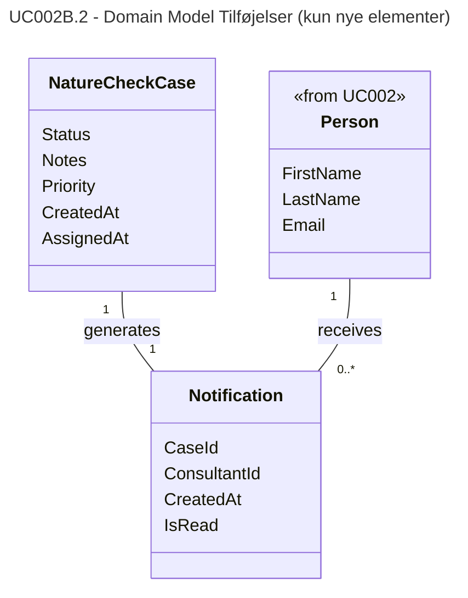

# UC002B.2 – Domain Model Tilføjelser og Mapping til DbScheme

Dette dokument viser kun de **tilføjelser** der er kommet fra UC002B.1 til UC002B.2, og hvordan disse domain model tilføjelser bliver til database schema.

---

## Domain Model Tilføjelser (UC002B.2)

Følgende er **kun** de nye elementer der er tilføjet i UC002B.2's domain model:



### Domain Model Tilføjelser - Detaljer:

#### 1. **Notification Entity** (Ny)
- **CaseId** - Reference til det Nature Check Case der genererede notifikationen
- **ConsultantId** - Reference til konsulenten der modtager notifikationen
- **CreatedAt** - Tidspunkt hvor notifikationen blev oprettet
- **IsRead** - Angiver om konsulenten har læst notifikationen

#### 2. **Nye Relationships**
- **NatureCheckCase → Notification** (1:1)
  - Et Nature Check Case genererer præcis én notifikation når det tildeles
- **Person → Notification** (1:0..*) *(Person entity kommer fra UC002)*
  - En konsulent (Person) kan modtage nul eller flere notifikationer
  - **Note:** Person entity eksisterer allerede fra UC002 (Administrate Farms and Users)

#### 3. **Nye Business Rules**
- Når et Nature Check Case tildeles, skal status være "Assigned"
- En gård kan ikke have flere aktive cases samtidigt
- Konsulenten skal have "Consultant" rolle for at kunne tildeles et case
- Priority skal gemmes på engelsk ("Low", "Medium", "High", "Urgent") selvom UI viser dansk
- Når et case tildeles, sættes både CreatedAt og AssignedAt til nuværende tidspunkt
- En notifikation oprettes automatisk når et case tildeles til en konsulent

---

## Mapping fra Domain Model til DbScheme

Følgende viser hvordan domain model tilføjelserne bliver til database schema:

### 1. Notification Entity → NOTIFICATIONS Tabel

| Domain Model | Database Schema | Mapping |
|--------------|-----------------|---------|
| **Notification** (Entity) | **NOTIFICATIONS** (Table) | Entity bliver til tabel |
| `CaseId` (Guid) | `CaseId` (uniqueidentifier, FK) | Direkte mapping med foreign key constraint |
| `ConsultantId` (Guid) | `ConsultantId` (uniqueidentifier, FK) | Direkte mapping med foreign key constraint |
| `CreatedAt` (DateTimeOffset) | `CreatedAt` (datetime2) | DateTimeOffset → datetime2 (UTC) |
| `IsRead` (bool) | `IsRead` (bit) | bool → bit |
| *(implicit Id)* | `Id` (uniqueidentifier, PK) | Entity får automatisk Id som primary key |

**DDL Eksempel:**
```sql
CREATE TABLE [dbo].[Notifications] (
    [Id] UNIQUEIDENTIFIER NOT NULL PRIMARY KEY DEFAULT NEWID(),
    [CaseId] UNIQUEIDENTIFIER NOT NULL,
    [ConsultantId] UNIQUEIDENTIFIER NOT NULL,
    [CreatedAt] DATETIME2 NOT NULL DEFAULT SYSUTCDATETIME(),
    [IsRead] BIT NOT NULL DEFAULT 0,
    
    CONSTRAINT [FK_Notifications_NatureCheckCases] 
        FOREIGN KEY ([CaseId]) 
        REFERENCES [dbo].[NatureCheckCases]([Id]) 
        ON DELETE CASCADE,
    
    CONSTRAINT [FK_Notifications_Consultant] 
        FOREIGN KEY ([ConsultantId]) 
        REFERENCES [dbo].[Persons]([Id]) 
        ON DELETE CASCADE
);
```

### 2. Relationships → Foreign Keys og Constraints

| Domain Relationship | Database Implementation |
|---------------------|------------------------|
| **NatureCheckCase → Notification** (1:1) | `FK_Notifications_NatureCheckCases` (CaseId → NatureCheckCases.Id) |
| **Person → Notification** (1:0..*) *(Person fra UC002)* | `FK_Notifications_Consultant` (ConsultantId → Persons.Id) |

**Cardinality Implementation:**
- 1:1 relationship opretholdes via foreign key constraint (en notification kan kun have én CaseId)
- 1:0..* relationship opretholdes via foreign key constraint (en person kan have flere notifications)

### 3. Business Rules → Constraints og Stored Procedures

| Business Rule | Database Implementation |
|---------------|------------------------|
| **Notification oprettes automatisk ved assignment** | Trigger eller stored procedure (`usp_NatureCheckCase_Insert` + `usp_Notification_Insert`) |
| **En gård kan ikke have flere aktive cases** | Check i stored procedure (`usp_CheckFarmHasActiveCase`) |
| **Konsulent skal have Consultant rolle** | Check i stored procedure (validerer via Persons.RoleId) |
| **Priority skal være engelsk format** | Konvertering i stored procedure (fra dansk UI til engelsk DB) |

**Stored Procedure Eksempel:**
```sql
CREATE PROCEDURE [dbo].[usp_NatureCheckCase_Insert]
    @FarmId UNIQUEIDENTIFIER,
    @ConsultantId UNIQUEIDENTIFIER,
    @AssignedByPersonId UNIQUEIDENTIFIER,
    @Priority NVARCHAR(50) = NULL,
    @Notes NVARCHAR(MAX) = NULL,
    @CaseId UNIQUEIDENTIFIER OUTPUT
AS
BEGIN
    -- Valider at gård ikke har aktiv case
    IF EXISTS (SELECT 1 FROM NatureCheckCases 
               WHERE FarmId = @FarmId 
               AND Status IN ('Assigned', 'InProgress'))
    BEGIN
        RAISERROR('Farm already has an active case', 16, 1);
        RETURN;
    END
    
    -- Valider at person har Consultant rolle
    IF NOT EXISTS (SELECT 1 FROM Persons p
                   INNER JOIN Roles r ON p.RoleId = r.Id
                   WHERE p.Id = @ConsultantId AND r.Name = 'Consultant')
    BEGIN
        RAISERROR('Person must have Consultant role', 16, 1);
        RETURN;
    END
    
    -- Konverter priority fra dansk til engelsk (hvis nødvendigt)
    SET @Priority = CASE @Priority
        WHEN 'Lav' THEN 'Low'
        WHEN 'Normal' THEN 'Medium'
        WHEN 'Høj' THEN 'High'
        WHEN 'Haster' THEN 'Urgent'
        ELSE @Priority
    END;
    
    -- Opret case
    INSERT INTO NatureCheckCases (FarmId, ConsultantId, AssignedByPersonId, 
                                   Status, Priority, Notes, CreatedAt, AssignedAt)
    VALUES (@FarmId, @ConsultantId, @AssignedByPersonId, 
            'Assigned', @Priority, @Notes, SYSUTCDATETIME(), SYSUTCDATETIME());
    
    SET @CaseId = SCOPE_IDENTITY();
    
    -- Opret notifikation automatisk
    EXEC [dbo].[usp_Notification_Insert] @CaseId, @ConsultantId;
END
```

### 4. Indexes for Performance

| Domain Concept | Database Index | Purpose |
|----------------|----------------|---------|
| **Query notifications by consultant** | `IX_Notifications_ConsultantId` | Effektiv opslag af notifikationer for en konsulent |
| **Query notification by case** | `IX_Notifications_CaseId` | Effektiv opslag af notifikation for et case |
| **Filter unread notifications** | `IX_Notifications_IsRead` | Effektiv filtrering af ulæste notifikationer |

**DDL Eksempel:**
```sql
CREATE INDEX [IX_Notifications_ConsultantId] 
    ON [dbo].[Notifications]([ConsultantId]);
    
CREATE INDEX [IX_Notifications_CaseId] 
    ON [dbo].[Notifications]([CaseId]);
    
CREATE INDEX [IX_Notifications_IsRead] 
    ON [dbo].[Notifications]([IsRead]);
```

---

## Oversigt: Domain Model → DbScheme Mapping

```
Domain Model (UC002B.2 Tilføjelser)
    │
    ├─→ Notification Entity (NY for UC002B.2)
    │   ├─→ NOTIFICATIONS Table
    │   ├─→ Primary Key: Id
    │   ├─→ Foreign Keys: CaseId, ConsultantId
    │   └─→ Indexes: ConsultantId, CaseId, IsRead
    │
    ├─→ Relationships (NYE for UC002B.2)
    │   ├─→ NatureCheckCase → Notification (1:1)
    │   │   └─→ FK_Notifications_NatureCheckCases
    │   └─→ Person → Notification (1:0..*)
    │       └─→ FK_Notifications_Consultant
    │       └─→ Note: Person entity eksisterer fra UC002
    │
    └─→ Business Rules (NYE for UC002B.2)
        ├─→ Auto-create notification → Stored Procedure Logic
        ├─→ No duplicate active cases → Check in SP
        ├─→ Consultant role validation → Check in SP
        └─→ Priority conversion → Conversion in SP
```

**Eksisterende Entities (ikke fra UC002B.2):**
- **Person** - Fra UC002 (Administrate Farms and Users)
- **NatureCheckCase** - Fra UC002B.1 eller tidligere
- **Farm, Address, Role** - Fra UC002

---

## Konklusion

**Domain Model tilføjelser i UC002B.2:**
- 1 ny entity: **Notification**
- 2 nye relationships: 
  - Case→Notification (1:1)
  - Person→Notification (1:0..*) - *Person entity kommer fra UC002*
- 5 nye business rules

**Database Schema implementering:**
- 1 ny tabel: **NOTIFICATIONS**
- 2 foreign key constraints (inkl. reference til eksisterende Persons tabel fra UC002)
- 3 nye indexes
- 3 nye stored procedures (med business rule validering)
- 1 trigger eller SP-logik til automatisk notifikations-oprettelse

**Vigtigt:** 
- **Person** entity og **Persons** tabel eksisterer allerede fra UC002 (Administrate Farms and Users)
- UC002B.2 tilføjer kun **Notification** entity og relationships der refererer til eksisterende entities
- Foreign key `FK_Notifications_Consultant` refererer til den eksisterende Persons tabel

Domain modellen definerer **hvad** systemet skal kunne (concepts og relationships), mens database schema'en definerer **hvordan** det implementeres teknisk (tabeller, constraints, procedures).

