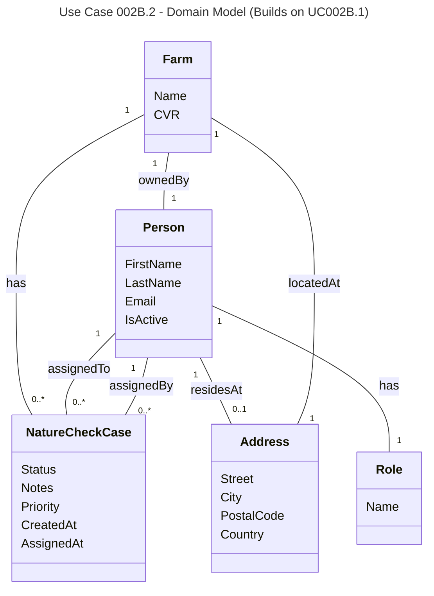

# UC002B.2 Domain Model

Domain Model for Assign Nature Check Case to Consultant use case. This builds upon UC002B.1 and adds assignment-specific relationships and concepts.

**Domain Concepts (from UC002B.1):**
- **Farm** - A farm that can have Nature Check Cases assigned to it
- **Person** - A person in the system who can be a consultant, Arla employee, or farm owner
- **Address** - A physical address where a person resides or a farm is located
- **Role** - A role that defines a person's function in the system (Consultant, Employee, Farmer)
- **NatureCheckCase** - An assignment of a Nature Check task to a consultant for a specific farm

**New Domain Concepts (UC002B.2):**
- **Assignment** - The act of creating a Nature Check Case and linking it to a farm and consultant
- **ConsultantNotificationDto** - A data transfer object representing a notification for a consultant (generated from NatureCheckCase data, not stored as separate entity)

**Domain Relationships (from UC002B.1):**
- A Farm can have zero or more Nature Check Cases
- A Person (consultant) can be assigned to zero or more Nature Check Cases
- A Person (Arla employee) can assign zero or more Nature Check Cases
- A Person has exactly one Role
- A Person may have one Address (where they reside)
- A Farm has exactly one Address (where it is located)
- A Farm has exactly one Person as owner

**New Domain Relationships (UC002B.2):**
- When a case is assigned, notifications are generated from the case data (not stored as separate entities)
- A Person (consultant) can receive zero or more notifications (as DTOs generated from assigned cases)

**Business Rules (from UC002B.1):**
- A Nature Check Case is always linked to one Farm
- A Nature Check Case is always assigned to one Person (consultant)
- A Nature Check Case is always assigned by one Person (Arla employee)
- A Farm must have an owner (Person)
- A Farm must have an address (Address)
- Priority is an optional attribute that indicates the urgency of a Nature Check Case
- Status indicates the current state of a Nature Check Case (Assigned, InProgress, Completed, etc.)
- Notes provide additional information about a Nature Check Case

**New Business Rules (UC002B.2):**
- When a new Nature Check Case is created, it must have status "Assigned"
- A farm cannot have multiple active cases (status "Assigned" or "InProgress") at the same time
- The consultant must have the "Consultant" role to be assigned a case
- Priority must be stored in English format ("Low", "Medium", "High", "Urgent") even though UI displays Danish
- When a case is assigned, both CreatedAt and AssignedAt are set to the current timestamp
- Notifications are generated from NatureCheckCase data when consultant views them (not stored as separate entities)

**Assignment-Specific Concepts:**
- **Case Creation** - The process of creating a new Nature Check Case
- **Consultant Assignment** - Linking a case to a specific consultant
- **Priority Assignment** - Setting the urgency level of a case
- **Notification Generation** - Creating ConsultantNotificationDto objects from assigned cases when consultant views them (not stored in database)

