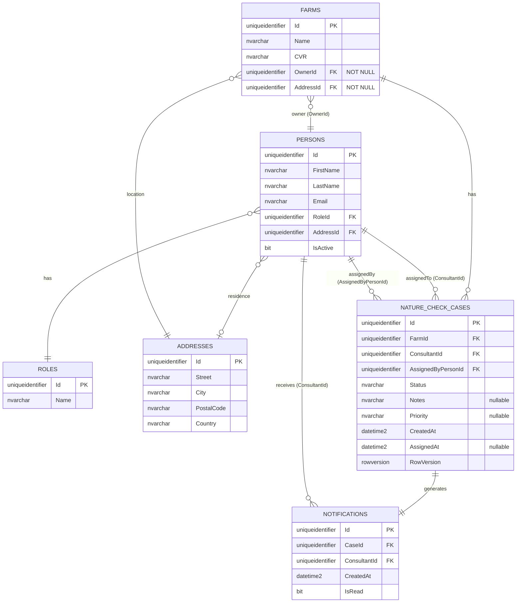

# UC002B.2 – Entity Relationship Diagram

ER Diagram for Assign Nature Check Case to Consultant. This builds upon UC002B.1 and adds the Notifications table and additional constraints for assignment operations.

**Note:** This diagram shows all tables used by UC002B.2. Tables from UC001/UC002 are assumed to already exist. The `NOTIFICATIONS` table is new for UC002B.2.

## Table Origins

| Table | Origin | Description |
|-------|--------|-------------|
| **ROLES** | UC002 | Role definitions (from UC002) |
| **ADDRESSES** | UC002 | Address information (from UC002) |
| **PERSONS** | UC002 | Person information (from UC002) |
| **FARMS** | UC002 | Farm information (from UC002) |
| **NATURE_CHECK_CASES** | UC002B | Nature Check Case assignments (from UC002B.1 or earlier) |
| **NOTIFICATIONS** | UC002B.2 | Database notifications for consultants (new for UC002B.2) |

## Relationship Details

### Relationships from UC002B.1:
| Relationship | Cardinality | Description |
|-----------|--------------|-------------|
| `FARMS` → `NATURE_CHECK_CASES` | **1 : 0..*** | One farm can have zero or more Nature Check Cases |
| `PERSONS` → `NATURE_CHECK_CASES` (ConsultantId) | **1 : 0..*** | One consultant can be assigned to zero or more Nature Check Cases |
| `PERSONS` → `NATURE_CHECK_CASES` (AssignedByPersonId) | **1 : 0..*** | One Arla employee can assign zero or more Nature Check Cases |
| `PERSONS` → `ROLES` | **N : 1** | Many persons can have the same role |
| `PERSONS` → `ADDRESSES` | **N : 1** | Many persons can share an address (nullable) |
| `FARMS` → `ADDRESSES` | **N : 1** | Many farms can share an address (NOT NULL per domain model) |
| `FARMS` → `PERSONS` | **N : 1** | Many farms can have the same owner (NOT NULL per domain model) |

### New Relationships for UC002B.2:
| Relationship | Cardinality | Description |
|-----------|--------------|-------------|
| `NATURE_CHECK_CASES` → `NOTIFICATIONS` | **1 : 1** | One case generates exactly one notification when assigned |
| `PERSONS` → `NOTIFICATIONS` (ConsultantId) | **1 : 0..*** | One consultant can receive zero or more notifications |

## Field Details

### NATURE_CHECK_CASES (from UC002B.1)
- `Status` field stores the case status as NVARCHAR (e.g., "Assigned", "InProgress", "Completed", "Cancelled")
- `Priority` field stores priority as NVARCHAR in English format ("Low", "Medium", "High", "Urgent")
- `Notes` is optional (nullable) for additional case information
- `CreatedAt` is set when the case is created (audit property)
- `AssignedAt` is set when the case is assigned to a consultant (can be null if not yet assigned)
- `RowVersion` is added for optimistic concurrency control

### NOTIFICATIONS (New for UC002B.2)
- `Id` is the primary key (uniqueidentifier)
- `CaseId` references the Nature Check Case that triggered the notification
- `ConsultantId` references the consultant who receives the notification
- `CreatedAt` is set when the notification is created
- `IsRead` indicates whether the consultant has read the notification (default: 0/false)

### FARMS (from UC002B.1)
- `OwnerId` is NOT NULL per domain model (a farm must have an owner)
- `AddressId` is NOT NULL per domain model (a farm must have an address)

### PERSONS (from UC002B.1)
- `RoleId` is used to filter consultants (must have "Consultant" role)
- `IsActive` determines if person should be displayed

## Indexes

### Indexes from UC002B.1:
| Index Name | Table | Columns | Purpose |
|------------|-------|----------|---------|
| `IX_Farms_OwnerId` | Farms | OwnerId | Efficient owner lookups |
| `IX_Farms_AddressId` | Farms | AddressId | Efficient address lookups |
| `IX_Persons_RoleId` | Persons | RoleId | Efficient role filtering |
| `IX_NatureCheckCases_FarmId` | NatureCheckCases | FarmId | Efficient case lookups by farm |
| `IX_NatureCheckCases_ConsultantId` | NatureCheckCases | ConsultantId | Efficient case lookups by consultant |
| `IX_NatureCheckCases_Status` | NatureCheckCases | Status | Filtering active cases |
| `IX_NatureCheckCases_CreatedAt` | NatureCheckCases | CreatedAt | Sorting by creation date |

### New Indexes for UC002B.2:
| Index Name | Table | Columns | Purpose |
|------------|-------|----------|---------|
| `IX_Notifications_ConsultantId` | Notifications | ConsultantId | Efficient notification queries by consultant |
| `IX_Notifications_CaseId` | Notifications | CaseId | Efficient case lookups |
| `IX_Notifications_IsRead` | Notifications | IsRead | Filtering unread notifications |
| `IX_Notifications_CreatedAt` | Notifications | CreatedAt | Sorting notifications by date |

## Constraints

### Check Constraints:
- `CK_NatureCheckCases_Status`: Status must be one of: "Assigned", "InProgress", "Completed", "Cancelled"
- `CK_NatureCheckCases_Priority`: Priority must be NULL or one of: "Low", "Medium", "High", "Urgent"

### Foreign Key Constraints:
- `FK_NatureCheckCases_Farms`: ON DELETE CASCADE (if farm is deleted, cases are deleted)
- `FK_NatureCheckCases_Consultant`: ON DELETE NO ACTION (cannot delete consultant with active cases)
- `FK_NatureCheckCases_AssignedBy`: ON DELETE NO ACTION (cannot delete employee who assigned cases)
- `FK_Notifications_NatureCheckCases`: ON DELETE CASCADE (if case is deleted, notification is deleted)
- `FK_Notifications_Consultant`: ON DELETE CASCADE (if consultant is deleted, notifications are deleted)

## Views (from UC002B.1)

### vw_FarmAssignmentOverview
Aggregates farm data with assignment status for efficient display.

### vw_ConsultantsList
Provides sorted list of all consultants for selection.

