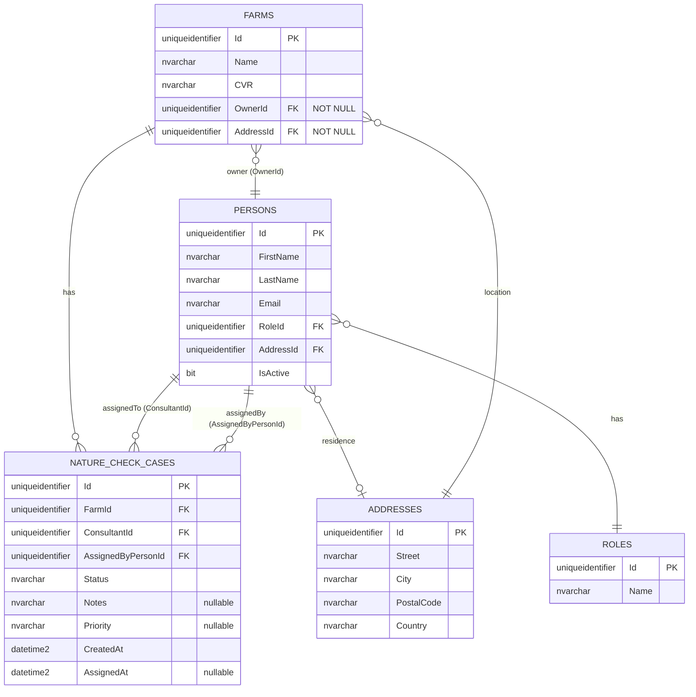

# UC002B.2 – Entity Relationship Diagram

ER Diagram for Assign Nature Check Case to Consultant. This builds upon UC002B.1 and shows the Entity Framework Core implementation.

**Note:** This diagram shows all tables used by UC002B.2. Tables from UC001/UC002 are assumed to already exist. 

**Important:** In Entity Framework Core implementation, there is **NO separate NOTIFICATIONS table**. Notifications are generated from `NatureCheckCase` data in the service layer and returned as `ConsultantNotificationDto` objects.



## Table Origins

| Table | Origin | Description |
|-------|--------|-------------|
| **ROLES** | UC002 | Role definitions (from UC002) |
| **ADDRESSES** | UC002 | Address information (from UC002) |
| **PERSONS** | UC002 | Person information (from UC002) |
| **FARMS** | UC002 | Farm information (from UC002) |
| **NATURE_CHECK_CASES** | UC002B | Nature Check Case assignments (from UC002B.1 or earlier) |

**Note:** In Entity Framework Core implementation, there is **NO separate NOTIFICATIONS table**. Notifications are generated from `NatureCheckCase` entities in the service layer (`NatureCheckCaseService.GetNotificationsForConsultantAsync()`) and returned as `ConsultantNotificationDto` objects.

**Table Creation:** The `NATURE_CHECK_CASES` table is created via **Entity Framework Core Migrations** when the `NatureCheckCase` entity is first added to the DbContext and migrations are run. See UC002B.1-DDL.sql for EF Core configuration details.

## Relationship Details

### Relationships from UC002B.1:
| Relationship | Cardinality | Description |
|-----------|--------------|-------------|
| `FARMS` → `NATURE_CHECK_CASES` | **1 : 0..*** | One farm can have zero or more Nature Check Cases |
| `PERSONS` → `NATURE_CHECK_CASES` (ConsultantId) | **1 : 0..*** | One consultant can be assigned to zero or more Nature Check Cases |
| `PERSONS` → `NATURE_CHECK_CASES` (AssignedByPersonId) | **1 : 0..*** | One Arla employee can assign zero or more Nature Check Cases |
| `PERSONS` → `ROLES` | **N : 1** | Many persons can have the same role |
| `PERSONS` → `ADDRESSES` | **N : 1** | Many persons can share an address (nullable) |
| `FARMS` → `ADDRESSES` | **N : 1** | Many farms can share an address (NOT NULL per domain model) |
| `FARMS` → `PERSONS` | **N : 1** | Many farms can have the same owner (NOT NULL per domain model) |

### Notifications in Entity Framework Implementation:

**Note:** Notifications are NOT stored in a separate table. Instead:

1. **Notifications are generated from NatureCheckCase data** in the service layer
2. **Service Method:** `NatureCheckCaseService.GetNotificationsForConsultantAsync()`
   - Loads assigned cases for consultant: `GetAssignedCasesForConsultantAsync(consultantId)`
   - Converts cases to `ConsultantNotificationDto` objects
   - Returns DTOs sorted by `AssignedAt` date

3. **DTO Structure:**
   ```csharp
   public class ConsultantNotificationDto
   {
       public Guid CaseId { get; init; }
       public Guid FarmId { get; init; }
       public string FarmName { get; init; }
       public DateTimeOffset AssignedAt { get; init; }
       public string? Priority { get; init; }
       public string? Notes { get; init; }
   }
   ```

4. **No Database Table:** Notifications exist only as in-memory DTOs created from `NatureCheckCase` entities.

## Field Details

### NATURE_CHECK_CASES (from UC002B.1)
- `Status` field stores the case status as NVARCHAR (e.g., "Assigned", "InProgress", "Completed", "Cancelled")
- `Priority` field stores priority as NVARCHAR in English format ("Low", "Medium", "High", "Urgent")
- `Notes` is optional (nullable) for additional case information
- `CreatedAt` is set when the case is created (audit property)
- `AssignedAt` is set when the case is assigned to a consultant (can be null if not yet assigned)
- `RowVersion` is added for optimistic concurrency control

### NOTIFICATIONS (Not a Database Table in EF Implementation)

**In Entity Framework Core implementation:**
- Notifications are **NOT stored in a database table**
- Notifications are **generated from NatureCheckCase entities** in the service layer
- Returned as `ConsultantNotificationDto` objects (in-memory DTOs)
- Created by querying `NatureCheckCases` where `ConsultantId` matches and `Status = Assigned`

### FARMS (from UC002B.1)
- `OwnerId` is NOT NULL per domain model (a farm must have an owner)
- `AddressId` is NOT NULL per domain model (a farm must have an address)

### PERSONS (from UC002B.1)
- `RoleId` is used to filter consultants (must have "Consultant" role)
- `IsActive` determines if person should be displayed

## Indexes

### Indexes from UC002B.1:
| Index Name | Table | Columns | Purpose |
|------------|-------|----------|---------|
| `IX_Farms_OwnerId` | Farms | OwnerId | Efficient owner lookups |
| `IX_Farms_AddressId` | Farms | AddressId | Efficient address lookups |
| `IX_Persons_RoleId` | Persons | RoleId | Efficient role filtering |
| `IX_NatureCheckCases_FarmId` | NatureCheckCases | FarmId | Efficient case lookups by farm |
| `IX_NatureCheckCases_ConsultantId` | NatureCheckCases | ConsultantId | Efficient case lookups by consultant |
| `IX_NatureCheckCases_Status` | NatureCheckCases | Status | Filtering active cases |
| `IX_NatureCheckCases_CreatedAt` | NatureCheckCases | CreatedAt | Sorting by creation date |

### Indexes for UC002B.2 (No New Indexes Needed):

**Note:** Since notifications are generated from `NatureCheckCase` data, existing indexes on `NatureCheckCases` table are sufficient:
- `IX_NatureCheckCases_ConsultantId` - Used for efficient notification queries
- `IX_NatureCheckCases_Status` - Used for filtering assigned cases
- `IX_NatureCheckCases_CreatedAt` - Used for sorting notifications by date

## Constraints

### Check Constraints:
- `CK_NatureCheckCases_Status`: Status must be one of: "Assigned", "InProgress", "Completed", "Cancelled"
- `CK_NatureCheckCases_Priority`: Priority must be NULL or one of: "Low", "Medium", "High", "Urgent"

### Foreign Key Constraints:
- `FK_NatureCheckCases_Farms`: ON DELETE CASCADE (if farm is deleted, cases are deleted)
- `FK_NatureCheckCases_Consultant`: ON DELETE NO ACTION (cannot delete consultant with active cases)
- `FK_NatureCheckCases_AssignedBy`: ON DELETE NO ACTION (cannot delete employee who assigned cases)

**Note:** No foreign key constraints for Notifications table since it doesn't exist in EF implementation.

## Entity Framework Navigation Properties

### Automatic Includes (AutoInclude Configuration)

EF Core automatically loads related entities via navigation properties:

- **Person.Role** - Automatically included when loading Person entities
- **Person.Address** - Automatically included when loading Person entities
- **Farm.Owner** - Automatically included when loading Farm entities
- **Farm.Address** - Automatically included when loading Farm entities
- **NatureCheckCase.Farm** - Navigation property to related Farm
- **NatureCheckCase.Consultant** - Navigation property to assigned consultant
- **NatureCheckCase.AssignedByPerson** - Navigation property to employee who assigned

### Views (Not Used in EF Implementation)

**Note:** In Entity Framework Core implementation, views are replaced by:
- **LINQ queries** in repositories
- **DTOs** created in service layer
- **In-memory processing** for aggregations

The following views exist only in standard SQL documentation:
- `vw_FarmAssignmentOverview` - Replaced by `FarmAssignmentOverviewDto` created in service
- `vw_ConsultantsList` - Replaced by LINQ query in `PersonRepository.GetPersonsByRoleAsync()`

