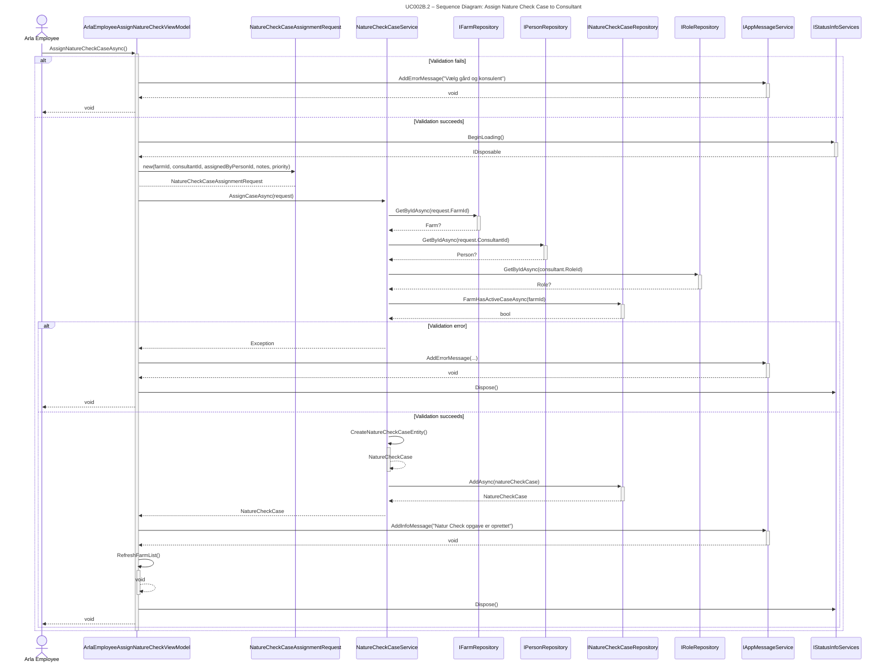

## UC002B.2 – Sequence Diagram: Assign Nature Check Case to Consultant

This sequence diagram shows the detailed interaction flow when an Arla employee assigns a Nature Check Case to a consultant, following Larmann's UML conventions.

**Notes:**
- All method calls use PascalCase (C# convention).
- All calls have return arrows (including void methods).
- Exception handling follows UML conventions with alt fragments for alternatives.
- Activation bars show object lifetime using automatic activation/deactivation (+/-).
- Maximum 3 levels of nested fragments for readability.
