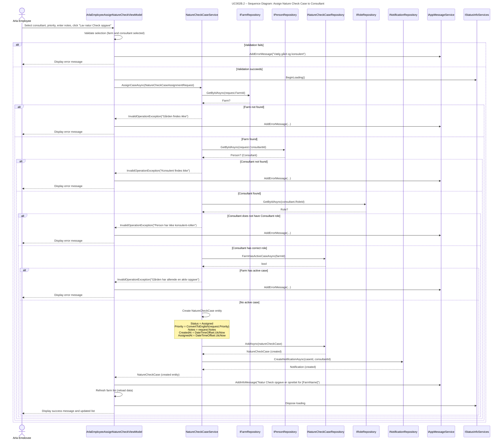

## UC002B.2 – Sequence Diagram: Assign Nature Check Case to Consultant

This sequence diagram shows the detailed interaction flow when an Arla employee assigns a Nature Check Case to a consultant, following Larmann's UML conventions.

**Notes:**
- The service validates all inputs before creating the case.
- Priority is converted from Danish (UI) to English (database) in the service layer.
- A notification is automatically created when the case is assigned.
- The farm list is refreshed to show the updated assignment status.

