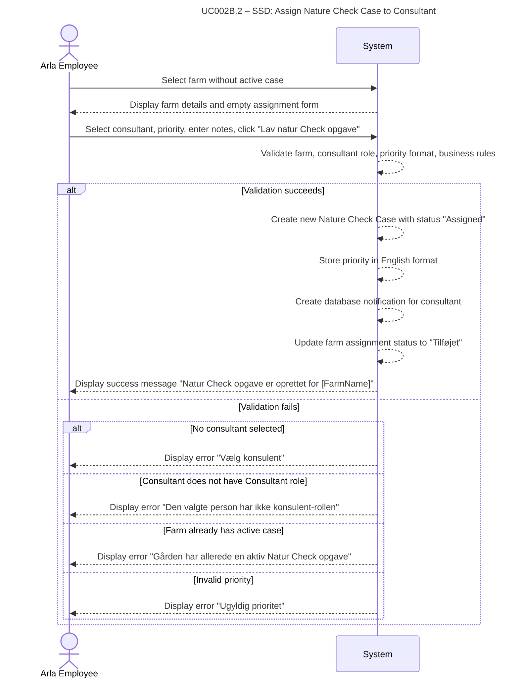

# UC002B.2-SSD – Assign Nature Check Case to Consultant

System Sequence Diagram showing the interaction between the Arla Employee actor and the System, following Larmann's UML conventions.

**Notes:**
- The system validates all inputs before creating the case.
- Priority is converted from Danish (UI) to English (database) during the assignment process.
- A notification is automatically created for the consultant when the case is assigned.
- The farm's assignment status is updated to reflect the new active case.

