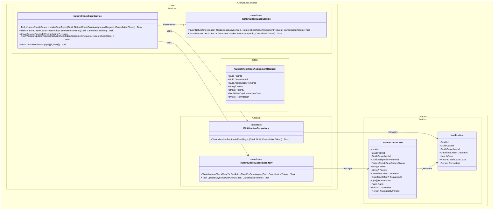

## UC002B.3 – Design Class Diagram

This diagram shows the main components that collaborate when an Arla employee updates a Nature Check Case assignment. It builds upon UC002B.2 and adds update-specific classes. It follows Larmann's UML conventions.

