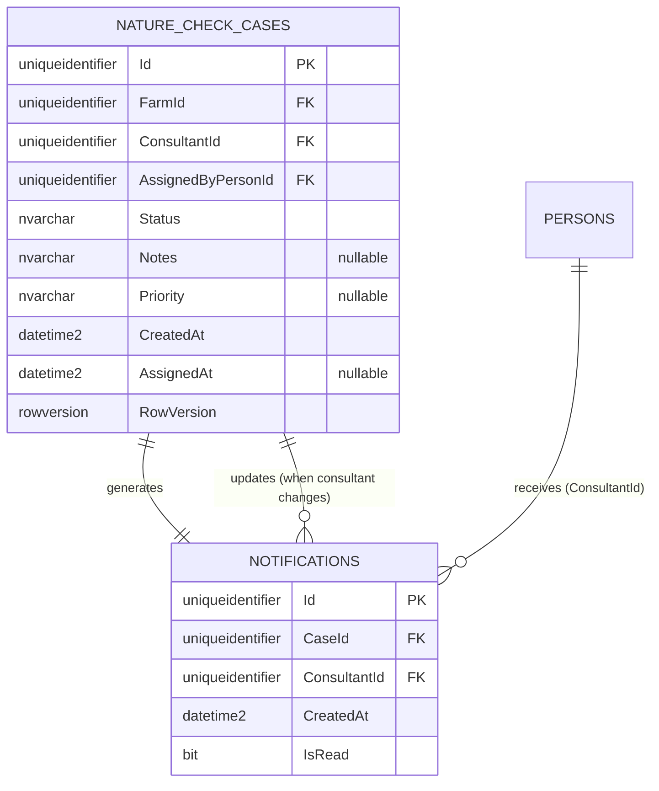

# UC002B.3 – Entity Relationship Diagram

ER Diagram for Update Nature Check Case Assignment. This builds upon UC002B.2 and adds update-specific constraints.

**Note:** This diagram shows tables relevant to UC002B.3. Tables from UC001/UC002 (FARMS, PERSONS, ROLES, ADDRESSES) are assumed to already exist and are referenced via foreign keys but not shown in detail here.

## Table Origins

| Table | Origin | Description |
|-------|--------|-------------|
| **NATURE_CHECK_CASES** | UC002B | Nature Check Case assignments (from UC002B.1/UC002B.2) |
| **NOTIFICATIONS** | UC002B.2 | Database notifications for consultants (from UC002B.2) |
| **FARMS** | UC002 | Farm information (assumed to exist from UC002) |
| **PERSONS** | UC002 | Person information (assumed to exist from UC002) |

**Note:** UC002B.3 assumes that all tables from UC001, UC002, and previous UC002B user stories already exist.

## Update-Specific Constraints

- **RowVersion** is used for optimistic concurrency control
- When consultant changes, multiple notifications may exist for the same case (old and new consultant)
- Old notifications are marked as read when consultant changes

