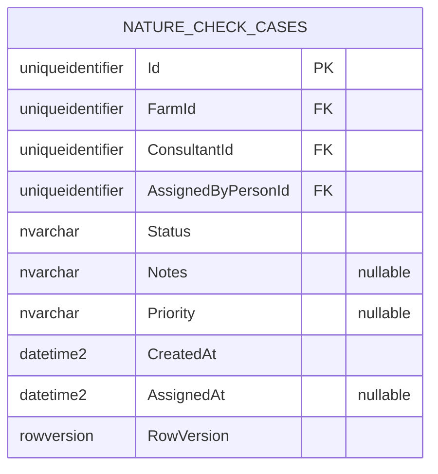

# UC002B.3 – Entity Relationship Diagram

ER Diagram for Update Nature Check Case Assignment. This builds upon UC002B.2 and adds update-specific constraints.

**Note:** This diagram shows tables relevant to UC002B.3. Tables from UC001/UC002 (FARMS, PERSONS, ROLES, ADDRESSES) are assumed to already exist and are referenced via foreign keys but not shown in detail here.

## Table Origins

| Table | Origin | Description |
|-------|--------|-------------|
| **NATURE_CHECK_CASES** | UC002B | Nature Check Case assignments (from UC002B.1/UC002B.2) |
| **FARMS** | UC002 | Farm information (assumed to exist from UC002) |
| **PERSONS** | UC002 | Person information (assumed to exist from UC002) |

**Note:** UC002B.3 assumes that all tables from UC001, UC002, and previous UC002B user stories already exist.

**Important:** In Entity Framework Core implementation, there is **NO separate NOTIFICATIONS table**. Notifications are generated from `NatureCheckCase` data in the service layer.

## Update Operations in Entity Framework

- **Entity Updates:** Modify entity properties, EF Core generates UPDATE SQL automatically
- **Change Tracking:** EF Core tracks property changes and updates only modified fields
- **No RowVersion:** Current implementation does not use optimistic concurrency control
- **Notifications:** When case is updated, notifications are regenerated from updated case data (not stored in database)

