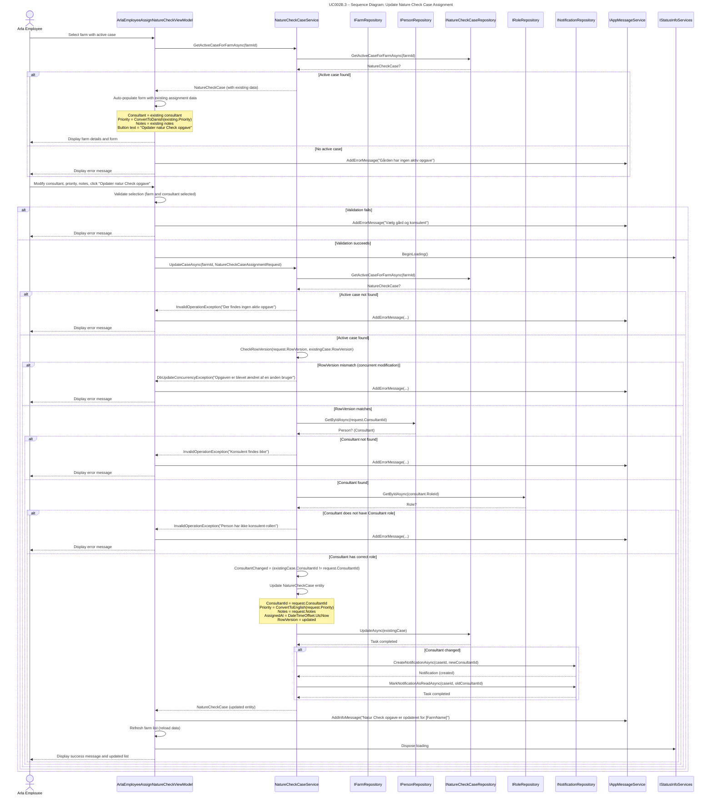

## UC002B.3 – Sequence Diagram: Update Nature Check Case Assignment

This sequence diagram shows the detailed interaction flow when an Arla employee updates a Nature Check Case assignment, following Larmann's UML conventions.

**Notes:**
- The service validates all inputs and checks for concurrent modifications using RowVersion.
- Priority is converted from Danish (UI) to English (database) in the service layer.
- If consultant changed, a new notification is created and the old one is marked as read.
- The assignment timestamp is updated to reflect when the case was last modified.

