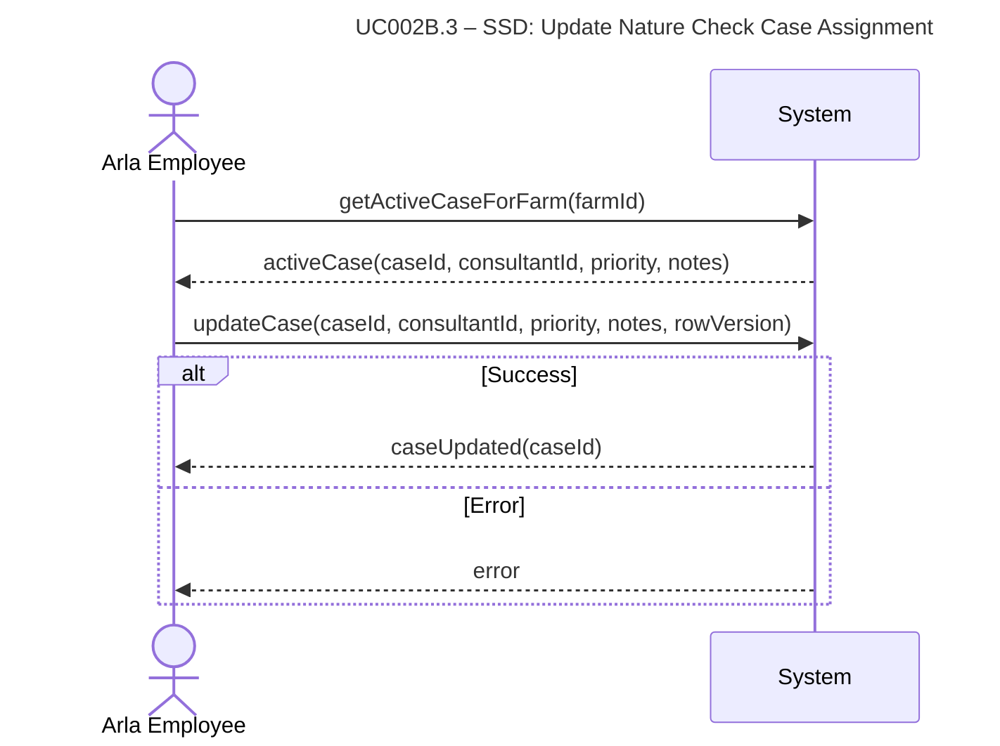

# UC002B.3-SSD – Update Nature Check Case Assignment

System Sequence Diagram showing the interaction between the Arla Employee actor and the System, following Larmann's UML conventions.

**Notes:**
- This SSD shows the high-level interaction for updating a Nature Check Case.
- All internal operations (validation, concurrency checks, etc.) are hidden within the system boundary.

