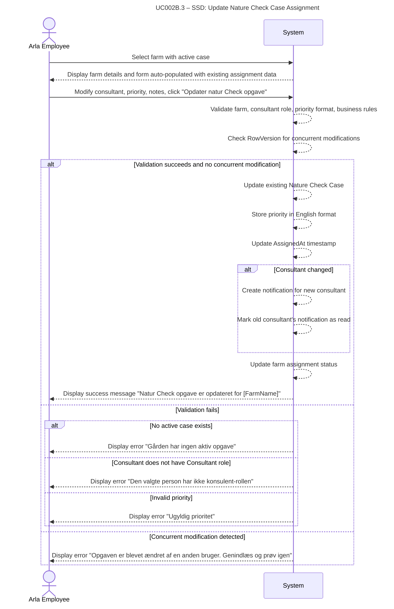

# UC002B.3-SSD – Update Nature Check Case Assignment

System Sequence Diagram showing the interaction between the Arla Employee actor and the System, following Larmann's UML conventions.

**Notes:**
- The system validates all inputs and checks for concurrent modifications using RowVersion.
- Priority is converted from Danish (UI) to English (database) during the update process.
- If consultant changed, a new notification is created and the old one is managed.
- The assignment timestamp is updated to reflect when the case was last modified.

