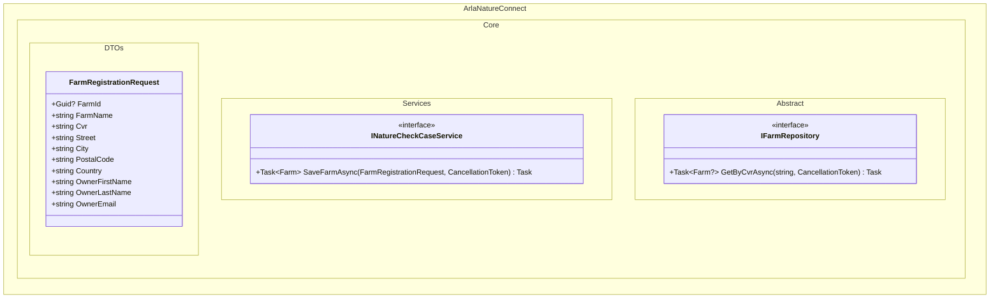

## UC002B.4 – Design Class Diagram

This diagram builds upon UC002B.3 and adds farm creation classes.

```mermaid
classDiagram
    direction TB
    %% === DCD – UC002B.4: Create Farm (Builds on UC002B.3) ===

    namespace ArlaNatureConnect.Core.DTOs {
        class FarmRegistrationRequest {
            +Guid? FarmId
            +string FarmName
            +string Cvr
            +string Street
            +string City
            +string PostalCode
            +string Country
            +string OwnerFirstName
            +string OwnerLastName
            +string OwnerEmail
        }
    }

    namespace ArlaNatureConnect.Core.Services {
        class INatureCheckCaseService {
            <<interface>>
            +Task~Farm~ SaveFarmAsync(FarmRegistrationRequest, CancellationToken) Task
        }
    }

    namespace ArlaNatureConnect.Core.Abstract {
        class IFarmRepository {
            <<interface>>
            +Task~Farm?~ GetByCvrAsync(string, CancellationToken) Task
        }
    }
```

