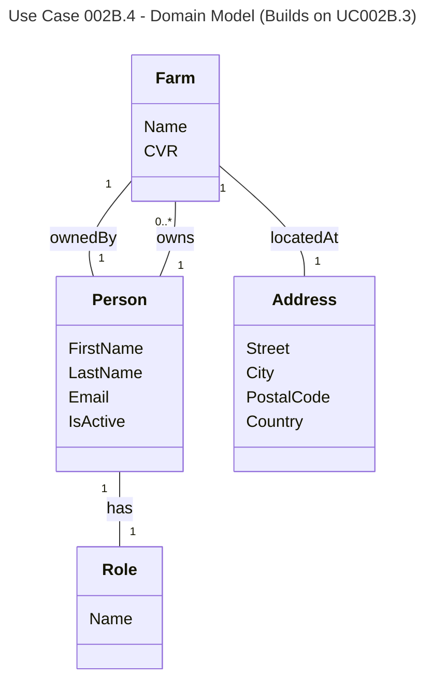

# UC002B.4 Domain Model

Domain Model for Create Farm (Inline) use case. This builds upon UC002B.3 and adds farm creation concepts.

**New Domain Concepts (UC002B.4):**
- **Farm Creation** - The process of creating a new farm with address and owner
- **CVR Uniqueness** - Each farm must have a unique CVR number
- **Farmer Reuse** - A farmer (person with Farmer role) can own multiple farms

**Business Rules:**
- CVR must be unique across all farms
- A farmer can own multiple farms with different CVR numbers
- Owner must have Farmer role to own multiple farms

