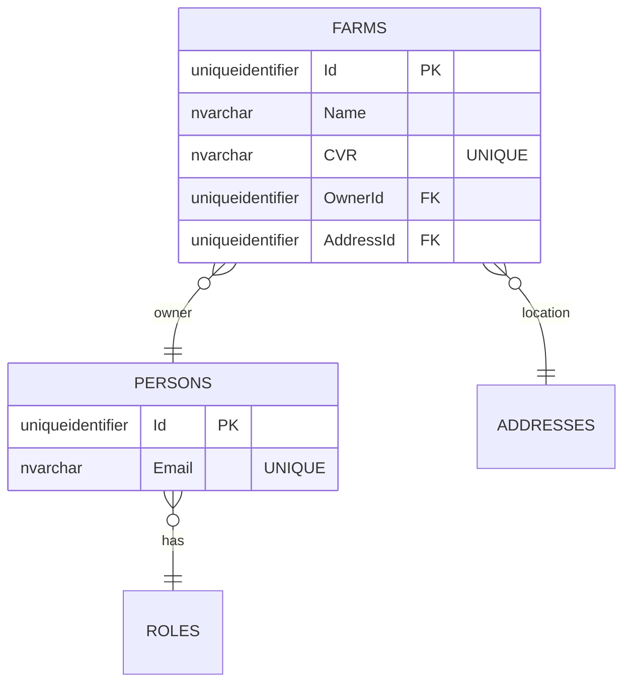

# UC002B.4 – Entity Relationship Diagram

ER Diagram for Create Farm (Inline). This builds upon UC002B.3.

**Note:** This diagram shows tables relevant to UC002B.4. Tables from UC001/UC002 (ROLES, ADDRESSES) are assumed to already exist.

## Table Origins

| Table | Origin | Description |
|-------|--------|-------------|
| **FARMS** | UC002 | Farm information (may be created or updated in UC002B.4) |
| **PERSONS** | UC002 | Person information (may be created or reused in UC002B.4) |
| **ROLES** | UC002 | Role definitions (assumed to exist from UC002) |
| **ADDRESSES** | UC002 | Address information (created in UC002B.4) |

**Note:** UC002B.4 can create new farms, addresses, and persons (if owner doesn't exist), or reuse existing persons with Farmer role.

## Constraints

- CVR must be UNIQUE (enforced by database UNIQUE constraint)
- Owner can have multiple farms (if Farmer role)
- Email must be UNIQUE (enforced by database UNIQUE constraint on Persons.Email, if exists)

## Entity Framework Navigation Properties

### Automatic Includes (AutoInclude Configuration)

EF Core automatically loads related entities via navigation properties:

- **Farm.Owner** - Automatically included when loading Farm entities
- **Farm.Address** - Automatically included when loading Farm entities
- **Person.Role** - Automatically included when loading Person entities
- **Person.Address** - Automatically included when loading Person entities

### Farm Creation Flow

1. Create Address entity → Save via IAddressRepository.AddAsync()
2. Check if owner exists by email → Reuse if Farmer role, otherwise create new Person
3. Create Farm entity → Link to Address and Person via foreign keys
4. Save Farm → EF Core handles all INSERT statements automatically

