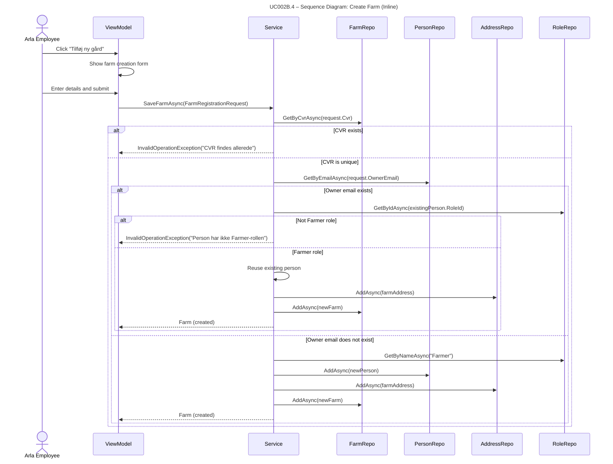

## UC002B.4 – Sequence Diagram: Create Farm (Inline)

```mermaid
sequenceDiagram
    title UC002B.4 – Sequence Diagram: Create Farm (Inline)

    actor ArlaEmployee as Arla Employee
    participant ViewModel
    participant Service
    participant FarmRepo
    participant PersonRepo
    participant AddressRepo
    participant RoleRepo

    ArlaEmployee ->> ViewModel: Click "Tilføj ny gård"
    ViewModel ->> ViewModel: Show farm creation form
    
    ArlaEmployee ->> ViewModel: Enter details and submit
    ViewModel ->> Service: SaveFarmAsync(FarmRegistrationRequest)
    
    Service ->> FarmRepo: GetByCvrAsync(request.Cvr)
    alt CVR exists
        Service -->> ViewModel: InvalidOperationException("CVR findes allerede")
    else CVR is unique
        Service ->> PersonRepo: GetByEmailAsync(request.OwnerEmail)
        alt Owner email exists
            Service ->> RoleRepo: GetByIdAsync(existingPerson.RoleId)
            alt Not Farmer role
                Service -->> ViewModel: InvalidOperationException("Person har ikke Farmer-rollen")
            else Farmer role
                Service ->> Service: Reuse existing person
                Service ->> AddressRepo: AddAsync(farmAddress)
                Service ->> FarmRepo: AddAsync(newFarm)
                Service -->> ViewModel: Farm (created)
            end
        else Owner email does not exist
            Service ->> RoleRepo: GetByNameAsync("Farmer")
            Service ->> PersonRepo: AddAsync(newPerson)
            Service ->> AddressRepo: AddAsync(farmAddress)
            Service ->> FarmRepo: AddAsync(newFarm)
            Service -->> ViewModel: Farm (created)
        end
    end
```

