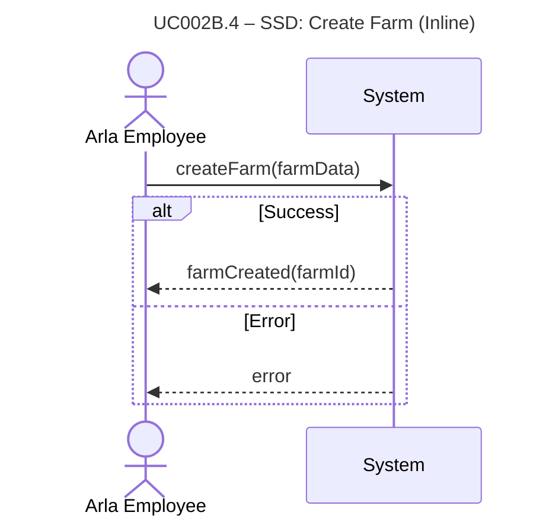

# UC002B.4-SSD – Create Farm (Inline)

System Sequence Diagram showing the interaction between the Arla Employee actor and the System, following Larmann's UML conventions.

**Notes:**
- This SSD shows the high-level interaction for creating a farm.
- All internal operations (validation, owner reuse logic, etc.) are hidden within the system boundary.

