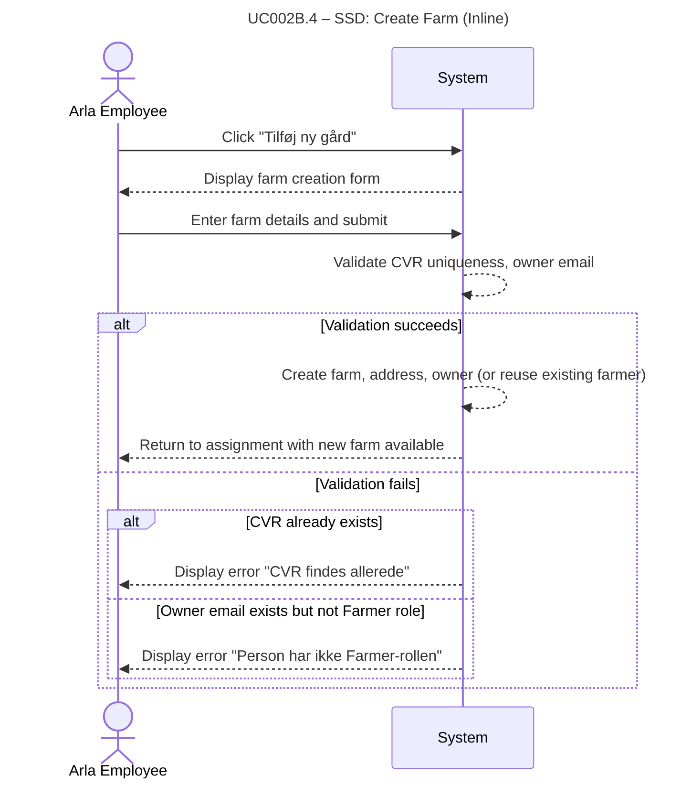

# UC002B.4-SSD – Create Farm (Inline)

```mermaid
sequenceDiagram
    title UC002B.4 – SSD: Create Farm (Inline)

    actor ArlaEmployee as Arla Employee
    participant System as System

    ArlaEmployee ->> System: Click "Tilføj ny gård"
    System -->> ArlaEmployee: Display farm creation form
    
    ArlaEmployee ->> System: Enter farm details and submit
    System -->> System: Validate CVR uniqueness, owner email
    
    alt Validation succeeds
        System -->> System: Create farm, address, owner (or reuse existing farmer)
        System -->> ArlaEmployee: Return to assignment with new farm available
    else Validation fails
        alt CVR already exists
            System -->> ArlaEmployee: Display error "CVR findes allerede"
        else Owner email exists but not Farmer role
            System -->> ArlaEmployee: Display error "Person har ikke Farmer-rollen"
        end
    end
```

